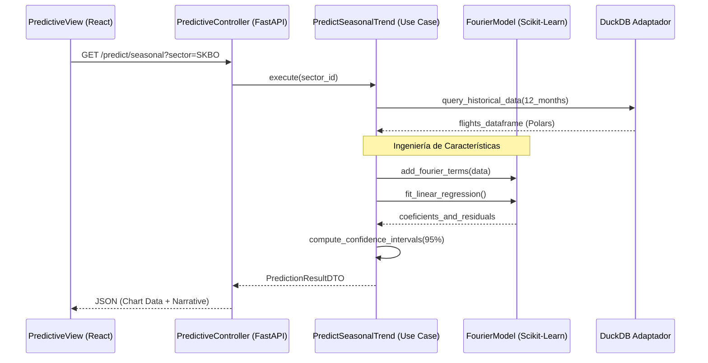

# Capa de Aplicación (Application Layer)

La capa de aplicación es la responsable de orquestar el flujo de datos entre la infraestructura y el dominio. Contiene los **Casos de Uso** (Use Cases), que representan las acciones específicas que un usuario puede realizar en el sistema.

## 🚀 Casos de Uso Principales

Los casos de uso se dividen en categorías funcionales:

### 1. Motor de Capacidad (Circular 006)
[`calculate_sector_capacity.py`](file:///c:/Users/LENOVO/Documents/tesis/src/application/use_cases/calculate_sector_capacity.py)
Implementa la lógica matemática para determinar la capacidad de un sector ATC.
- **Flujo**: Recibe parámetros de sector -> Consulta trayectorias históricas -> Aplica fórmula SCV/DORATASK -> Retorna métricas TPS, TFC y CH.

### 2. Ingestión y Procesamiento (ETL)
[`ingest_flights_data.py`](file:///c:/Users/LENOVO/Documents/tesis/src/application/use_cases/ingest_flights_data.py)
Orquesta la carga masiva de datos desde archivos Excel hacia DuckDB.
- **Acciones**: Validación de esquema -> Deduplicación -> Transformación de tipos -> Carga asíncrona -> Actualización de historial.

### 3. Análisis Predictivo (ML)
[`predict_sector_saturation.py`](file:///c:/Users/LENOVO/Documents/tesis/src/application/use_cases/predict_sector_saturation.py)
Cruza la predicción de demanda con la capacidad técnica.
- **Modelos**: Utiliza Random Forest para la demanda y modelos de Fourier para tendencias estacionales ([`predict_seasonal_trend.py`](file:///c:/Users/LENOVO/Documents/tesis/src/application/use_cases/predict_seasonal_trend.py)).

### 4. Generación de Reportes
- **Ejecutivo**: [`generate_executive_report.py`](file:///c:/Users/LENOVO/Documents/tesis/src/application/use_cases/generate_executive_report.py) (Narrativa técnica generada).
- **Estadístico**: Reportes de empresas, orígenes, destinos y picos horarios.

---

## 🔄 3.2.3 Casos de Uso Extendidos

Más allá de los flujos básicos, el sistema contempla escenarios de excepción y flujos alternos críticos para la operación ATC.

### Ingesta de Datos con Recuperación de Errores
- **Escenario**: El archivo cargado contiene columnas faltantes o formatos de fecha no estándar.
- **Flujo Alterno**: El `DateParser` intenta múltiples formatos -> Si falla, el registro se marca como `ERROR` en `file_processing_control` -> Se notifica al frontend sin detener la ingesta de los registros válidos.

### Análisis de Saturación con Umbrales ATFM
- **Escenario**: La saturación proyectada supera el 100%.
- **Acción**: El sistema activa una lógica de recomendación que sugiere la activación de sectores secundarios o la aplicación de slots temporales.

---

## 📅 3.6.5 Diagramas de Secuencia (Predicción de ML)

Este diagrama detalla la orquestación interna cuando se solicita un pronóstico de demanda estacional.

---

## 🔄 Flujo de Datos Arquitectural
... (Contenido existente simplificado)

## 📦 Objetos de Transferencia de Datos (DTOs)
Ubicados en `src/application/dtos/`, aseguran que la información que sale de la aplicación esté estructurada y validada para la interfaz de usuario.

> [!TIP]
> Cada caso de uso es una clase o función independiente. Esto facilita el mantenimiento y evita que el sistema se convierta en una "Big Ball of Mud".
