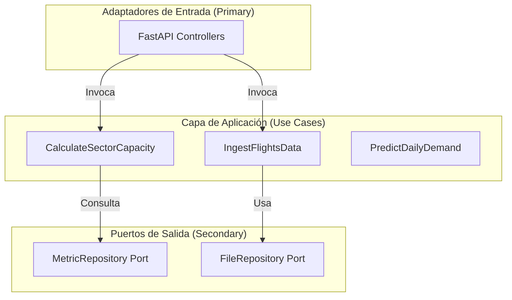
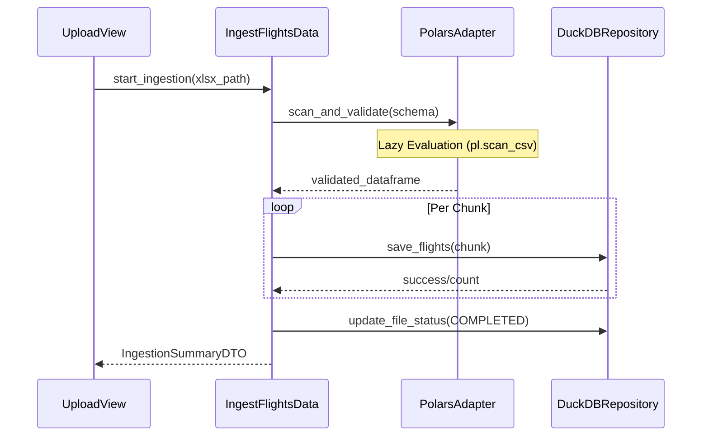
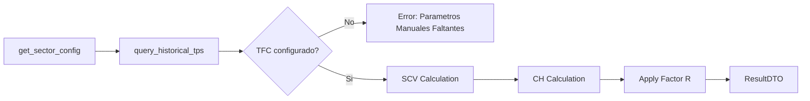
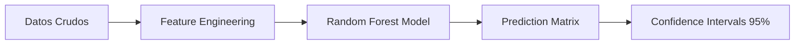
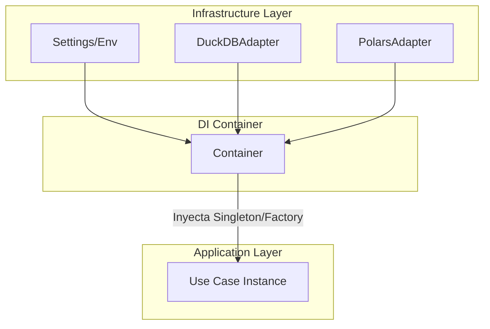

# Capa de Aplicación (Application Layer)

La capa de aplicación es el núcleo orquestador del sistema. Implementa el patrón **Command** (vía Casos de Uso) para separar la intención del usuario de la implementación técnica.

---

## 🏛️ 3.1 Arquitectura de Orquestación

---

## 📥 3.2 Ingesta y Procesamiento Técnica (ETL)

El archivo [`ingest_flights_data.py`](file:///c:/Users/LENOVO/Documents/tesis/src/application/use_cases/ingest_flights_data.py) coordina el flujo desde el archivo plano hasta la persistencia relacional.

### Diagrama de Secuencia: Ingesta Masiva

---

## 🧮 3.3 Motor de Capacidad: Derivación Circular 006

Este caso de uso ([`calculate_sector_capacity.py`](file:///c:/Users/LENOVO/Documents/tesis/src/application/use_cases/calculate_sector_capacity.py)) traduce la normativa de la Aerocivil en algoritmos computacionales.

### Flujo Lógico de Cálculo

- **`execute()`**: Centraliza la aplicación de la fórmula de capacidad horaria:

$$
\text{CH} = \frac{3600 \times \text{SCV}}{\text{TPS}}
$$

---

## 🤖 3.4 Análisis Predictivo (ML Pipeline)

La orquestación de modelos en [`predict_daily_demand.py`](file:///c:/Users/LENOVO/Documents/tesis/src/application/use_cases/predict_daily_demand.py) sigue un patrón de **Recursive Forecasting** para series temporales.

### Ingeniería de Características (Features)
El sistema genera automáticamente:
- **Lags Temporales**: Desplazamientos de 1, 7, 14 y 28 días para capturar la auto-correlación.
- **Dummies Estacionales**: Día de la semana, mes y tendencia anual.

---

## 🏗️ 3.5 Inyección de Dependencias (Dependency Injection)

El sistema utiliza la librería `dependency-injector` ([`container.py`](file:///c:/Users/LENOVO/Documents/tesis/src/application/di/container.py)) para desacoplar la creación de objetos de su uso.

### Flujo de Resolución de Dependencias

**Beneficios Técnicos**:
- **Ciclo de Vida**: Los repositorios son `Singleton` (una sola instancia compartida), mientras que los Casos de Uso son `Factory` (nueva instancia por petición), optimizando el uso de memoria.
- **Configuración Centralizada**: Todos los paths (DuckDB, Logs, Temp) se inyectan desde `Settings`, eliminando hardcoding.

---

## 📦 3.6 Arquitectura de DTOs y Validación

Los DTOs definidos en `src/application/dtos/` actúan como el contrato formal entre el backend y el frontend.

### Validación Prospectiva con Pydantic
Cada DTO utiliza el motor de validación de **Pydantic v2**. Esto garantiza que:
1.  **Tipado Estricto**: Un `sector_id` debe ser un `str`, no un entero.
2.  **Reglas de Negocio**: Mediante `Field(...)`, se validan rangos operativos (ej: el `R_factor` debe estar entre 0.1 y 1.0).

---

> [!IMPORTANT]
> Esta arquitectura garantiza la integridad de la transacción de negocio. Ninguna operación de persistencia se realiza sin pasar antes por la lógica de validación del Caso de Uso.
