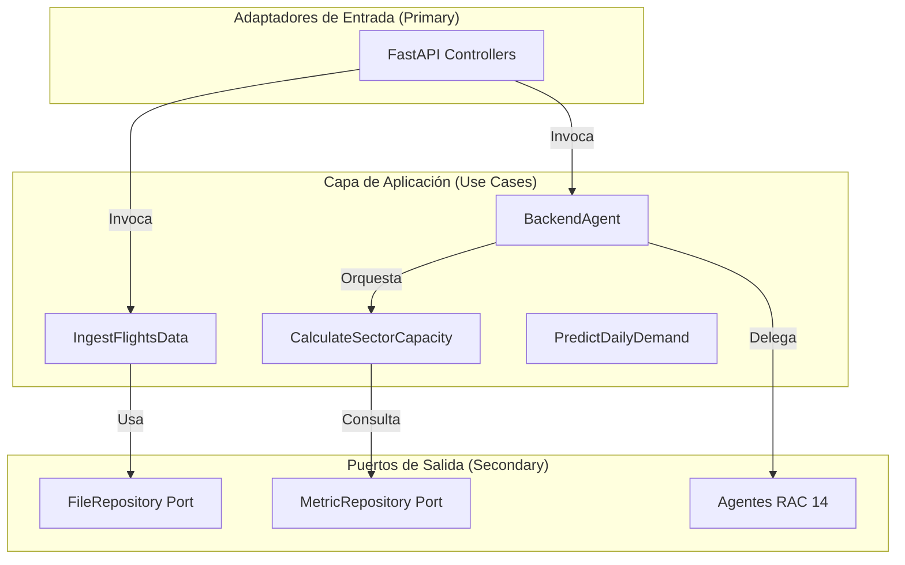
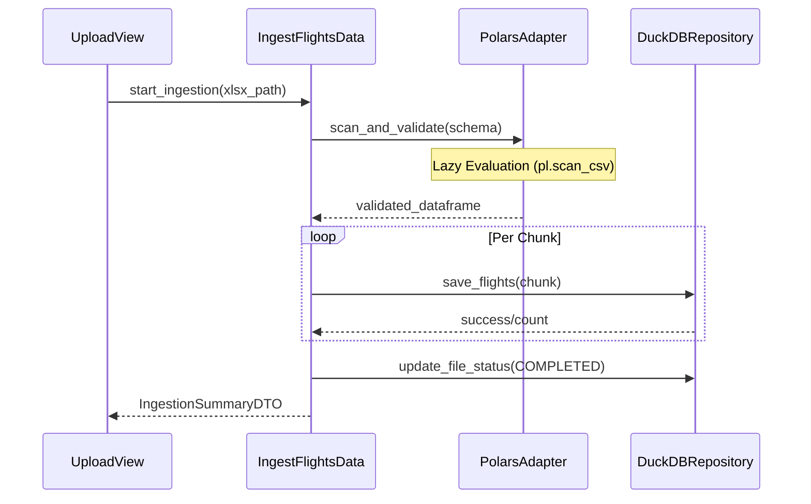
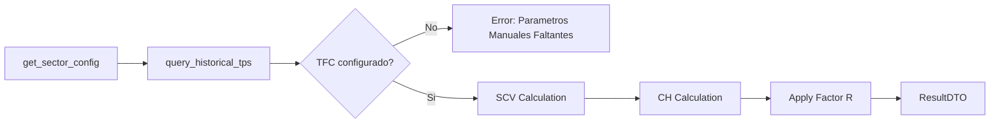
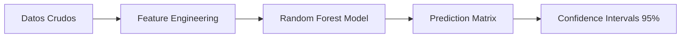
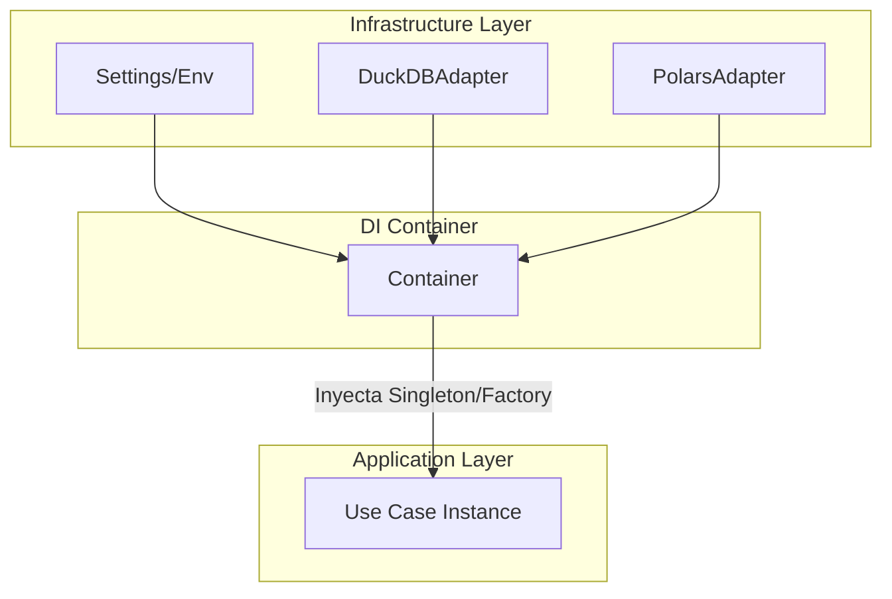

# Capa de Aplicación (Application Layer)

La capa de aplicación es el núcleo orquestador del sistema. Implementa el patrón **Command** (vía Casos de Uso) para separar la intención del usuario de la implementación técnica.

---

## 🏛️ 3.1 Arquitectura de Orquestación

```mermaid
graph TD
    subgraph "Adaptadores de Entrada (Primary)"
        API[FastAPI Controllers]
    end

    subgraph "Capa de Aplicación (Use Cases)"
        UC_INGEST[IngestFlightsData]
        BA[BackendAgent]
        UC_CAP[CalculateSectorCapacity]
        UC_PRED[PredictDailyDemand]
    end

    subgraph "Puertos de Salida (Secondary)"
        P_REPO[MetricRepository Port]
        P_FILE[FileRepository Port]
        AGENTS[Agentes RAC 14]
    end

    API -- Invoca --> UC_INGEST
    API -- Invoca --> BA
    BA -- Orquesta --> UC_CAP
    BA -- Delega --> AGENTS
    UC_INGEST -- Usa --> P_FILE
    UC_CAP -- Consulta --> P_REPO
```
### 🔍 Análisis Detallado: Orquestación
- **Explicación del Gráfico**: Muestra el flujo de control vertical desde la entrada HTTP hasta la persistencia. La arquitectura fuerza que el API (Adaptador Primario) nunca hable directamente con la Base de Datos. En la nueva arquitectura RAC 14, **BackendAgent** actúa como super-orquestador entre casos de uso (como `CalculateSectorCapacity`) y la lógica de los agentes de dominio.
- **Componentes Involucrados**: 
    - `FastAPI Controllers` (`src/infrastructure/adapters/api/`)
    - `Use Cases & Integrator` (`src/application/use_cases/`)
    - `Repositories & Agents` (`src/domain/`)
- **Referencias a Código**:
    - [`main.py`](file:///c:/Users/LENOVO/Documents/tesis/src/main.py): Punto de entrada que monta los routers.
    - [`backend_agent.py`](file:///c:/Users/LENOVO/Documents/tesis/src/application/use_cases/backend_agent.py): El maestro orquestador de capacidad dinámica.

---

## 📥 3.2 Ingesta y Procesamiento Técnica (ETL)

El archivo [`ingest_flights_data.py`](file:///c:/Users/LENOVO/Documents/tesis/src/application/use_cases/ingest_flights_data.py) coordina el flujo desde el archivo plano hasta la persistencia relacional.

### Diagrama de Secuencia: Ingesta Masiva

```mermaid
sequenceDiagram
    participant UI as UploadView
    participant UC as IngestFlightsData
    participant PL as PolarsAdapter
    participant DB as DuckDBRepository

    UI->>UC: start_ingestion(xlsx_path)
    UC->>PL: scan_and_validate(schema)
    Note over PL: Lazy Evaluation (pl.scan_csv)
    PL-->>UC: validated_dataframe
    
    loop Per Chunk
        UC->>DB: save_flights(chunk)
        DB-->>UC: success/count
    end

    UC->>DB: update_file_status(COMPLETED)
    UC-->>UI: IngestionSummaryDTO
```
### 🔍 Análisis Detallado: Pipeline de Ingesta
- **Flujo y Retornos**:
    1.  **Input**: Archivo Excel/CSV subido por el usuario (`UploadView`).
    2.  **Proceso**: `IngestFlightsData.execute()` recibe el path temporal.
    3.  **Lazy Loading**: `PolarsAdapter` escanea el archivo sin cargarlo en RAM (`scan_csv`).
    4.  **Validación**: Se verifican tipos de datos y columnas requeridas.
    5.  **Persistencia**: Se inserta en DuckDB por lotes (chunks) para eficiencia.
    6.  **Output**: `IngestionSummaryDTO` con total de filas procesadas y tiempo transcurrido.
- **Referencias a Código**:
    - [`ingest_flights_data.py`](file:///c:/Users/LENOVO/Documents/tesis/src/application/use_cases/ingest_flights_data.py): Lógica de orquestación.
    - [`polars_data_source.py`](file:///c:/Users/LENOVO/Documents/tesis/src/infrastructure/adapters/polars/polars_data_source.py): Implementación de lectura eficiente.

---

## 🧮 3.3 Motor de Capacidad: Derivación Circular 006

Este caso de uso ([`calculate_sector_capacity.py`](file:///c:/Users/LENOVO/Documents/tesis/src/application/use_cases/calculate_sector_capacity.py)) traduce la normativa de la Aerocivil en algoritmos computacionales.

### Flujo Lógico de Cálculo

```mermaid
flowchart LR
    A[get_sector_config] --> B[query_historical_tps]
    B --> C{TFC configurado?}
    C -- No --> D[Error: Parametros Manuales Faltantes]
    C -- Si --> E[SCV Calculation]
    E --> F[CH Calculation]
    F --> G[Apply Factor R]
    G --> H[ResultDTO]
```
### 🔍 Análisis Detallado: Motor de Capacidad
- **Componentes**:
    - `ManageSectors`: Recupera configuración (polígono, TFC).
    - `MetricRepository`: Consulta TPS histórico.
- **Diagrama de Flujo**:
    1.  **Inicio**: Se solicita cálculo para el Sector "BOG-NORTE".
    2.  **Validación**: ¿Existen parámetros manuales (TFC)? Si no, *Fail-Fast*.
    3.  **Cálculo**:
        - `TPS` = Promedio duración vuelos en el sector.
        - `SCV` = `TPS` / (`TFC` * 1.3). *Nota: 1.3 es el buffer de seguridad.*
    4.  **Ajuste**: Se multiplica por el Factor R (ej. 0.95 por clima).
- **Referencias a Código**:
    - Método principal: [`CalculateSectorCapacity.execute()`](file:///c:/Users/LENOVO/Documents/tesis/src/application/use_cases/calculate_sector_capacity.py).

- **`execute()`**: Centraliza la aplicación de la fórmula de capacidad horaria:

$$
\text{CH} = \frac{3600 \times \text{SCV}}{\text{TPS}}
$$

---

## 🤖 3.4 Análisis Predictivo (ML Pipeline)

La orquestación de modelos en [`predict_daily_demand.py`](file:///c:/Users/LENOVO/Documents/tesis/src/application/use_cases/predict_daily_demand.py) sigue un patrón de **Recursive Forecasting** para series temporales.

### Ingeniería de Características (Features)
El sistema genera automáticamente:
- **Lags Temporales**: Desplazamientos de 1, 7, 14 y 28 días para capturar la auto-correlación.
- **Dummies Estacionales**: Día de la semana, mes y tendencia anual.

```mermaid
graph LR
    RAW[Datos Crudos] --> ENG[Feature Engineering]
    ENG --> RF[Random Forest Model]
    RF --> PRED[Prediction Matrix]
    PRED --> CI[Confidence Intervals 95%]
```
### 🔍 Análisis Detallado: Pipeline ML
- **Explicación**: Transfromación de datos crudos en predicciones probabilísticas.
- **Pasos Técnicos**:
    1.  **Feature Engineering**: `pandas` crea columnas `lag_1`, `lag_7` (historia reciente) y `day_of_week` (ciclicidad).
    2.  **Inferencia**: `RandomForestRegressor` recibe la matriz `X` y emite `y` (predicción).
    3.  **Incertidumbre**: Se calcula la desviación estándar de los árboles del bosque para generar el intervalo de confianza (CI).
- **Referencias a Código**:
    - Clase: [`PredictDailyDemand`](file:///c:/Users/LENOVO/Documents/tesis/src/application/use_cases/predict_daily_demand.py).
    - Librería: `scikit-learn` para el `RandomForestRegressor`.

---

## 🏗️ 3.5 Inyección de Dependencias (Dependency Injection)

El sistema utiliza la librería `dependency-injector` ([`container.py`](file:///c:/Users/LENOVO/Documents/tesis/src/application/di/container.py)) para desacoplar la creación de objetos de su uso.

### Flujo de Resolución de Dependencias

```mermaid
graph TD
    subgraph "Infrastructure Layer"
        CONF[Settings/Env]
        DB_ADAP[DuckDBAdapter]
        PL_ADAP[PolarsAdapter]
    end

    subgraph "DI Container"
        CONT[Container]
    end

    subgraph "Application Layer"
        UC[Use Case Instance]
    end

    CONF --> CONT
    DB_ADAP --> CONT
    PL_ADAP --> CONT
    CONT -- Inyecta Singleton/Factory --> UC
```
### 🔍 Análisis Detallado: Wiring (Cableado)
- **Concepto**: El `Container` actúa como la "Placa Madre" del sistema.
- **Relación**:
    - **Singleton**: `DuckDBAdapter` se instancia una sola vez. Todos los casos de uso comparten esta conexión.
    - **Factory**: `CalculateSectorCapacity` se crea bajo demanda, recibiendo el repositorio ya instanciado.
- **Referencias a Código**:
    - [`container.py`](file:///c:/Users/LENOVO/Documents/tesis/src/application/di/container.py): Definición de providers.
    - [`main.py`](file:///c:/Users/LENOVO/Documents/tesis/src/main.py): Instanciación global `container = Container()`.

**Beneficios Técnicos**:
- **Ciclo de Vida**: Los repositorios son `Singleton` (una sola instancia compartida), mientras que los Casos de Uso son `Factory` (nueva instancia por petición), optimizando el uso de memoria.
- **Configuración Centralizada**: Todos los paths (DuckDB, Logs, Temp) se inyectan desde `Settings`, eliminando hardcoding.

---

## 📦 3.6 Arquitectura de DTOs y Validación

Los DTOs definidos en `src/application/dtos/` actúan como el contrato formal entre el backend y el frontend.

### Validación Prospectiva con Pydantic
Cada DTO utiliza el motor de validación de **Pydantic v2**. Esto garantiza que:
1.  **Tipado Estricto**: Un `sector_id` debe ser un `str`, no un entero.
2.  **Reglas de Negocio**: Mediante `Field(...)`, se validan rangos operativos (ej: el `R_factor` debe estar entre 0.1 y 1.0).

---

> [!IMPORTANT]
> Esta arquitectura garantiza la integridad de la transacción de negocio. Ninguna operación de persistencia se realiza sin pasar antes por la lógica de validación del Caso de Uso.
