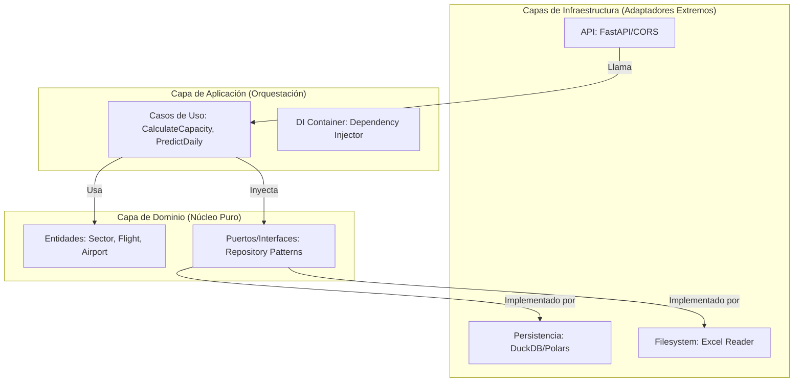

# Arquitectura Hexagonal y Limpia (Deep Dive)

Este sistema adopta un enfoque de **Arquitectura de Puertos y Adaptadores** (Hexagonal) fusionado con principios de **Arquitectura de Cebolla** (Onion Architecture). Esta sección detalla la fundamentación teórica, técnica y matemática de por qué el sistema está estructurado de esta manera.

---

## 🏛️ 1. Fundamentación Teórica: El Hexágono de Cockburn

Propuesto por **Alistair Cockburn** en 2005, el objetivo de esta arquitectura es permitir que una aplicación sea igualmente gobernada por usuarios, programas, pruebas automatizadas o scripts, y que sea desarrollada y probada de forma aislada de sus dispositivos de ejecución y bases de datos eventuales.

### 📐 El Principio de Inversión de Dependencias (DIP)
El pilar matemático/lógico de nuestra arquitectura es el **DIP** (la 'D' en SOLID):
> "Las dependencias deben dirigirse hacia las abstracciones, no hacia las concreciones."

En este proyecto, esto se traduce en que la **Capa de Aplicación** no depende de `DuckDB`, sino de una **Interfaz (Puerto)** definida en la **Capa de Dominio**.

---

## 🌀 2. Visualización: El Diagrama de Cebolla (Onion Architecture)

Este diagrama representa la jerarquía de estabilidad del código. Las capas más internas son las más estables y puras (Dominio), mientras que las externas son volátiles y cambiantes (Infraestructura).

### 🔍 Análisis Detallado: Niveles de Abstracción
- **Explicación del Gráfico**: Representa la "Cebolla" donde las dependencias solo pueden apuntar hacia adentro.
- **Capas (de afuera hacia adentro)**:
    1.  **Infraestructura (Volátil)**: Aquí viven los frameworks (`FastAPI`) y drivers (`DuckDB`). Si cambia la base de datos, solo esta capa se entera.
    2.  **Aplicación (Orquestación)**: Contiene los Casos de Uso (`UC`) que coordinan las tareas. No sabe de SQL ni de HTTP.
    3.  **Dominio (Estable)**: El núcleo del sistema. Contiene las Entidades (`ENT`) y las definiciones de Puertos (`PORTS`). Es la verdad absoluta del negocio.
- **Regla de Oro**: `API` depende de `UC`, `UC` depende de `ENT`. Nunca al revés.
- **Referencias a Código**:
    - **Nivel Extremo**: [`src/infrastructure/`](file:///c:/Users/LENOVO/Documents/tesis/src/infrastructure/)
    - **Nivel Medio**: [`src/application/`](file:///c:/Users/LENOVO/Documents/tesis/src/application/)
    - **Nivel Núcleo**: [`src/domain/`](file:///c:/Users/LENOVO/Documents/tesis/src/domain/)

---

## ⚓ 3. Puertos y Adaptadores: Mapeo de Código

### ¿Qué es un Puerto? (The Interface)
Es un contrato definido en el Dominio. 
- **Código**: [`src/domain/ports/metric_repository.py`](file:///c:/Users/LENOVO/Documents/tesis/src/domain/ports/metric_repository.py) (Asumiendo estructura estándar).
- **Teoría**: Define **qué** se puede hacer (ej. `get_flights()`) sin decir **cómo**.

### ¿Qué es un Adaptador? (The Implementation)
Es el detalle técnico que reside en la periferia.
- **Entrada (Primary)**: [`src/infrastructure/controllers/`](file:///c:/Users/LENOVO/Documents/tesis/src/infrastructure/controllers/) - FastAPI traduce HTTP a Casos de Uso.
- **Salida (Secondary)**: [`src/infrastructure/adapters/duckdb_repository.py`](file:///c:/Users/LENOVO/Documents/tesis/src/infrastructure/adapters/duckdb_repository.py) - Implementa el puerto del dominio usando SQL específico de DuckDB.

---

## 📂 4. Mapeo de Estructura de Directorios

| Directorio | Capa Arquitectónica | Responsabilidad Técnica |
| :--- | :--- | :--- |
| `src/domain/` | **Dominio** | Entidades de negocio puras y definiciones de interfaces (Puertos). |
| `src/application/` | **Aplicación** | Lógica de orquestación, DTOs de transferencia y Casos de Uso. |
| `src/infrastructure/` | **Infraestructura** | Implementación de bases de datos, APIs, configuración y ETL. |
| `web/` | **Presentación** | Interfaz de usuario reactiva (React/Vite). |

---

## 🔄 5. Flujo de Datos y Control (Sequence Flow)

Cuando el sistema procesa una consulta de **Capacidad de Sector**:

1.  **Capa Infra (Controller)**: Captura el `sector_id` de la URL.
2.  **Capa Aplicación (DI Container)**: Inyecta el adaptador `DuckDBMetricRepository` en el caso de uso `CalculateSectorCapacity`.
3.  **Capa Aplicación (Use Case)**: Aplica la matemática de la **Circular 006** llamando a los métodos del puerto.
4.  **Capa Dominio (Port)**: El puerto actúa como un puente ciego hacia la base de datos real.
5.  **Capa Infra (Adapter)**: DuckDB ejecuta la agregación OLAP y devuelve los datos planos al Caso de Uso.

---

## 📚 6. Fundamentación Bibliográfica

Para el diseño de esta arquitectura se utilizaron los siguientes referentes:

1.  **Cockburn, A. (2005)**. *Hexagonal Architecture (Ports and Adapters)*. [Publicación original que define el patrón].
2.  **Martin, R. C. (2017)**. *Clean Architecture: A Craftsman's Guide to Software Structure and Design*. Prentice Hall. [Base para la separación de capas y la Regla de Dependencia].
3.  **Evans, E. (2003)**. *Domain-Driven Design: Tackling Complexity in the Heart of Software*. Addison-Wesley. [Definición de entidades y servicios de dominio].
4.  **Palermo, J. (2008)**. *The Onion Architecture*. [Variación que enfatiza el dominio como centro del sistema].

---

> [!CAUTION]
> **Violación de Capas**: Importar `duckdb` o `fastapi` dentro de la carpeta `src/domain` o `src/application` es un error arquitectónico grave que rompe la testabilidad y el aislamiento del sistema.
