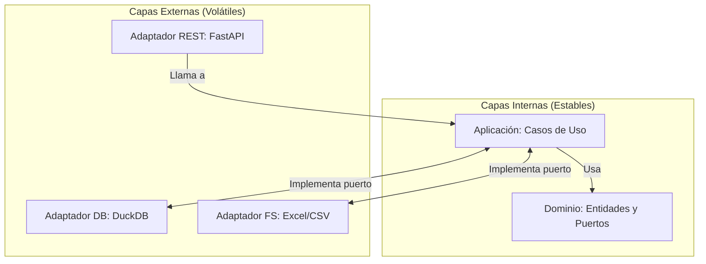

# Arquitectura Hexagonal (Puertos y Adaptadores)

Este proyecto implementa los principios de **Arquitectura Hexagonal**, una aproximación de diseño de software que facilita el aislamiento de las reglas de negocio del sistema de las herramientas y tecnologías externas.

## 📐 El Objetivo del "Hexágono"
El núcleo del sistema (Dominio + Aplicación) no debe saber nada de la base de datos, del servidor web o del sistema de archivos. Esto nos permite:
1. **Testabilidad**: Probar la lógica de predicción sin encender una base de datos.
2. **Flexibilidad**: Cambiar de DuckDB a PostgreSQL, o de FastAPI a Flask, sin tocar una sola línea de lógica de negocio.
3. **Mantenibilidad**: Las capas están desacopladas, lo que reduce los efectos colaterales.

---

## 📋 3.6.1 Requerimientos del Sistema

Para el desarrollo del sistema de gestión de capacidad ATC, se han definido los siguientes requerimientos basados en las necesidades operativas de la Aerocivil:

### Requerimientos Funcionales (RF)
| ID | Requerimiento | Descripción |
|---|---|---|
| **RF01** | Ingesta de Datos | El sistema debe permitir la carga masiva de archivos SRS en formato .xlsx/csv. |
| **RF02** | Cálculo Circular 006 | Implementación automática de las fórmulas de SCV y CH según normativa. |
| **RF03** | Parámetros Manuales | Permitir al controlador ajustar factores técnicos (TFC, R, Carga Mental). |
| **RF04** | Predicción de Demanda | Generar pronósticos diarios de carga de trabajo mediante modelos de ML. |
| **RF05** | Análisis Estacional | Identificar tendencias interanuales mediante análisis de Fourier. |
| **RF06** | Alertas de Saturación | Notificar visualmente cuando la demanda excede la capacidad declarada. |

### Requerimientos No Funcionales (RNF)
- **RNF01 (Modularidad)**: Uso de Arquitectura Hexagonal para desacoplar el núcleo del negocio.
- **RNF02 (Rendimiento)**: Procesamiento de >100k registros en menos de 5 segundos (Polars).
- **RNF03 (Escalabilidad)**: Capacidad de añadir nuevos modelos predictivos sin alterar la base de datos.
- **RNF04 (Usabilidad)**: Interfaz responsiva con visualizaciones dinámicas (ApexCharts).

---

## 🤝 3.6.4 Diagrama de Colaboración

Este diagrama ilustra cómo los diferentes adaptadores de infraestructura colaboran para cumplir con un caso de uso (Ej: Ingesta de Datos).

```mermaid
graph LR
    User((Usuario)) -- 1. Carga Archivo --> UI["Web UI (React)"]
    UI -- 2. POST /upload --> API["API Controller (FastAPI)"]
    
    subgraph "Colaboración Capa Infraestructura"
        API -- 3. Valida --> FS["Filesystem Adaptador"]
        FS -- 4. Lee Stream --> Polars["Polars Engine"]
        Polars -- 5. Transforma --> DuckDB["DuckDB Adaptador"]
        DuckDB -- 6. Persiste --> Disk[(metrics.duckdb)]
    end
    
    DuckDB -. 7. Notifica Éxito .-> API
    API -. 8. Responde 200 .-> UI
```

---

## 🏗️ Estructura de Capas

### 1. El Núcleo: Domain
**Ubicación**: [`src/domain/`](domain.md)
Es la capa más interna. Contiene las entidades y las interfaces (puertos). Nada fuera del hexágono puede afectar al dominio.

### 2. La Orquestación: Application
**Ubicación**: [`src/application/`](application.md)
Define los servicios y casos de uso. Aquí es donde se "conectan" los puertos con la lógica de negocio.

### 3. El Mundo Exterior: Infrastructure
**Ubicación**: [`src/infrastructure/`](infrastructure.md)
Contiene los adaptadores. Es donde se implementan los detalles técnicos (DuckDB, FastAPI, Polars).

---

## ⚓ Puertos y Adaptadores: Cómo Interactúan

Un **Puerto** es una definición de lo que el sistema necesita (ej. "Necesito guardar un aeropuerto"). Un **Adaptador** es la pieza que sabe cómo hacerlo (ej. "Yo sé guardar aeropuertos en DuckDB").



## 🔄 Flujo de una Petición

Cuando un usuario presiona "Calcular Capacidad" en el frontend:
1. **Entrada**: El controlador `sectors_controller.py` (Adaptador) recibe la petición HTTP.
2. **Transformación**: Convierte el JSON a un DTO de aplicación.
3. **Ejecución**: Llama al caso de uso `CalculateSectorCapacity.execute()`.
4. **Dominio**: El caso de uso utiliza las reglas de negocio definidas en el dominio.
5. **Persistencia**: El caso de uso pide datos al puerto `AirportRepository`, el cual es ejecutado por el adaptador `DuckDBAirportRepository`.
6. **Respuesta**: El resultado viaja de vuelta hasta convertirse en JSON para el frontend.

---

> [!TIP]
> **Regla de Oro**: Las dependencias siempre apuntan hacia adentro. El código de `src/infrastructure` puede importar código de `src/domain`, pero el código de `src/domain` **jamás** debe importar nada de `src/infrastructure`.
