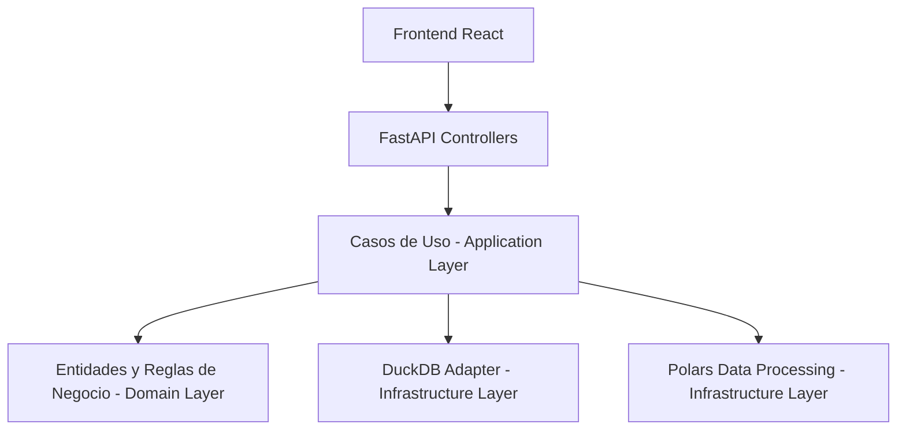

# Arquitectura del Sistema

El proyecto sigue los principios de **Arquitectura Hexagonal** (Puertos y Adaptadores) para asegurar la escalabilidad, testabilidad e independencia de tecnologías externas.

## 🏗️ Diagrama de Componentes

## 🔵 Capas

### 1. Domain (Dominio)
Contiene las entidades de negocio (como `Metric` o `Sector`) y las interfaces de los repositorios. Es el núcleo del sistema y no tiene dependencias externas.

### 2. Application (Aplicación)
Contiene los casos de uso que orquestan el flujo de datos. Aquí se inyectan las dependencias (Database, Ingestor) y se procesan los DTOs.

### 3. Infrastructure (Infraestructura)
Implementaciones concretas de los puertos de dominio. Incluye el acceso a DuckDB, el procesamiento masivo de datos con Polars y la configuración de API con FastAPI.
