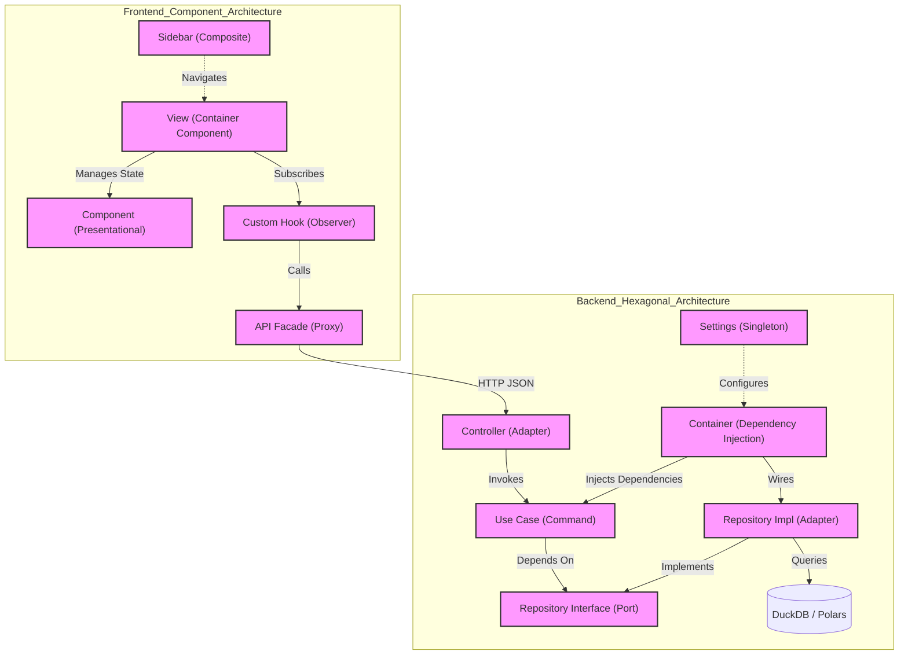

# 📄 Guía del Código: Explicación Archivo por Archivo

Este documento proporciona una referencia detallada de cada archivo individual presente en el proyecto, explicando su propósito técnico y su rol dentro de la arquitectura del sistema.

---

## 📂 1. Núcleo del Backend (`src/`)

El backend está construido bajo los principios de Arquitectura Hexagonal y se divide en tres capas principales: Dominio, Aplicación e Infraestructura.

### 🧩 1.1 Capa de Dominio (`src/domain/`)
*Verdadera lógica de negocio, independiente de tecnologías externas.*

| Archivo | Propósito Técnico |
| :--- | :--- |
| `entities/airport.py` | Entidad que representa un aeropuerto con su código ICAO y coordenadas. |
| `entities/file_info.py` | Entidad para el seguimiento del estado de procesamiento de archivos. |
| `entities/region.py` | Entidad para agrupar aeropuertos en regiones administrativas. |
| `entities/region_airport.py` | Entidad de relación entre regiones y aeropuertos. |
| `entities/sector.py` | Entidad que define la lógica de un sector (par o-d). |
| `ports/airport_repository.py` | Interfaz (Puerto) para el acceso a datos de aeropuertos. |
| `ports/file_repository.py` | Interfaz para la gestión del repositorio de archivos. |
| `ports/region_repository.py` | Interfaz para la gestión de datos de regiones. |
| `ports/region_airport_repository.py` | Interfaz para la relación región-aeropuerto. |
| `repositories/metric_repository.py` | Puerto principal para la obtención de métricas de vuelos. |
| `value_objects/date_range.py` | Objeto de valor inmutable para rangos de fechas con validación. |

### 🧠 1.2 Capa de Aplicación (`src/application/`)
*Orquestación de casos de uso e inyección de dependencias.*

| Archivo | Propósito Técnico |
| :--- | :--- |
| `di/container.py` | Contenedor de Inyección de Dependencias (Dependency Injector). |
| `dtos/metric_dto.py` | Objetos de Transferencia de Datos para reportes de métricas. |
| `use_cases/calculate_sector_capacity.py` | Lógica central del cálculo de capacidad (Circular 006). |
| `use_cases/ingest_flights_data.py` | Orquestador del proceso ETL de ingesta masiva. |
| `use_cases/predict_daily_demand.py` | Pipeline de predicción de demanda diaria (ML). |
| `use_cases/predict_seasonal_trend.py` | Cálculo de tendencias estacionales mediante Fourier. |
| `use_cases/predict_sector_saturation.py` | Lógica de detección de colisión demanda vs capacidad. |
| `use_cases/manage_sectors.py` | CRUD y lógica de administración de sectores. |
| `use_cases/manage_airports.py` | Gestión de catálogos de aeropuertos. |
| `use_cases/manage_regions.py` | Gestión de catálogos de regiones. |

### ⚡ 1.3 Capa de Infraestructura (`src/infrastructure/`)
*Implementaciones técnicas, adaptadores y configuración.*

| Archivo | Propósito Técnico |
| :--- | :--- |
| `adapters/database/duckdb_repository.py` | Implementación del repositorio de métricas usando DuckDB. |
| `adapters/duckdb_airport_repository.py` | Adaptador para persistencia de aeropuertos. |
| `adapters/polars/polars_data_source.py` | Motor de procesamiento paralelo usando Polars. |
| `adapters/api/metrics_controller.py` | Endpoints REST para el cálculo de capacidad. |
| `adapters/api/etl_controller.py` | Endpoints para la gestión de ingesta y archivos. |
| `adapters/api/sectors_controller.py` | Endpoints para la administración de sectores. |
| `config/settings.py` | Gestión de variables de entorno y rutas del sistema. |
| `api_server.py` | Punto de entrada del servidor FastAPI. |

---

## ⚛️ 2. Interfaz de Usuario (`web/`)

Frontend desarrollado en React v18+ y TypeScript, optimizado para visualización de datos.

### 🖼️ 2.1 Vistas Principales (`web/src/views/`)
*Contenedores de alto nivel para cada sección de la App.*

| Archivo | Propósito Técnico |
| :--- | :--- |
| `DashboardView.tsx` | Panel principal con resumenes ejecutivos. |
| `CapacityReportView.tsx` | Vista detallada para la generación de reportes de capacidad. |
| `PredictionsView.tsx` | Interfaz interactiva para el motor de IA. |
| `SectorConfigurationView.tsx`| Pantalla de administración de parámetros de sectores. |
| `FilesView.tsx` | Centro de gestión y carga de archivos SRS. |

### 📊 2.2 Componentes Analíticos (`web/src/components/`)
*Módulos reutilizables de visualización y lógica UI.*

| Archivo | Propósito Técnico |
| :--- | :--- |
| `SectorSaturationChart.tsx` | Gráfico dinámico de capacidad vs demanda proyectada. |
| `DailyDemandChart.tsx` | Visualización de series temporales con intervalos de confianza. |
| `SeasonalTrendChart.tsx` | Gráfico de descomposición estacional (Fourier). |
| `DestinationsTreemap.tsx` | Visualización jerárquica de tráficos por destino. |
| `layout/Sidebar.tsx` | Navegación principal con iconos Lucide. |

---

## 🛠️ 3. Herramientas y Configuración de Raíz

Archivos esenciales para el ciclo de vida del desarrollo y despliegue.

| Archivo | Propósito Técnico |
| :--- | :--- |
| `main.py` | Lanzador principal del sistema (Backend). |
| `build.spec` | Configuración de PyInstaller para la creación del ejecutable (.exe). |
| `requirements.txt` | Lista de dependencias de Python para el entorno virtual. |
| `package.json` | Gestión de scripts y dependencias del frontend (npm). |
| `mkdocs.yml` | Configuración del sitio de documentación técnica. |
| `vite.config.ts` | Configuración del motor de construcción y desarrollo del frontend. |
| `tsconfig.json` | Reglas de tipado y compilación de TypeScript. |

---

## 📂 4. Directorios de Datos

| Directorio | Contenido |
| :--- | :--- |
| `data/raw/` | Almacenamiento temporal de archivos subidos por el usuario. |
| `data/metrics.duckdb` | Base de datos principal (OLAP) del sistema. |
| `docs/` | Archivos fuente (`.md`) de la documentación técnica. |

---

> [!NOTE]
> Cada archivo individual ha sido diseñado para seguir el principio de **Responsabilidad Única (SRP)**. Si un archivo crece excesivamente en líneas de código, considere su refactorización en componentes más pequeños dentro de su respectiva capa.

## 🔍 5. Análisis Detallado: Librerías e Importaciones (Deep Dive)

Este apartado detalla la relación entre el código del proyecto y sus dependencias externas, mapeando métodos específicos y su utilidad operativa.

### 🐍 5.1 Capa de Inteligencia y Persistencia (Backend)

#### 🧬 Motor Predictivo (`src/application/use_cases/predict_daily_demand.py`)
| Librería | Propósito Técnico | Métodos / Implementaciones |
| :--- | :--- | :--- |
| **duckdb** | Persistencia OLAP. | `connect()` para sesión in-process; `fetchdf()` para inyectar datos directamente a buffers de Pandas. |
| **pandas** | Estructuración de series. | `pd.to_datetime()`, `date_range()`, `reindex()` para normalización de fechas faltantes. |
| **numpy** | Cálculo estadístico. | `np.mean()`, `np.std()` para el intervalo de confianza del 95% en proyecciones. |
| **scikit-learn** | Regresión por ensamble. | `RandomForestRegressor(n_estimators=100)` para proyecciones recursivas; `predict()`. |

#### 🏎️ Motor ETL (`src/infrastructure/adapters/polars/polars_data_source.py`)
| Librería | Propósito Técnico | Métodos / Implementaciones |
| :--- | :--- | :--- |
| **polars** | Procesamiento paralelo. | `scan_csv()`, `scan_parquet()` (Lazy API); `group_by().agg()` para agregaciones masivas. |
| **pathlib** | Multiproveedor de rutas. | `Path.suffix`, `Path.stat().st_size` para validación de extensiones y metadatos de archivos. |
| **uuid** | Integridad referencial. | `uuid4()` para generar SIDs únicos en la ingesta de vuelos SRS. |

#### 🌐 Capa API (`src/infrastructure/adapters/api/predictive_controller.py`)
| Librería | Propósito Técnico | Métodos / Implementaciones |
| :--- | :--- | :--- |
| **fastapi** | Framework de servicios. | `APIRouter` para segmentación de rutas; `Depends` para Inyección de Dependencias (DI). |
| **pydantic** | Validación de tipos. | Implementado a través de `dtos/metric_dto.py` para asegurar integridad de respuestas JSON. |

---

### ⚛️ 5.2 Capa de Visualización y Experiencia (Frontend)

#### 📊 Gráficos Proyectivos (`web/src/components/SectorSaturationChart.tsx`)
| Librería | Propósito Técnico | Métodos / Implementaciones |
| :--- | :--- | :--- |
| **React** | Lógica de componentes. | `useEffect()` coordinado con filtros; `useState()` para manejo de series temporales dinámicas. |
| **apexcharts** | Motor de Renderizado. | `type: 'line'` + `type: 'column'` (Ejes Duales); `annotations` para límites críticos (80%/100%). |
| **lucide-react** | Semántica Visual. | Uso de iconos para representar estados de salud de la predicción (Alerta, Ok). |

#### 📡 Comunicación (`web/src/api/index.ts`)
| Librería | Propósito Técnico | Métodos / Implementaciones |
| :--- | :--- | :--- |
| **axios** | Cliente de red REST. | `axios.create()` con redundancia y manejo de tiempos de espera para cálculos pesados. |

---

### 🏛️ 5.3 Estructura de Datos (Domain Entities)

| Archivo | Librería Base | Uso Específico |
| :--- | :--- | :--- |
| `entities/airport.py` | `pydantic` | `BaseModel` para validación de códigos IATA/ICAO mediante expresiones regulares. |
| `value_objects/date_range.py` | `datetime` | `timedelta` para cálculos de ventanas de tiempo deslizantes en la ingesta. |

---

> [!IMPORTANT]
> **Sinergia Técnica**: El sistema está diseñado para que el **90% del procesamiento pesado** (ML y ETL) ocurra en la infraestructura (DuckDB/Polars), permitiendo que la capa de **Aplicación** se mantenga pura y la capa de **Frontend** se enfoque exclusivamente en la visualización reactiva de alta fidelidad.

## 🧪 6. Análisis de Parámetros y Argumentos (Deep Parameter)

Este nivel de detalle explica cada variable de entrada en las funciones críticas, incluyendo aquellas delegadas a librerías de terceros.

### 🐍 6.1 Parámetros del Backend (Python)

#### `PredictDailyDemand.execute()`
| Parámetro | Tipo | Valor Defecto | Descripción |
| :--- | :--- | :--- | :--- |
| `days_ahead` | `int` | `30` | Horizonte temporal de la proyección. Usado para generar el `date_range` de salida. |
| `sector_id` | `str` | `None` | UUID del sector. Gatilla una subconsulta SQL para filtrar por polígonos O-D. |
| `airport` | `str` | `None` | Código ICAO. Filtra registros donde sea Origen **OR** Destino. |
| `min_level` | `int` | `None` | Altitud mínima. Traducido a condición `nivel >= ?` en DuckDB. |
| `start_date` / `end_date`| `str` | `None` | Activan el modo **Estacional**. Requieren formato `YYYY-MM-DD`. |

#### `RandomForestRegressor` (Delegación scikit-learn)
*Argumentos implementados en `PredictDailyDemand`:*
- `n_estimators=100`: Define la creación de 100 árboles de decisión independientes para reducir la varianza.
- `random_state=42`: Semilla de aleatoriedad para asegurar resultados reproducibles en cada ejecución.

---

### ⚡ 6.2 Parámetros de Infraestructura y ETL

#### `PolarsDataSource.aggregate_metrics()`
| Parámetro | Tipo | Descripción |
| :--- | :--- | :--- |
| `file_paths` | `List[Path]` | Lista de objetos Path. Soporta mezcla de `.csv` y `.parquet`. |
| `group_by` | `List[str]` | Dimensiones de agregación (ej. `['origen', 'destino']`). |

#### `pl.scan_csv()` (Delegación Polars)
- `csv_paths`: Lista de strings. Polars procesa estos archivos en paralelo usando su motor de *query planning*.

---

### ⚛️ 6.3 Parámetros del Frontend (TypeScript)

#### `getAirports(page, pageSize, search)`
| Parámetro | Tipo | Valor Defecto | Descripción |
| :--- | :--- | :--- | :--- |
| `page` | `number` | `1` | Índice de página para la paginación del backend. |
| `pageSize` | `number` | `10` | Cantidad de registros por petición. |
| `search` | `string` | `""` | Texto para filtrado dinámico en la tabla de aeropuertos. |

#### `axios.create(config)` (Delegación Axios)
- `baseURL`: `http://localhost:8000`. Define el punto de anclaje para todas las llamadas asíncronas.

---

---

> [!TIP]
> **Tipado Estricto**: El uso de **TypeScript** en el frontend y **Type Hints** en Python asegura que los parámetros pasados entre capas mantengan su integridad, reduciendo errores de *Runtime* en los cálculos matemáticos complejos.

## 🏛️ 7. Catálogo de Patrones de Diseño (Architectural Patterns)

A continuación, se presenta la cartografía arquitectónica del proyecto, identificando el **Patrón de Diseño predominante** en cada módulo y la justificación técnica de su implementación.

### 🧠 7.1 Backend (Python) - Arquitectura Hexagonal

| Archivo / Directorio | Patrón de Diseño | Justificación Técnica |
| :--- | :--- | :--- |
| **`src/application/di/container.py`** | **Dependency Injection (DI)** | Centraliza la creación de objetos, desacoplando la instanciación del uso. Permite cambiar implementaciones (ej. DuckDB a PostgreSQL) sin tocar el código de negocio. |
| **`src/domain/repositories/*.py`** | **Repository Interface (Port)** | Define contratos abstractos (`ABC`) que la infraestructura debe cumplir. Es el núcleo de la Inversión de Dependencias (DIP). |
| **`src/infrastructure/adapters/database/*.py`** | **Repository Implementation (Adapter)** | Implementación concreta de la persistencia. Encapsula las consultas SQL (DuckDB) ocultándolas del dominio. |
| **`src/application/use_cases/*.py`** | **Command / Use Case** | Cada clase encapsula una única regla de negocio o intención del usuario (SRP). Sigue el patrón `Execute Method`. |
| **`src/infrastructure/adapters/api/*.py`** | **Controller / Adapter** | Adaptadores de entrada (Primary Adapters) que transforman peticiones HTTP (FastAPI) en llamadas a Casos de Uso. |
| **`src/infrastructure/config/settings.py`** | **Singleton** | Garantiza una única instancia de configuración para toda la vida de la aplicación. |
| **`src/application/use_cases/predict_*.py`** | **Strategy (Implícito)** | Los distintos predictores actúan como estrategias intercambiables para resolver problemas de inferencia específicos. |

### ⚛️ 7.2 Frontend (React) - Component Based Architecture

| Archivo / Componente | Patrón de Diseño | Justificación Técnica |
| :--- | :--- | :--- |
| **`web/src/api.ts`** | **Facade / Proxy** | Provee una interfaz simplificada y unificada para todas las llamadas de red, ocultando la complejidad de Axios y URLs base. |
| **`web/src/views/*.tsx`** | **Container Component** | Gestionan el estado de la página, orquestan llamadas a la API y pasan datos a los componentes de presentación. No contienen estilos complejos. |
| **`web/src/components/*.tsx`** | **Presentational Component** | Se enfocan puramente en cómo se ven los datos (`UI`). Reciben datos vía `props` y emiten eventos. |
| **`Sidebar.tsx`** | **Composite / Recursion** | Utiliza una estructura recursiva para renderizar menús anidados de profundidad variable. |
| **`UseEffect` (en todas las vistas)** | **Observer / Subscription** | Observa cambios en filtros o estados (`[filters]`) y reacciona disparando efectos secundarios (recarga de datos). |
| **`web/src/hooks/*` (Lógica interna)** | **Custom Hook** | (Aunque implementado inline en Vistas) La lógica de `fetchData` encapsula el manejo de estado asíncrono y errores. |

### 📐 7.3 Patrones Transversales

- **Inversión de Control (IoC)**: El `container.py` controla el flujo de dependencias en todo el backend.
- **Data Transfer Object (DTO)**: Implícito en el uso de modelos Pydantic y Interfaces TypeScript para validar el intercambio de datos entre capas.
- **Fail-Fast**: Validaciones tempranas en los constructores y métodos `execute` (ej. `if not sector: raise ValueError`).

### 🗺️ 7.4 Mapa Visual de Patrones

---
