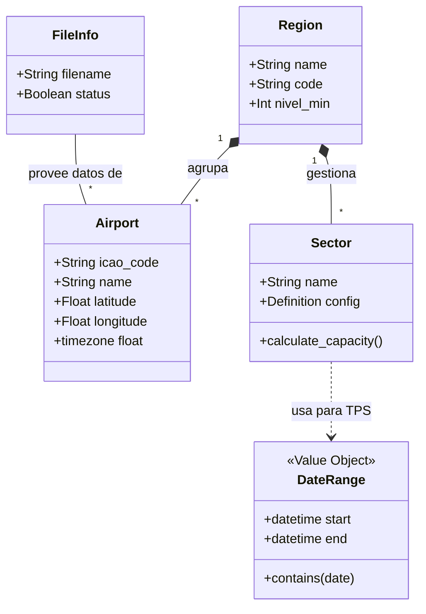

# Capa de Dominio: El Corazón del Negocio (Deep Dive)

La capa de dominio es el núcleo de nuestro sistema, diseñada bajo los principios de **Domain-Driven Design (DDD)**. Aquí residen las reglas de negocio más puras, aisladas de cualquier preocupación técnica periférica.

---

## 🏛️ 1. Fundamentos Teóricos: Domain-Driven Design (DDD)

A diferencia de las arquitecturas tradicionales centradas en los datos (Data-Centric), este sistema se centra en el **Modelo de Dominio**. Según **Eric Evans (2003)**, el dominio es el área de conocimiento y actividad alrededor de la cual gira el software.

### 🧩 Elementos del Bloque de Construcción del Dominio:
1.  **Entidades (Entities)**: Objetos que poseen una identidad única que trasciende sus atributos (ej: un Aeropuerto sigue siendo el mismo aunque cambie su nombre, mientras conserve su código OACI).
2.  **Objetos de Valor (Value Objects)**: Objetos descriptivos sin identidad intrínseca. Son inmutables.
3.  **Puertos (Ports)**: Definiciones abstractas de interfaces que permiten al dominio comunicarse con el exterior sin conocer los detalles de implementación.

---

## 🧩 2. Entidades de Espacio Aéreo (Entities)

Ubicación: [`src/domain/entities/`](file:///c:/Users/LENOVO/Documents/tesis/src/domain/entities/)

### ✈️ 2.1 Airport
La entidad [`Airport`](file:///c:/Users/LENOVO/Documents/tesis/src/domain/entities/airport.py) es la piedra angular del sistema. 

- **Atributos Técnicos**: 
    - `icao_code`: Identificador único de 4 caracteres según el estándar de la Organización de Aviación Civil Internacional (OACI).
    - `latitude/longitude`: Coordenadas en formato decimal para cálculos de geofencing y trayectorias.
- **Teoría de Identidad**: Su identidad está ligada al `icao_code`. El sistema utiliza este código para normalizar datos provenientes de diferentes fuentes (OurAirports vs SRS).

### 🗺️ 2.2 Region
La entidad [`Region`](file:///c:/Users/LENOVO/Documents/tesis/src/domain/entities/region.py) representa una unidad administrativa aeronáutica (ej: un FIR - Flight Information Region).

- **Lógica de Agregación**: Permite agrupar aeropuertos para el cálculo de métricas agregadas por zona de control.
- **Atributo `nivel_min`**: Define el piso operacional para el análisis de vuelos dentro de su jurisdicción, filtrando datos de baja altitud no relevantes para el control de área.

---

## 💎 3. Objetos de Valor (Value Objects)

Ubicación: [`src/domain/value_objects/`](file:///c:/Users/LENOVO/Documents/tesis/src/domain/value_objects/)

### 📅 3.1 DateRange
[`DateRange`](file:///c:/Users/LENOVO/Documents/tesis/src/domain/value_objects/date_range.py) es un objeto de valor inmutable que garantiza la integridad de cualquier consulta temporal.

- **Invariante Matemática**: `start_date <= end_date`. El constructor lanza un `ValueError` si esta condición se viola, asegurando que ningún caso de uso opere con rangos inválidos.
- **Inmutabilidad**: Al ser un dataclass con `frozen=True`, garantizamos que una vez creado, su estado no cambie, evitando efectos colaterales en hilos paralelos de procesamiento.

---

## � 4. Diagrama de Estructura de Dominio (Extendido)

### 🔍 Análisis Detallado: Estructura del Dominio
- **Explicación del Gráfico**: Muestra las relaciones estáticas entre las Entidades de Negocio (diagrama de clases UML simplificado).
- **Semántica de Relaciones**:
    - **Composición (`*--`)**: Una `Region` *se compone de* múltiples `Airports`. Si la región desaparece, la asignación pierde sentido.
    - **Dependencia (`..>`)**: El `Sector` *usa* `DateRange` para delimitar temporalmente sus cálculos de TPS.
    - **Asociación (`--`)**: `FileInfo` *conoce* qué aeropuertos contiene un archivo SRS procesado.
- **Atributos Clave**:
    - `Sector.config`: Objeto complejo JSON con la geometría del polígono.
    - `Airport.timezone`: Crucial para la normalización de horas UTC vs Locales.
- **Referencias de Código**:
    - Entidades Puras: [`src/domain/entities/`](file:///c:/Users/LENOVO/Documents/tesis/src/domain/entities/)
    - Value Objects: [`src/domain/value_objects/`](file:///c:/Users/LENOVO/Documents/tesis/src/domain/value_objects/)

---

## ⚓ 5. Puertos: La Definición del Contrato

Ubicación: [`src/domain/ports/`](file:///c:/Users/LENOVO/Documents/tesis/src/domain/ports/)

Los puertos definen **qué** necesita el dominio para funcionar, sin importar **cómo** se implemente.

- **`AirportRepository`**: Define métodos como `get_by_icao()` y `get_paginated()`. Esto permite que el sistema use DuckDB hoy, pero pueda migrar a una API REST externa mañana sin cambiar el código de dominio.
- **`MetricRepository`**: Centraliza el acceso a los datos de vuelos para cálculos de capacidad.

---

## 📚 6. Fundamentación Técnica y Bibliografía

1.  **Evans, E. (2003)**. *Domain-Driven Design: Tackling Complexity in the Heart of Software*. Addison-Wesley. [Texto fundamental sobre la segregación de lógica de dominio].
2.  **Fowler, M. (2002)**. *Patterns of Enterprise Application Architecture*. Addison-Wesley. [Base para el patrón Repository y el uso de Value Objects].
3.  **OACI (ICAO)**. *Anexo 15: Servicios de Información Aeronáutica*. [Referencia para la estructura de códigos OACI y metadatos de aeropuertos].
4.  **Aerocivil Colombia**. *Manual de Reglamentos Aeronáuticos de Colombia (RAC)*. [Base para la definición de regiones FIR y niveles mínimos de vuelo].

---

> [!CAUTION]
> **Pureza del Dominio**: Esta capa tiene **CERO** dependencias externas. No debe importar `fastapi`, `duckdb`, `pandas` ni ninguna librería que no sea estándar de Python (salvo Pydantic para validación de tipos).
