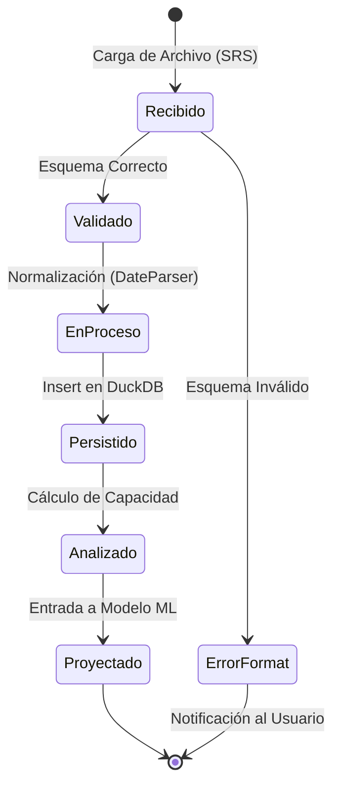
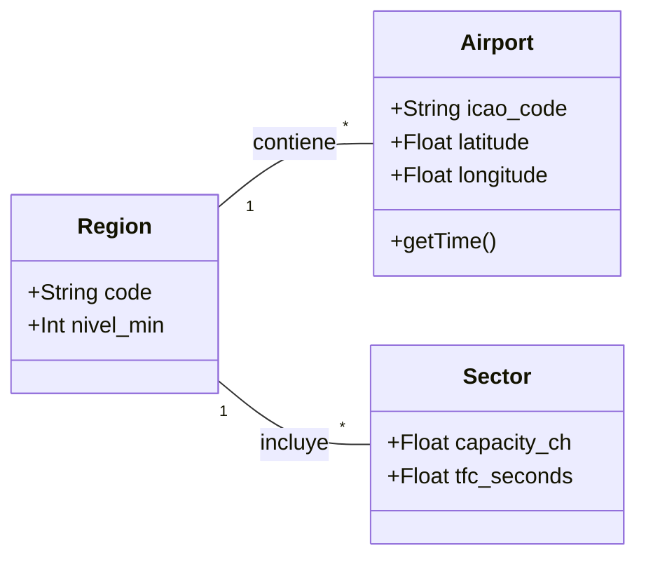

# Capa de Dominio (Domain Layer)

La capa de dominio es el núcleo de la **Arquitectura Hexagonal**. Contiene las reglas de negocio, entidades y definiciones de interfaces (puertos) que son independientes de cualquier tecnología externa (base de datos, UI, frameworks).

## 🧩 Entidades (Entities)

Las entidades representan los conceptos fundamentales del espacio aéreo y la operación.

### Airport
[`Airport`](file:///c:/Users/LENOVO/Documents/tesis/src/domain/entities/airport.py)
Representa una instalación aeroportuaria con sus atributos técnicos y geográficos.
- **Atributos Clave**: `icao_code`, `latitude`, `longitude`, `timezone`.
- **Uso**: Fundamental para el trazado de trayectorias y normalización de tiempos UTC.

### Region
[`Region`](file:///c:/Users/LENOVO/Documents/tesis/src/domain/entities/region.py)
Define una zona geográfica o administrativa aeronáutica.
- **Atributos Clave**: `code`, `nivel_min`.
- **Uso**: Agrupación lógica de aeropuertos y sectores para reportes regionales.

### Sector
*(Documentación pendiente de validación de archivo)*
Representa un sector de control de tráfico aéreo con sus capacidades teóricas y configuraciones de Circular 006.

---

## ⚓ Puertos (Ports / Interfaces)

Los puertos definen el "contrato" que la infraestructura debe cumplir. Utilizamos el patrón **Repository** para abstraer la persistencia.

### IAirportRepository
Definido en [`airport_repository.py`](file:///c:/Users/LENOVO/Documents/tesis/src/domain/ports/airport_repository.py).
Interfaz para la gestión de datos maestros de aeropuertos.

### IRegionRepository
Interfaz para el CRUD de regiones y zonas de control.

### IFileRepository
Interfaz para el seguimiento del estado de procesamiento de archivos (ETL).

---

## 🔄 3.6.3 Diagrama de Estados (Ciclo de Vida del Vuelo)

El siguiente diagrama describe los estados por los que transita la información de un vuelo dentro del motor analítico de la tesis.

---

## 📊 3.6.2 Diagrama de Dominio

> [!IMPORTANT]
> Ningún archivo en esta capa importa módulos de `application` o `infrastructure`. Esto garantiza que las reglas de negocio sean puras y fáciles de testear.
