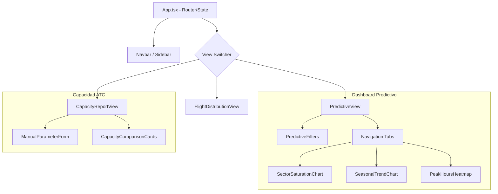

# Arquitectura Frontend (React & Visualización)

La interfaz de usuario está diseñada como una **Single Page Application (SPA)** reactiva, optimizada para la visualización de datos de alta frecuencia y análisis predictivo.

## 🌳 Jerarquía de Componentes

El sistema sigue un patrón de composición donde las vistas actúan como contenedores de estado y los componentes de bajo nivel son puramente representativos o autónomos en su fetching de datos.

## 🧠 Gestión de Estado y Datos

1. **Estado Local**: Se utiliza `useState` y `useEffect` para gestionar filtros y datos de gráficos.
2. **Debouncing**: Las búsquedas y filtros dinámicos (ej. autocompletado de aeropuertos) implementan retardos para optimizar las peticiones al backend.
3. **API Client**: Todas las comunicaciones se centralizan en [`api.ts`](file:///c:/Users/LENOVO/Documents/tesis/web/src/api.ts) usando **Axios**.

## 📊 Visualización Avanzada (ApexCharts)

Los componentes de gráficos en `web/src/components/` integran configuraciones avanzadas de ApexCharts:
- **SectorSaturationChart**: Implementa `annotations` para marcar los límites de alerta (80%) y crítica (100%).
- **PeakHoursHeatmap**: Utiliza esquemas de colores térmicos para identificar congestión horaria.
- **RegionsTreemap**: Implementa eventos de click para navegar entre dimensiones (Origen -> Destino).

## 🛠️ Estructura de Archivos

- `web/src/views/`: Contenedores de vistas principales.
- `web/src/components/`: Piezas reutilizables (Botones, Inputs, Cards).
- `web/src/components/charts/`: (Lógica de visualización específica).

---

> [!TIP]
> **React Best Practices**: Mantener los componentes de gráficos pequeños y desacoplados de la lógica de enrutamiento permite que sean reutilizados en diferentes dashboards con solo pasarles nuevos filtros.
