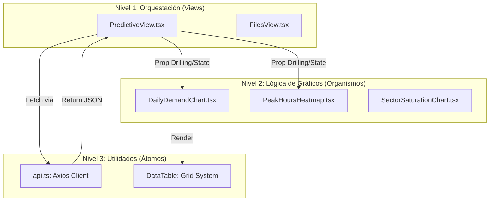

# Arquitectura Frontend: La Interfaz Reactiva (Deep Dive)

La interfaz de usuario del sistema ATC es una **Single Page Application (SPA)** construida con **React v18**, diseñada para la orquestación de flujos de datos complejos y la visualización analítica en tiempo real.

---

## 🏛️ 1. Fundamentación Teórica: El Paradigma Reactivo

El frontend se basa en la **Programación Declarativa** y el **Flujo de Datos Unidireccional** (One-Way Data Flow).

### 📐 Principios de Ingeniería UI Implementados:
1.  **Component-Based Architecture**: El sistema se divide en piezas autónomas y reutilizables.
2.  **Virtual DOM Reconciliation**: Optimiza el renderizado de gráficos pesados (ApexCharts) al actualizar solo los nodos que han cambiado de estado.
3.  **Atomic Design (Adaptado)**: 
    - **Átomos**: `Button`, `Input`, `Badge` (en `web/src/components/`).
    - **Organismos**: `DailyDemandChart`, `RegionsTreemap` (componentes complejos con lógica propia).
    - **Páginas (Templates)**: `Views` que orquestan el layout.

---

## 🌀 2. Visualización: Jerarquía de Componentes y Flujo de Datos

Este diagrama representa cómo fluye la información desde la persistencia (Backend) hasta la retina del usuario.

---

## 🧠 3. Gestión de Estado y Asincronía

### ⚡ Ciclo de Vida del Fetching
Para asegurar una UX fluida (Glassmorphism), el fetching de datos en componentes como [`PredictiveView.tsx`](file:///c:/Users/LENOVO/Documents/tesis/web/src/views/PredictiveView.tsx) sigue este patrón:
1.  **Estado inicial**: `isLoading = true`, `data = null`.
2.  **Sincronización**: `useEffect` dispara la llamada asíncrona a `api.getDailyDemand(filters)`.
3.  **Renderizado**: Se utiliza la técnica de **Conditional Rendering** para mostrar esqueletos de carga antes de pintar el componente final.

### 🛡️ Optimización de Rendimiento
- **Debounce de Filtros**: Se implementa un retardo en los inputs de búsqueda para evitar ráfagas de peticiones HTTP al backend mientras el usuario escribe.
- **Memoización**: Uso de `useMemo` en el procesamiento de series temporales antes de pasarlas a ApexCharts, evitando recalculos en cada re-renderizado.

---

## 📊 4. Mapeo Técnico de Vistas y Componentes

| Funcionalidad Visual | Archivo Principal | Capa Técnica | Integración API |
| :--- | :--- | :--- | :--- |
| Dashboard Predictivo | `PredictiveView.tsx` | View | `/predict/daily` |
| Gestión de Sectores | `SectorConfigurationView.tsx` | View | `/sectors/` |
| Gráfico de Demanda | `DailyDemandChart.tsx` | Organismo | Integrado en PrediciveView |
| Mapa Térmico (Picos) | `PeakHoursHeatmap.tsx` | Organismo | `/predict/peak-hours` |
| Listado de Archivos | `FilesView.tsx` | View | `/files/` |

---

## 📚 5. Fundamentación Bibliográfica y Referencias

1.  **Abramov, D.** *Thinking in React*. Facebook Open Source. [Referencia sobre la filosofía de componentes y estado].
2.  **Nielsen, J. (1994)**. *10 Usability Heuristics for User Interface Design*. [Base para el diseño de estados de carga y feedback de error].
3.  **React Docs**. *The Component Lifecycle*. [react.dev](https://react.dev).
4.  **ApexCharts Documentation**. *Visualizing Time Series Data with Annotations and Shaders*. [apexcharts.com](https://apexcharts.com).

---

> [!TIP]
> **React Best Practices**: El estado de los filtros se mantiene en la **View** y se pasa a los **Charts** vía props. Esto permite que los gráficos sean "tontos" (presentacionales) y fáciles de testear.
