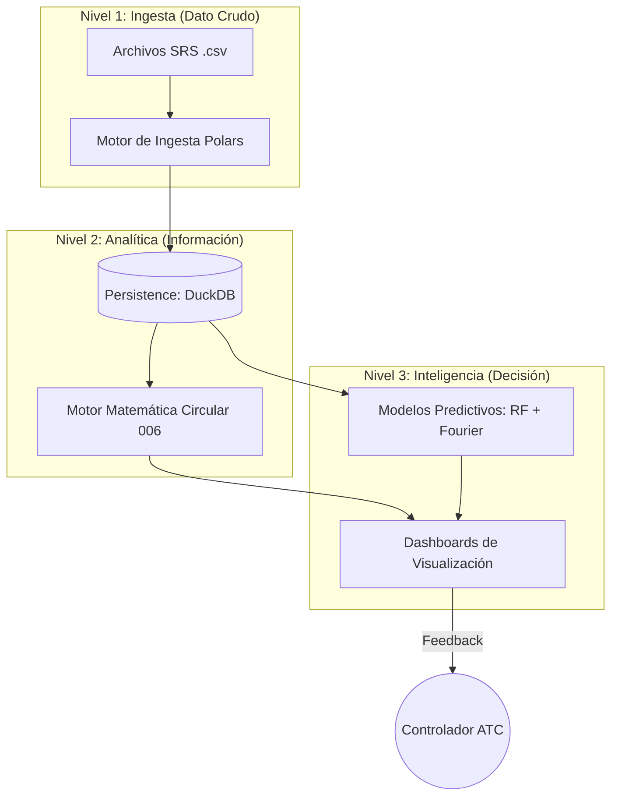

# ATC Capacity & Analytics: Technical Ecosystem

Este sistema representa una solución de ingeniería avanzada para la gestión y predicción de la capacidad en sectores de control de tráfico aéreo (ATC). Integra modelos matemáticos normativos con algoritmos de inteligencia artificial para transformar datos operativos en decisiones estratégicas.

---

## 🏛️ 1. Síntesis del Problema: Congestión y Capacidad

La gestión de la capacidad ATC es un problema de **Optimización de Recursos bajo Incertidumbre**. El reto técnico consiste en equilibrar la **Carga Mental del Controlador (Mental Workload)** con el flujo de vuelos, asegurando la seguridad operacional (Safety).

### 📐 Fundamentación Teórica
El sistema aborda el problema desde tres dimensiones:
1.  **Dimensión Normativa**: Ejecución de la **Circular 006 (UAEAC)** para definir la capacidad declarada.
2.  **Dimensión Estadística**: Análisis de distribución de vuelos históricos para identificar cuellos de botella.
3.  **Dimensión Predictiva**: Uso de Redes de Aprendizaje (Random Forest) y Análisis de Frecuencia (Fourier) para anticipar la saturación.

---

## 🌀 2. Mapa de Macro-Arquitectura (The Big Picture)

El flujo de valor del dato sigue el principio de **Single Source of Truth (SSoT)** mediado por una arquitectura de micro-servicios desacoplados.

### 🔍 Análisis Detallado: Flujo de Valor del Dato
- **Explicación del Gráfico**: Ilustra la metamorfosis del dato desde su estado crudo hasta convertirse en decisión estratégica.
- **Niveles de Transformación**:
    1.  **Nivel 1 (Ingesta)**: Archivos `.csv` de vigilancia radar (SRS) son procesados por [`polars`](https://pola.rs) para limpieza y tipado.
    2.  **Nivel 2 (Analítica)**: Los datos limpios residen en `DuckDB`. Aquí se aplica la **Circular 006** para calcular capacidades históricas.
    3.  **Nivel 3 (Inteligencia)**: Se entrenan modelos de ML con los históricos de DuckDB para proyectar escenarios futuros.
- **Interacción de Componentes**:
    - `SRS` -> [`Use Case: Ingest`](file:///c:/Users/LENOVO/Documents/tesis/src/application/use_cases/ingest_flights_data.py)
    - `C006` -> [`Use Case: Capacity`](file:///c:/Users/LENOVO/Documents/tesis/src/application/use_cases/calculate_sector_capacity.py)
    - `ML` -> [`Use Case: Prediction`](file:///c:/Users/LENOVO/Documents/tesis/src/application/use_cases/predict_daily_demand.py)

---

## 📂 3. Mapa de Navegación Técnica

| Manual | Objetivo Técnico | Audiencia |
| :--- | :--- | :--- |
| [📂 Arquitectura](architecture.md) | Principios de diseño Hexagonal y Clean Architecture. | Arquitectos de Software |
| [🧩 Dominio](domain.md) | Reglas de negocio puras, Entidades y Puertos. | Desarrolladores Senior |
| [🏗️ Infraestructura](infrastructure.md) | Implementación de DuckDB, Polars y FastAPI. | DevOPS y Data Engineers |
| [⚛️ Frontend](frontend.md) | React, ApexCharts y gestión de estado. | Frontend Developers |
| [📘 Manual Técnico Maestro](tech_manual.md) | Derivaciones matemáticas y lógica de ML. | Data Scientists / Tesistas |
| [📐 Project Blueprints](project_blueprints.md) | Especificaciones UML detalladas (Clases, Secuencia, Estados). | Arquitectos / Auditores |
| [📏 Fundamentos Teóricos](theoretical_basis.md) | Sustentación matemática y algorítmica (Fórmulas, Estadística, ML, Geometría). | Data Scientists / Tesistas |
| [📈 Análisis y Resultados](results_analysis.md) | Validación empírica, métricas de ML y discusión. | Directores de Tesis / Stakeholders |
| [📖 Glosario Técnico](technical_glossary.md) | Diccionario de acrónimos, símbolos y términos. | Todos los lectores |

---

## 📚 4. Fundamentación Bibliográfica de Gestión ATC

1.  **OACI (ICAO)**. *Doc 9689: Manual on Air Traffic Services (ATS) Capacity Management*. [Guía internacional para la gestión de capacidad].
2.  **FAA (Federal Aviation Administration)**. *Air Traffic Organization: Capacity Planning*. [Estándares de EE.UU. para la optimización de flujo aéreo].
3.  **UAEAC Colombia**. *Circular Informativa 006*. [Normativa local para el cálculo de capacidad de sectores].
4.  **Eurocontrol**. *Performance Review Report (PRR)*. [Análisis de eficiencia y capacidad en el espacio aéreo europeo].

---

> [!IMPORTANT]
> Esta documentación está diseñada para ser la **Fuente Definitiva de Verdad** técnica del proyecto, vinculando cada línea de código con su justificación académica y operativa.
