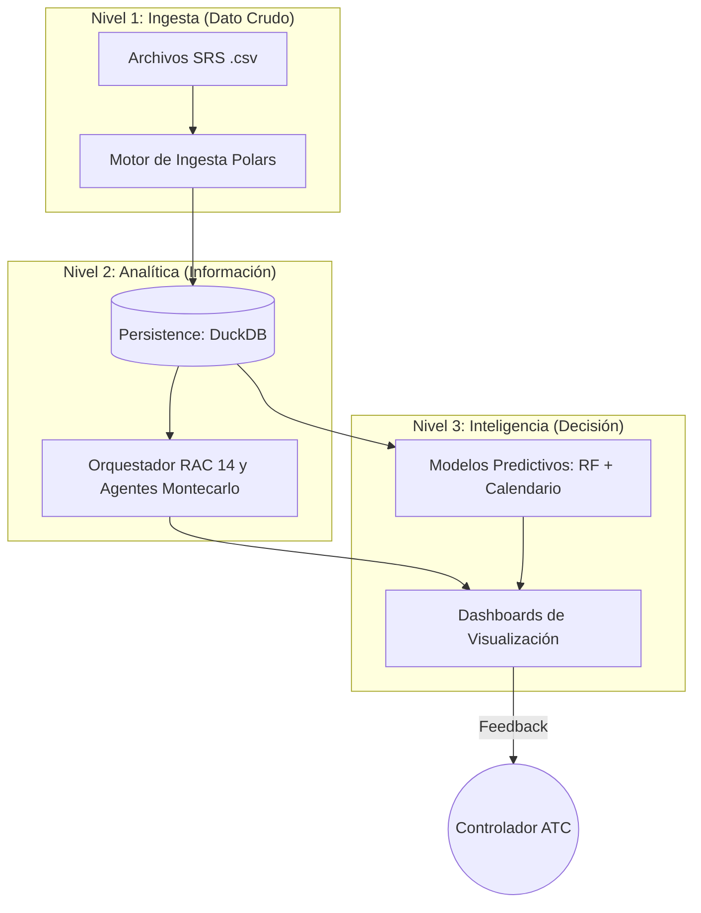

# ATC Capacity & Analytics: Technical Ecosystem

Este sistema representa una solución de ingeniería avanzada para la gestión y predicción de la capacidad en sectores de control de tráfico aéreo (ATC). Integra modelos matemáticos normativos con algoritmos de inteligencia artificial para transformar datos operativos en decisiones estratégicas.

---

## 🏛️ 1. Síntesis del Problema: Congestión y Capacidad

La gestión de la capacidad ATC es un problema de **Optimización de Recursos bajo Incertidumbre**. El reto técnico consiste en equilibrar la **Carga Mental del Controlador (Mental Workload)** con el flujo de vuelos, asegurando la seguridad operacional (Safety).

### 📐 Fundamentación Teórica
El sistema aborda el problema desde tres dimensiones:
1.  **Dimensión Normativa y Dinámica**: Ejecución algorítmica de la simulación probabilística **RAC 14** apoyada en Agentes Físicos.
2.  **Dimensión Estadística**: Análisis de distribución de vuelos históricos para identificar cuellos de botella.
3.  **Dimensión Predictiva**: Uso de Redes de Aprendizaje (Random Forest) y Variables Dummy de Calendario para anticipar la saturación.
---
## 🌀 2. Mapa de Macro-Arquitectura (The Big Picture)

El flujo de valor del dato sigue el principio de **Single Source of Truth (SSoT)** mediado por una arquitectura de micro-servicios desacoplados.

```mermaid
graph TD
    subgraph "Nivel 1: Ingesta (Dato Crudo)"
        SRS[Archivos SRS .csv] --> POLARS[Motor de Ingesta Polars]
    end

    subgraph "Nivel 2: Analítica (Información)"
        POLARS --> DUCKDB[(Persistence: DuckDB)]
        DUCKDB --> RAC14[Orquestador RAC 14 y Agentes Montecarlo]
    end

    subgraph "Nivel 3: Inteligencia (Decisión)"
        DUCKDB --> ML[Modelos Predictivos: RF + Calendario]
        RAC14 --> DASH[Dashboards de Visualización]
        ML --> DASH
    end

    DASH -- Feedback --> USER((Controlador ATC))
```
### 🔍 Análisis Detallado: Flujo de Valor del Dato
- **Explicación del Gráfico**: Ilustra la metamorfosis del dato desde su estado crudo hasta convertirse en decisión estratégica.
- **Niveles de Transformación**:
    1.  **Nivel 1 (Ingesta)**: Archivos `.csv` de vigilancia radar (SRS) son procesados por [`polars`](https://pola.rs) para limpieza y tipado.
    2.  **Nivel 2 (Analítica)**: Los datos limpios residen en `DuckDB`. Aquí interactúan los **Agentes Inteligentes RAC 14** para calcular la estocástica.
    3.  **Nivel 3 (Inteligencia)**: Se entrenan modelos de ML con los históricos de DuckDB para proyectar escenarios futuros.
- **Interacción de Componentes**:
    - `SRS` -> [`Use Case: Ingest`](file:///c:/Users/LENOVO/Documents/tesis/src/application/use_cases/ingest_flights_data.py)
    - `RAC 14` -> [`BackendAgent & Physics`](file:///c:/Users/LENOVO/Documents/tesis/src/application/use_cases/backend_agent.py)
    - `ML` -> [`Use Case: Prediction`](file:///c:/Users/LENOVO/Documents/tesis/src/application/use_cases/predict_daily_demand.py)

---

## 📂 3. Mapa de Navegación Técnica

| Manual | Objetivo Técnico | Audiencia |
| :--- | :--- | :--- |
| **--- MANUALES DEL SISTEMA ---** | | |
| [✈️ Manual Aeronáutico (Principiantes)](aeronautical_guide.md) | Introducción teórica y conceptos ATC explicados de cero. | Novatos / Estudiantes / Stakeholders |
| [📙 Manual de Usuario](user_manual.md) | Guía visual de uso de las interfaces. | Controladores ATC |
| [📘 Manual Técnico Maestro](tech_manual.md) | Derivaciones matemáticas y lógica de ML. | Data Scientists / Tesistas |
| [🤖 Manual de Agentes RAC 14](agents_rac14.md) | Lógica estocástica multi-agente y Montecarlo. | Expertos ATC / Arquitectos |
| **--- ARQUITECTURA ---** | | |
| [📂 Arquitectura Hexagonal](architecture.md) | Principios de diseño y Clean Architecture. | Arquitectos de Software |
| [🧩 Dominio](domain.md) | Reglas de negocio puras, Entidades y Puertos. | Desarrolladores Senior |
| [🏗️ Infraestructura](infrastructure.md) | Implementación de DuckDB, Polars y FastAPI. | DevOPS / Data Engineers |
| [🧠 Aplicación](application.md) | Casos de uso e Inyección de Dependencias. | Desarrolladores Backend |
| [💻 Frontend](frontend.md) | React, ApexCharts y gestión de estado. | Frontend Developers |
| [📐 Project Blueprints](project_blueprints.md) | Especificaciones UML (Clases, Secuencia). | Arquitectos / Auditores |
| **--- CIENCIA Y DATOS ---** | | |
| [📏 Fundamentos Teóricos](theoretical_basis.md) | Sustentación estadística y algorítmica. | Data Scientists / Tesistas |
| [📈 Análisis y Resultados](results_analysis.md) | Validación empírica y métricas. | Directores / Stakeholders |
| **--- CÓDIGO Y REFERENCIA ---** | | |
| [📋 Requerimientos](requirements.md) | Matriz de requerimientos funcionales. | QA / Product Owners |
| [📄 Guía del Código](codebase_guide.md) | Diccionario de archivos y responsabilidades. | Nuevos Desarrolladores |
| [📚 Referencia Técnica](reference.md) | Endpoints de la API y componentes UI. | Integradores |
| [📖 Glosario Técnico](technical_glossary.md) | Diccionario de acrónimos y términos. | Todos los lectores |

---

## 📚 4. Fundamentación Bibliográfica de Gestión ATC

1.  **OACI (ICAO)**. *Doc 9689: Manual on Air Traffic Services (ATS) Capacity Management*. [Guía internacional para la gestión de capacidad].
2.  **FAA (Federal Aviation Administration)**. *Air Traffic Organization: Capacity Planning*. [Estándares de EE.UU. para la optimización de flujo aéreo].
3.  **UAEAC Colombia**. *Circular Informativa 006*. [Normativa local para el cálculo de capacidad de sectores].
4.  **Eurocontrol**. *Performance Review Report (PRR)*. [Análisis de eficiencia y capacidad en el espacio aéreo europeo].

---

> [!IMPORTANT]
> Esta documentación está diseñada para ser la **Fuente Definitiva de Verdad** técnica del proyecto, vinculando cada línea de código con su justificación académica y operativa.
