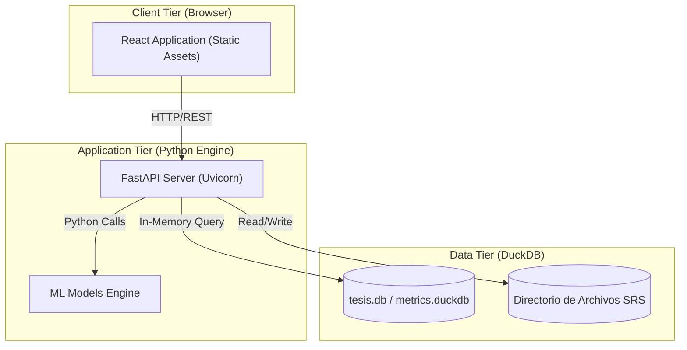
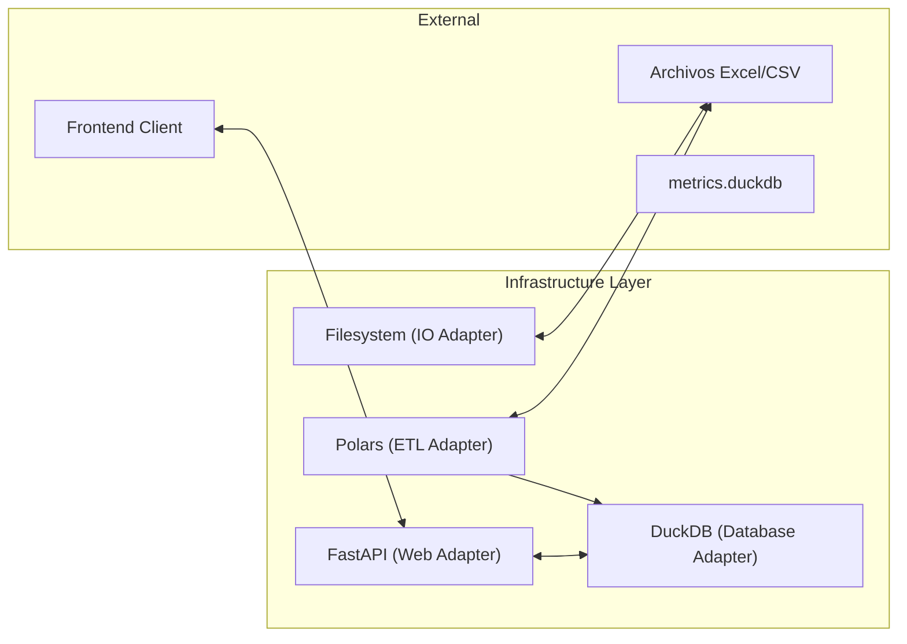

# Capa de Infraestructura (Infrastructure Layer)

La capa de infraestructura contiene las implementaciones técnicas de los puentes definidos en el dominio. Aquí es donde el sistema interactúa con el mundo exterior: bases de datos, sistemas de archivos, APIs de terceros y frameworks web.

## 🗄️ Persistencia y Repositorios

Utilizamos **DuckDB** como motor analítico principal debido a su eficiencia en el procesamiento de grandes volúmenes de datos en memoria.

### DuckDB Repository
[`duckdb_repository.py`](file:///c:/Users/LENOVO/Documents/tesis/src/infrastructure/adapters/duckdb_repository.py)
- **Función**: Traduce los objetos de dominio a esquemas relacionales y viceversa.
- **Ventaja**: Ejecuta consultas SQL complejas (JOINs, aggregaciones) con latencia mínima.

### Filesystem Repository
[`filesystem_repository.py`](file:///c:/Users/LENOVO/Documents/tesis/src/infrastructure/adapters/filesystem_repository.py)
- **Función**: Gestiona la lectura y escritura de archivos Excel/CSV para el proceso de ingesta.
- **Acceso**: Abstrae las rutas locales del sistema de archivos.

---

## 🚀 Adaptador de API (FastAPI)
El sistema expone sus capacidades a través de una API RESTful construida con **FastAPI**.

- **Ubicación**: `src/infrastructure/adapters/api/`
- **Controladores**:
    - `flights_controller.py`: Endpoints para gestión y consulta de vuelos.
    - `sectors_controller.py`: Configuración de parámetros de la Circular 006.
    - `predictions_controller.py`: Acceso a modelos de Machine Learning.

---

## ⚡ Procesamiento con Polars
Para operaciones de transformación de datos masivos (ETL), el sistema utiliza **Polars**.
- **Ventaja**: Procesamiento vectorial paralelo que supera significativamente el rendimiento de Pandas en conjuntos de datos aeronáuticos extensos.

---

## 🌐 3.6.7 Diagrama de Distribución (Deployment View)

El sistema está diseñado para ejecutarse localmente como una aplicación empaquetada o en un servidor de red interno.

---

## 📊 Diagrama de Infraestructura
... (Resto del contenido existente)

> [!NOTE]
> Al estar en la capa más externa, estos archivos pueden depender de librerías de terceros (FastAPI, Polars, DuckDB) y del dominio, pero nunca de la capa de aplicación.
