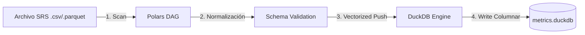
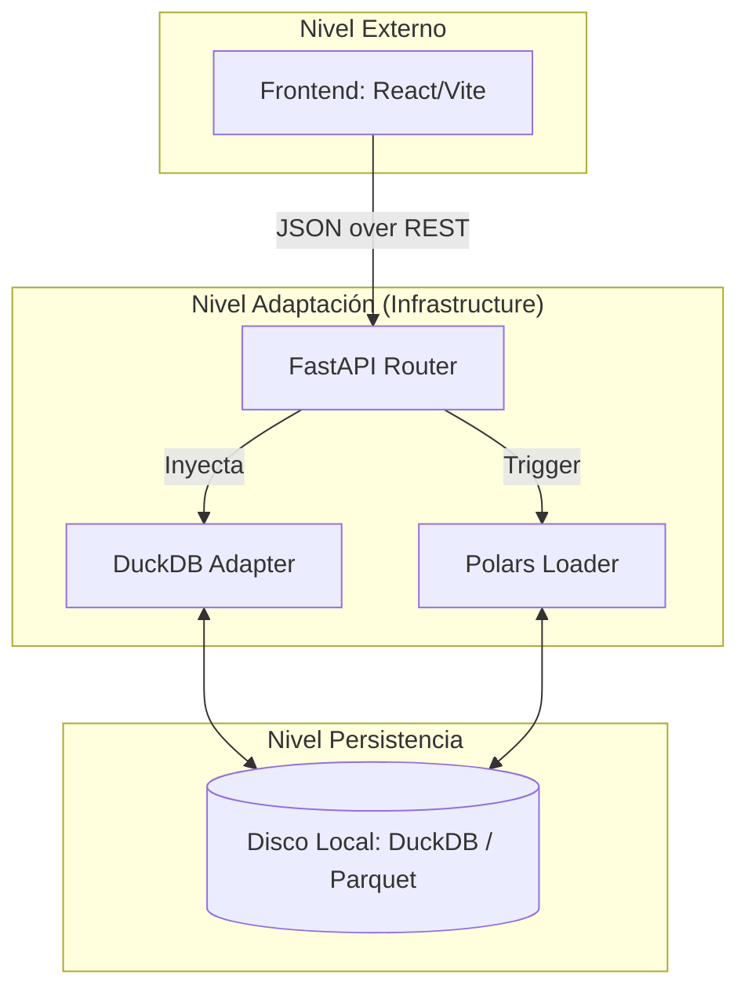

# Capa de Infraestructura: Soporte Técnico y Persistencia (Deep Dive)

La capa de infraestructura es donde la abstracción del dominio se encuentra con la realidad física del hardware. Este sistema implementa tecnologías de última generación para garantizar que el procesamiento de grandes volúmenes de datos aeronáuticos sea eficiente y escalable.

---

## ⚡ 1. Motor de Datos: Polars y Evaluación Perezosa (Lazy Evaluation)

El sistema utiliza **Polars** ([`polars_data_source.py`](file:///c:/Users/LENOVO/Documents/tesis/src/infrastructure/adapters/polars/polars_data_source.py)) para la ingesta y transformación de datos.

### 📐 Fundamentación Técnica: Por qué Polars
A diferencia de librerías tradicionales (como Pandas) que procesan datos de forma ansiosa (Eager), Polars permite la **Evaluación Perezosa**. 

- **Optimización de Consultas**: Al usar `pl.scan_csv()` o `pl.scan_parquet()`, el sistema no carga el archivo en memoria inmediatamente. En su lugar, construye un **Grafo Directo Acíclico (DAG)** de operaciones.
- **Pushdown Optimization**: El motor de Polars "empuja" los filtros y las selecciones de columnas hacia el archivo original, leyendo solo los bytes necesarios del disco.
- **Paralelismo SIMD**: Polars está escrito en **Rust**, lo que permite utilizar instrucciones SIMD (Single Instruction, Multiple Data) para vectorizar cálculos matemáticos en la CPU.

---

## 🗄️ 2. Persistencia: DuckDB y Arquitectura OLAP

La persistencia de las métricas históricas y parámetros de configuración reside en **DuckDB**.

### 📐 Teoría: OLAP vs OLTP
DuckDB es un motor de base de datos **OLAP (Online Analytical Processing)**. 
- **Almacenamiento Columnar**: Los datos se almacenan por columnas en lugar de filas. Esto es matemáticamente superior para agregaciones (SUM, AVG) porque la CPU solo lee las columnas involucradas en el cálculo.
- **Vectorized Execution**: DuckDB procesa datos en bloques o "vectores", maximizando el uso del caché L1/L2 de la CPU.

**Archivos Críticos**:
- [`duckdb_repository.py`](file:///c:/Users/LENOVO/Documents/tesis/src/infrastructure/adapters/duckdb_repository.py): Maneja la lógica de inserción masiva (bulk insert) y consultas analíticas de capacidad.
- **Base de Datos**: `data/metrics.duckdb`.

---

## 🚀 3. Capa de Comunicación: FastAPI y Concurrencia

La API RESTful ([`controllers/`](file:///c:/Users/LENOVO/Documents/tesis/src/infrastructure/adapters/api/)) utiliza el framework **FastAPI**.

### 📐 Técnicamente: Asincronía y Tipado
1.  **Event Loop**: Mediante `async def`, el sistema puede manejar múltiples peticiones I/O (lectura de disco/DB) de forma concurrente sin bloquear el hilo principal.
2.  **Validación de Esquema**: Se integra con Pydantic para garantizar que los datos que entran al sistema cumplen con la especificación técnica antes de tocar el dominio.

---

## 🔄 4. Pipeline de Ingesta (ETL Flow)

### 🔍 Análisis Detallado: Pipeline ETL
- **Explicación del Gráfico**: Detalla el viaje del dato desde el upload hasta el disco.
- **Optimizaciones Clave**:
    - **Step 1 (Scan)**: `Polars` mapea el archivo en memoria virtual. No lee nada aún.
    - **Step 3 (Vectorized)**: Se transforma el dataframe de Polars a DuckDB usando **Apache Arrow** (transferencia zero-copy).
    - **Step 4 (Write)**: Se persiste en formato comprimido.
- **Código**: [`src/infrastructure/adapters/polars/`](file:///c:/Users/LENOVO/Documents/tesis/src/infrastructure/adapters/polars/)

---

## 🌐 5. Topología de Despliegue y Distribución

### 🔍 Análisis Detallado: Mapa de Despliegue
- **Explicación del Gráfico**: Muestra los límites físicos de los componentes en tiempo de ejecución.
- **Relación de Componentes**:
    - `UI` corre en el navegador del cliente.
    - `API`, `JDBC`, `PL_AD` corren en el servidor (Python process).
    - `STORAGE` es el sistema de archivos del servidor.
- **Flujo**:
    - El Frontend nunca toca el disco. Siempre pide al API.
    - El API delega a los adaptadores (JDBC/Polars) el acceso al hardware.
- **Referencias**: [`src/main.py`](file:///c:/Users/LENOVO/Documents/tesis/src/main.py) (punto de montaje).

---

## 📚 6. Fundamentación Bibliográfica

Para el desarrollo de la infraestructura se consultaron las siguientes referencias académicas y técnicas:

1.  **Vandervoort, R. (2022)**. *High-Performance Data Processing with Polars*. [Documentación técnica sobre paralelismo en Rust/Python].
2.  **Raasveldt, M., & Mühleisen, H. (2019)**. *DuckDB: an Embeddable Analytical Database*. ACM SIGMOD. [Paper original sobre la arquitectura OLAP vectorizada].
3.  **Ritchie, V. (2020)**. *Introduction to Columnar Storage and Vectorized Execution*. [Análisis matemático de eficiencia en memoria].
4.  **FastAPI Documentation**. *Concurrent and Asynchronous Programming*. [tiangolo.com](https://fastapi.tiangolo.com).

---

> [!IMPORTANT]
> **Aislamiento Técnico**: Todos los drivers de base de datos y librerías de parsing están confinados a esta capa. El resto del sistema solo conoce los resultados procesados, no la tecnología que los generó.
