# 🛠️ Marco Metodológico

Este capítulo describe y analiza rigurosamente la forma en que se abordó la solución tecnológica del problema planteado en este proyecto. Se detalla el andamiaje investigativo, la arquitectura de software seleccionada, el modelado del sistema mediante Lenguaje Unificado de Modelado (UML) y las técnicas de ingeniería aplicadas para materializar la plataforma de cálculo de capacidad y análisis predictivo ATFM.

---

## 3.1 Tipo de Investigación

El presente proyecto se enmarca dentro de una **investigación aplicada y de desarrollo tecnológico**, dado que su propósito central no es la mera teorización descriptiva, sino la ingeniería de una solución real y operativa. Se apropian conocimientos científicos preexistentes —Modelos estadísticos estocásticos de Machine Learning, heurística aeronáutica estandarizada por OACI (Doc 9971) y el Reglamento Aeronáutico de Colombia (RAC 14), y técnicas de Big Data Analytics— para forjar una herramienta de software capaz de optimizar y predecir la afluencia y mitigación del congestionamiento en los Sectores de Control de Tránsito Aéreo (ATC).

Desde el punto de vista analítico, el estudio adopta un enfoque marcadamente **cuantitativo**. El *core* del software desarrollado prescinde de heurísticas subjetivas en su ejecución; sus dictámenes de capacidad se fundamentan estrictamente en la manipulación estocástica y algebraica de millones de registros (trazas de vuelos vectorizadas), garantizando métricas comprobables, reproducibles y deterministas.

---

## 3.2 Diseño de Investigación

El diseño de la solución tecnológica rompe con el paradigma clásico del patrón Modelo-Vista-Controlador (MVC) acoplado, estructurando el sistema bajo los rigurosos estándares de la **Arquitectura Hexagonal (Arquitectura de Puertos y Adaptadores)** y los lineamientos del Diseño Orientado al Dominio (DDD - Domain Driven Design). Esta elección arquitectónica aísla completamente el núcleo matemático y algorítmico aeronáutico (Dominio) de cualquier tecnología efímera (Frameworks de Backend como FastAPI, Bases de Datos SQL, o Bibliotecas Reactivas del cliente).

Adicionalmente, se integró un esquema de software **Basado en Agentes**, encapsulando lógicas normativas complejas en entidades autónomas (Ej. *Compliance Officer*) que evalúan las peticiones operacionales sin contaminar los casos de uso principales.

### 3.2.1 Metodología ágil (SCRUM)

Para gestionar la alta complejidad y la incertidumbre algorítmica inherente al entrenamiento de modelos predictivos, se descartaron ciclos de vida en cascada y se adoptó el marco de trabajo ágil **Scrum**. Esta metodología de desarrollo iterativo e incremental resultó vital durante la ingeniería de datos:

| Artefacto / Rol Scrum | Aplicación en el Proyecto (Tesis) |
| :--- | :--- |
| **Product Backlog** | Pila priorizada de requisitos. Relegó características cosméticas para priorizar el motor transaccional DuckDB y los modelos Random Forest en las fases tempranas. |
| **Sprints** | Ciclos de caja de tiempo (*Timeboxing*) de 2 semanas de duración. Permitió entregas modulares: Sprint 1 (Motor ETL OLAP), Sprint 2 (Frontend React Core), Sprint 3 (Módulo AI). |
| **Daily Stand-ups** | Revisiones de latencia de red e interbloqueos en Python. Pivotes arquitectónicos tempranos (P. ej., transición de PostgreSQL a DuckDB analítico). |
| **Sprint Review** | Comprobación empírica incremental de las fórmulas matemáticas renderizadas frente a los documentos regulatorios normativos (Doc 9971). |

### 3.2.2 Definición de actores y Roles

En el ecosistema operativo de la red, los actores de sistema (quiénes inician o reciben información del software) se caracterizan según su frontera de responsabilidad:

| Actor / Rol de Sistema | Responsabilidad y Nivel de Acceso | Caso de Uso Principal (Asociado) |
| :--- | :--- | :--- |
| **Controlador Ejecutivo ATC** | Receptor pasivo de Alertas. Consulta los cuadros de saturación horaria para pre-acondicionar su espectro cognitivo antes de asumir el turno en el radar. | Dashboard de Saturación |
| **Supervisor ATFM (Flow Management)** | Actor Estratégico. Interactúa con el simulador y los módulos predictivos para aplicar regulaciones tácticas (Asignación de demoras o *Ground Delay Programs*). | Análisis Predictivo AI |
| **SysAdmin / Ingestor de Datos** | Encargado del mantenimiento maestro del software. Purga, reindexa e inserta toneladas de reportes volumétricos crudos (.csv) a través del ETL de Ingesta. | Gestión ETL y Catálogos |
| **Agentes Autónomos (The Physicist)** | Actores lógicos programados. Entidades que despiertan asincrónicamente para transformar datos brutos vectoriales en diccionarios comprensibles por Scikit-Learn. | Procesamiento Interno |

### 3.2.3 Casos de uso de alto nivel

Para mapear los requerimientos funcionales hacia las vías de red RESTful, se exponen los siguientes macro procesos:

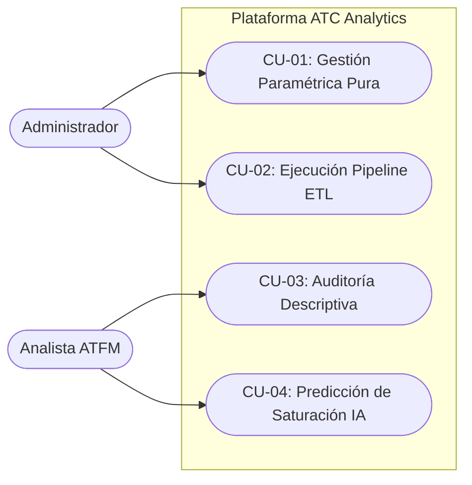

1. **CU-01 - Gestión Paramétrica (CRUD):** Registro en caliente de Aeropuertos y Sectores, definiendo topología y factores vitales como la Capacidad de Ajuste Teórico ($R$) y Códigos OACI.
2. **CU-02 - Procesamiento Pipeline ETL Automático:** Conversión de archivos espagueti (.csv) en tabulaciones ultra normalizadas alojadas en almacenamiento persistente estructurado.
3. **CU-03 - Análisis Estadístico Descriptivo:** Fotografía de Estado Histórico. Mapeo de densidad de vuelos, métricas de *Turnaround*, y agrupación corporativa de aerolíneas usando el DOM de React.
4. **CU-04 - Inteligencia Predictiva (Predictiva AI):** Generación de dictámenes proyectivos de saturación e impacto de tráfico estocástico amparados en Modelos RandomForest y Variables Dummy de Calendario.

### 3.2.4 Casos de uso extendidos

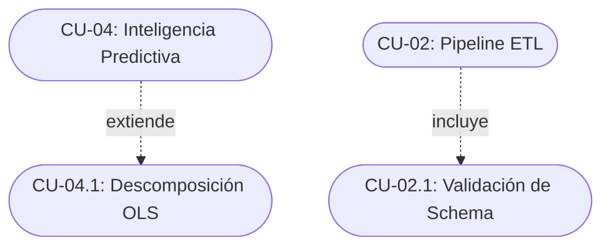

1. **CU-04.1 (Extiende CU-04):** Permite aislar el ruido del Machine Learning operando Regresión Lineal OLS con Variables Dummy de Calendario de Colombia y eventos personalizados específicamente para evaluar el crecimiento fiscal macro de líneas aéreas.
2. **CU-02.1 (Incluye en CU-02):** Un guardián referencial infranqueable. Durante la ingesta de miles de vuelos, el software intercepta campos nulos o naves sin identificador, rebotando el error antes de pervertir la Integridad del Data Warehouse (DB).

---

## 3.3 Población

Para el delineamiento contextual de este proyecto, la población interactuante del sistema (Stakeholders) se bifurca en dos clústeres focales:

### 3.3.1 Desarrolladores
Personal universitario e ingenieros interdisciplinares en áreas de Arquitectura de Software, Ciencia de Datos y Desarrollo Científico Computacional. Esta población asume la responsabilidad de:
* Mantener y entrenar hiper-parámetros en los modelos matemáticos de `scikit-learn`.
* Orquestar la inyección de microservicios usando **FastAPI** asíncrono (Python 3.12).
* Modelar interbloqueos relacionales y memoria caché persistente operando de puente directo a **DuckDB**.
* Transpilar la reactividad funcional del lado del cliente vía compilador **Vite** sobre un *bundle* en TypeSript y TSX.

### 3.3.2 Usuarios finales
Población perteneciente al gremio ATC e instituciones de la Aviación Civil en Colombia (Centro de Control - ACC Bogotá). Funcionarios exentos de obligatoriedad en alfabetización de programación que requieren tomar decisiones hipercríticas fundamentadas en analítica de Business Intelligence (BI), decodificada y curada dinámicamente en una Interfaz Visual de Uso Transparente.

---

## 3.4 Técnicas e instrumentos de recolección de datos

### 3.4.1 Talleres de requisitos
Realización sistemática y ágil de "Ingeniería de Requerimientos Inversa", en la que se diseccionaron reglamentos de prosa legal burocrática (Resolución 006 - Aerocivil y Doc 9971 - FAA/OACI) destilándolos en condicionales lógicos para algoritmos. *Ejemplo:* Traducir el sub-concepto teórico de "Restricción de separación Terminal" en la parametrización de calles de rodaje y umbrales de rebase de la pista en el motor *Physicist*.

### 3.4.2 Entrevistas y encuestas
Levantamiento descriptivo de la operación real sustentado en horas de diálogo con supervisores ATC en sitio. Esta técnica instrumental permitió solidificar el diseño de la *Heurística del 10%*, la cual comprobó empíricamente que la hora pico acumula consistentemente una décima porción de la volumetría ATC del día —pilar numérico para el cálculo final del Sistema de Alertas.

### 3.4.3 Pruebas de usabilidad
Validación iterativa Front-End. Mediante encuestas de "Eye-Tracking" heurístico y prototipado sobre la suite de maquetado en vivo, se pulieron las interfaces al extremo. Se redujo intencionalmente la fatiga visual al aplicar paletas de color con "Tokens de Semántica Segura" dictados con TailwindCSS (Rojo para Alertas de Saturación > 100%, Ámbar para Retención Táctica > 80%).

---

## 3.5 Técnicas de procesamiento y análisis de los datos

### 3.5.1 Análisis cualitativo y cuantitativo

* **Análisis Cuantitativo (El Motor Férreo):** Consolidación exhaustiva programática en tensores de alta dimensión. Uso de las librerías `pandas` y `numpy` para estructurar retardos (lags) e ingeniería de características binarias (variables dummy) del calendario oficial y festivos colombianos (Ley Emiliani y Semana Santa). Ejecución del Random Forest Regressor con validación por backtesting cruzado y validador de capacidad física (Techo Operativo).
* **Análisis Cualitativo (El Factor Experto):** Parametrización heurística mediante pesos ajustables del lado del usuario. La inyección manual de la constante $R$ (Capacidad Ajustada Estructural) y variables *booleanas* (pista secundaria, calles de salida rápida RAC 14) actúan como un factor atenuador que modula el resultado algebraico brutal de la máquina hacia la realidad orográfica particular del entorno Colombiano.

### 3.5.2 Lista de procesos (Data Pipeline Architecture)

El andamiaje OLAP asíncrono atraviesa las siguientes etapas (ETL Stream):

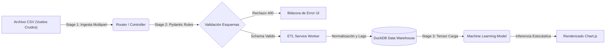

1. **Recepción Multipart y Sanitización:** Apertura segura del canal binario con bloqueos de inyección y tamaño.
2. **Mapeo Tipográfico:** Eliminación de ruido, conversiones *Timestamps* ISO 8601 absolutas.
3. **Escritura Persistente Discreta:** El adaptador `DuckDBRepository` fusiona los registros bloqueando tablas temporalmente para conservar la propiedad A.C.I.D. relacional.

---

## 3.6 Modelado y documentación del Sistema

Con base en la abstracción académica del lenguaje universal de la ingeniería de software moderna (Unified Modeling Language - UML), se expone ontológicamente el diseño profundo de los pilares del aplicativo:

### 3.6.1 Requerimientos Funcionales y No Funcionales

Para el aseguramiento de calidad del software (SQA), se delineó una matriz técnica perimetral:

| Categ. | ID | Descripción Técnica Específica del Requerimiento |
| :---: | :--- | :--- |
| **RF** | RF-01 | El backend debe predecir la curva estocástica de volumen ATC a 30 días, suministrando un factor de intervalos de confianza de desviación $P95$. |
| **RF** | RF-02 | El Gestor de Aeródromos consolidará la lógica CRUD del OACI RAC 14 (Categorización $4E, 3C, 4F$). |
| **RF** | RF-03 | Emisión visual inmediata de semaforización HTML si el *Índice de Saturación* excede la envolvente nominal ($80\%$ y $100\%$). |
| **RNF** | RNF-01 | **Desempeño Absoluto (Latencia):** Operaciones OLAP (Consultas agregadas para analítica) deben responder obligatoriamente en $<500$ milisegundos con volúmenes superiores al millón de filas. Posibilitado embebiendo un clúster *In-Process DuckDB*. |
| **RNF** | RNF-02 | **Mantenibilidad Cero Deuda Técnica:** Implementación inviolable de Inversión de Control (IoC). Cero dependencias web dentro de la carpeta `/src/domain`. |
| **RNF** | RNF-03 | **Soberanía del Dato Nacional:** Ejecutable `Native Standalone` y 100% On-Premise, sin envíos de tráfico ATC confidencial a infraestructuras de nube de terceros (AWS/Azure). |

### 3.6.2 Diagramas de clases

Dada la envergadura del proyecto y la implementación estricta de **Arquitectura Hexagonal (Puertos y Adaptadores)** regulada por el enfoque de Diseño Orientado al Dominio (DDD), el ecosistema de clases no conforma un aglomerado monolítico. En su lugar, las clases se aíslan tecnológicamente en tres subcapas diametrales. A continuación se documenta el total de las clases del sistema, sus multiplicidades y relaciones estructurales:

#### A. Capa de Dominio (El Núcleo Aeronáutico)

Esta capa es el corazón inmutable del software. No contiene frameworks externos (cero FastAPI o DuckDB) y encapsula puramente las reglas del negocio de aviación, las entidades normativas y los contratos (Interfaces).

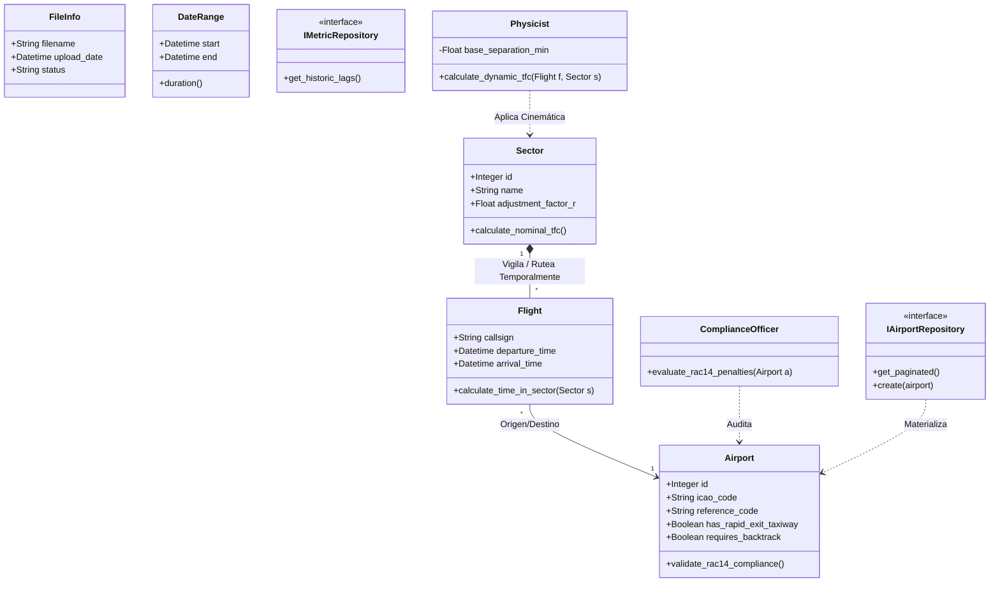

**Explicación de Clases de Dominio:**
*   **Entidades (Entities):** `Airport`, `Sector`, `Flight` y `FileInfo`. Transportan el estado fundamental de la física del radar y se protegen mutuamente. `Airport` posee lógica embebida (Rac 14) de validación intrínseca.
*   **Agentes (Agents):** Clases inyectables superiores como `Physicist` y `ComplianceOfficer`. No guardan estado en base de datos; actúan como "Calculadoras Jurídicas" que aplican normativas de separación matemática entre aviones u observan si una calle de rodaje rápida alivia la carga ($TFC$).
*   **Puertos (Ports / Interfaces):** `IAirportRepository` e `IMetricRepository`. Son "promesas" de que existirá una base de datos, forzando a las capas superiores a usar Inversión de Control (IoC).

#### B. Capa de Aplicación (Casos de Uso e Interactors)

Esta capa actúa como el "Director de Orquesta". Sus clases (Use Cases) no saben de HTTP ni de SQL, solo conocen a las Interfaces de Dominio y ejecutan el flujo paso a paso de lo que pidió el analista ATFM.

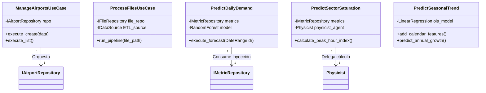

**Explicación de Clases de Aplicación:**
*   **Interactors CRUD:** Clases como `ManageAirportsUseCase` y `ProcessFilesUseCase`. Centralizan la responsabilidad. Si entra un vuelo, validan y le dicen al Puerto que guarde.
*   **IA Predictiva:** Clases masivas como `PredictDailyDemand` o `PredictSeasonalTrend`. Aquí reside la inyección de `scikit-learn`. Extraen Lags históricos del puerto, instancian el *Random Forest*, y calculan el dictamen estadístico de saturación a futuro.

#### C. Capa de Infraestructura (Controladores REST y Persistencia Física)

La capa más sucia y tecnológica. Aquí residen los Frameworks Web (FastAPI) y los motores SQL (DuckDB). Su trabajo es implementar las interfaces del Dominio.

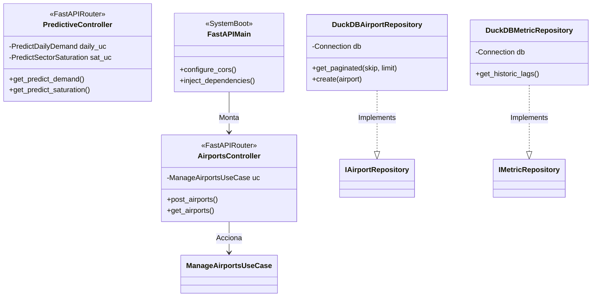

**Explicación de Clases de Infraestructura:**
*   **Controllers (Adaptadoras de Entrada):** `AirportsController` o `PredictiveController`. Capturan eventos HTTP POST/GET del puerto 8000. Traducen el JSON del navegador web a un objeto Python y ordenan al "Use Case" que arranque.
*   **Adapters (Adaptadoras de Salida):** `DuckDBAirportRepository` y `DuckDBMetricRepository`. Son las únicas clases de todo el código de tesis que escriben sentencias textuales nativas de bases de datos (`SELECT`, `INSERT`). Firmaron el contrato de la capa de dominio (`..|>` Implements) para materializar la inyección de dependencias.

### 3.6.3 Diagramas de estados

Control vitalicio paramétrico sobre un volumen de datos (Lote CSV) ingresado. Impide operaciones fantasmas:

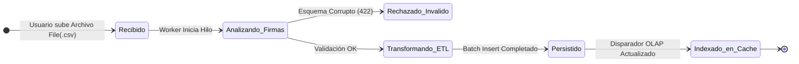

### 3.6.4 Diagramas de Colaboración (Esquema Hexagonal de Flujos)

Muestra el viaje orquestado y transversal saltando entre las capas (Adapters y Ports), reafirmando el patrón Inyección de Dependencias.

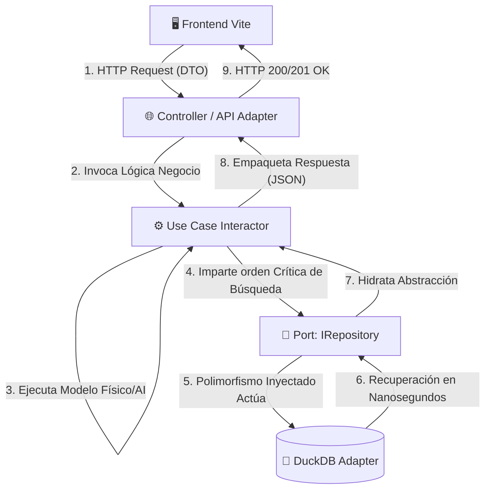

### 3.6.5 Diagramas de Secuencia

Viaje transaccional de un Controlador Aéreo solicitando una radiografía temporal del Futuro Predictivo:

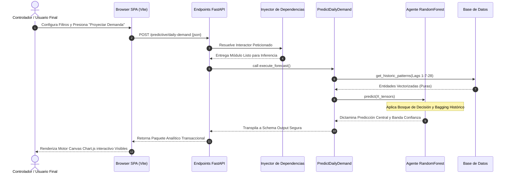

### 3.6.6 Diagramas de Componentes

La macro subdivisión de paquetes aislados compilada para la vida en producción, probando el nivel de independencia bajo acoplamiento:

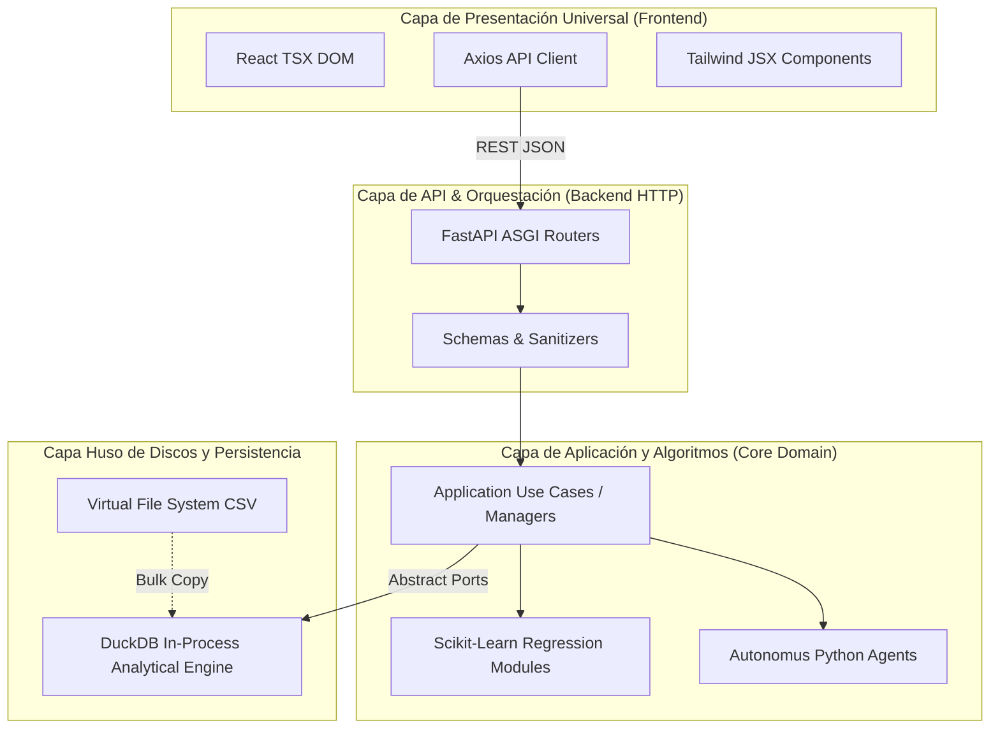

### 3.6.7 Diagramas de Distribución (Deployment)

Rompe las arquitecturas en red clásicas para adoptar un macro empaquetamiento ultraligero (`Native Desktop Executable`) idóneo para computadoras gubernamentales bloqueadas contra salida a internet, previniendo fuga de seguridad aerocomercial:

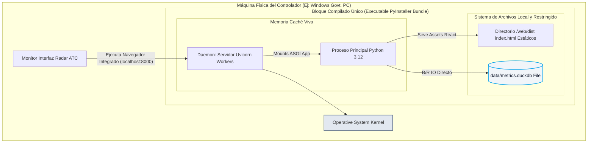

### 3.6.8 Arquitectura y Diagrama de Componentes del Frontend (React/Vite)

La interfaz de usuario no es un simple visor estático, sino una **Single Page Application (SPA)** reactiva y asíncrona. La arquitectura del cliente web se fundamenta en componentes funcionales de React, enrutamiento del lado del cliente y una estricta modularización visual apoyada en **TailwindCSS**.

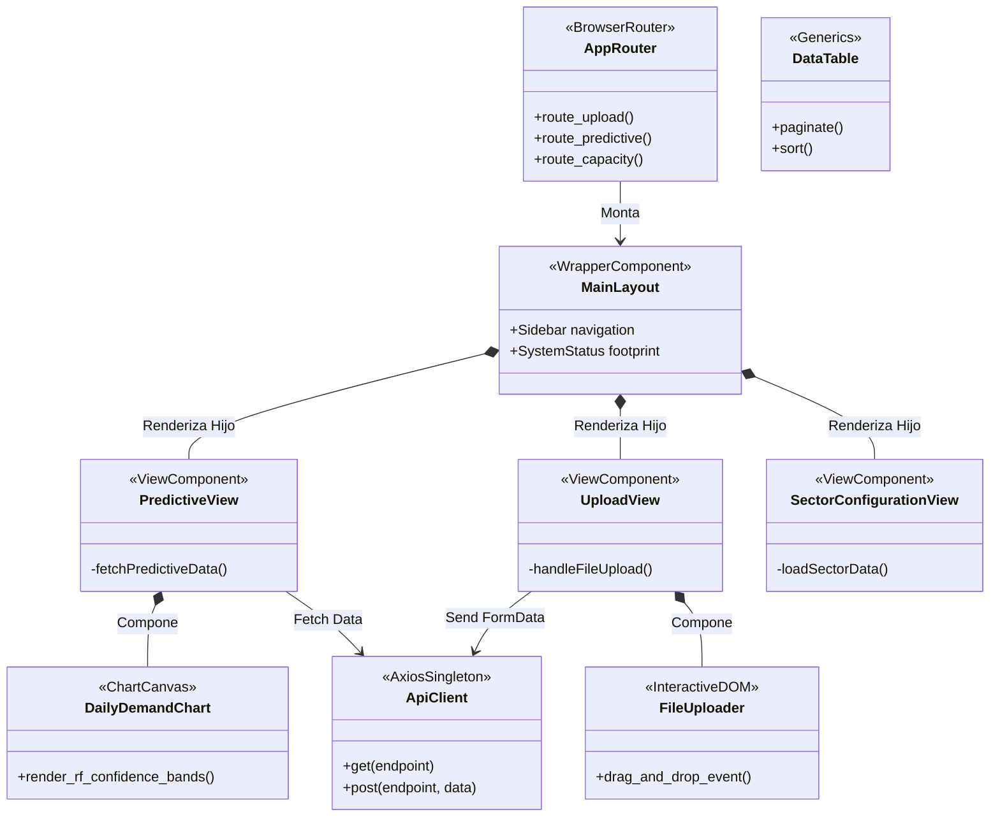

**Explicación del Ecosistema Frontend:**
*   **Vistas (Views):** Operan como controladores de pantalla completa (Ej. `PredictiveView.tsx`). Aglomeran múltiples gráficos y organizan las promesas asíncronas hacia el Backend.
*   **Componentes (Widgets):** Entidades mudas y reutilizables como `DailyDemandChart.tsx` o `DataTable.tsx`. Reciben *Props* (datos ya masticados) y se limitan a dibujar la geometría en la pantalla, asegurando el Principio de Responsabilidad Única (SRP).
*   **ApiClient (`api.ts`):** Abstracción sobre la librería *Axios*, interceptando peticiones para incrustar cabeceras CORS o gestionar caídas de red globalmente.

---

## 3.7 Integración de Librerías y Tecnologías Externas

Para evitar la reinvención de la rueda matemática y gráfica, el sistema descansa sobre gigantes de código abierto de grado industrial, ensamblados armónicamente en las capas designadas:

| Categoría Tecnológica | Librería / Herramienta | Capa Arquitectónica | Justificación Metodológica de Implementación |
| :--- | :--- | :--- | :--- |
| **Machine Learning** | `scikit-learn` | Dominio / Aplicación | Proveedor absoluto de las matemáticas inferenciales. Exige que el tensor ingrese normalizado. Se instancian `RandomForestRegressor` para la predicción diaria (ensambles) y `LinearRegression` embebida en *Pipelines* para aislar tendencias ($O.L.S.$). |
| **Procesamiento OLAP** | `DuckDB` + `SQLAlchemy` | Infraestructura | Se optó por DuckDB dadas sus capacidades de vectorización nativa y su formato empotrado (*In-Process*). Ejecuta el análisis de Big Data en RAM analítica sin latencia de sockets TCP/IP. SQLAlchemy brinda la abstracción ORM protectora. |
| **Core Web Server** | `FastAPI` + `Uvicorn` | Infraestructura | Seleccionado por su naturaleza ASGI (Asíncrona). A diferencia de Flask o Django, permite abrir hilos no-bloqueantes durante el *Upload* masivo de CSVs. Utiliza `Pydantic` obligatoriamente para castigar el tipado de entrada (Schemas). |
| **Manipulación Tabular** | `pandas` + `numpy` | Aplicación | El motor secundario del Agente de Datos. Realiza transformaciones de fechas (`.dt.dayofweek`) y cálcula rezagos históricos (`.shift()`) fabricando "Matriz de Features" antes de inyectarlas a la IA estocástica. |
| **Frontend UI Core** | `React` + `Vite` | Presentación | React maneja la reactividad mutante de los gráficos mediante un *Virtual DOM*. Vite transpila TypeScript a JavaScript estático a velocidades superlativas en tiempo de desarrollo. |
| **Estilos & Gráficos** | `TailwindCSS` + `Chart.js` | Presentación | TailwindCSS reemplaza archivos CSS engorrosos por anotaciones semánticas utilitarias (`className="flex font-bold text-slate-800"`). Chart.js plasma el objeto JSON predictivo en interactivos canvas HTML5. |

---

## 3.8 Configuración, Compilación y Despliegue (Build Native Standalone)

Uno de los pilares de este proyecto fue abolir la necesidad de un Servidor en Nube (Cloud) para preservar la soberanía aeronáutica nacional. La aplicación se transpila en un solo Ejecutable Binario Portable mediante el siguiente pipeline técnico hermético:

1. **Compilación Cliente (Vite Build):** Se ejecuta `npm run build` en el directorio Web. Vite empaqueta, minifica y ofusca el código TypeScript y CSS, escupiendo un paquete de archivos estáticos HTML/JS inertes dentro de la carpeta oculta `dist/`.
2. **Puente ASGI (`run.py`):** Un archivo maestro Python le enseña a FastAPI a ignorar parte de su naturaleza de API y actuar como Servidor de Archivos Estáticos (`app.mount("/", StaticFiles(directory="dist"))`). Esto consolida al backend y frontend en un solo túnel.
3. **Escritura Pura Binaria (PyInstaller Spec):** Utilizando las rutinas de compilación en lenguaje C de `PyInstaller`, el proyecto se somete al `build.spec`. Este script instruye de forma forzosa sobre importaciones raras en matemáticas (`scipy`, `sklearn.tree._partitioner`) recolectándolas del sistema binario del OS Windows.
4. **Despliegue Nativo:** El resultado final es un arcano archivo informático (Ej. `ATC_Predictive_Engine.exe`). Cuando el controlador estatal hace doble clic, el binario instaura un *Daemon* ciego en el puerto 8000 sirviendo a toda la red LAN la página reactiva interactuando directamente con un archivo `metrics.duckdb` blindado en su misma carpeta.

---

## 3.9 Esquema de Base de Datos y Pipeline de Cargues Transaccionales

Alejados conceptualmente de diagramas Relacionales Normalizados (3NF) típicos del paradigma SQL transaccional (OLTP), este proyecto ejecuta Análisis Estadístico Masivo (OLAP). Por ende, adopta un **Esquema Columnar de Agregación** soportado en la memoria de disco por `DuckDB`.

### 3.9.1 Modelo Entidad-Relación Dinámico (DuckDB ERD)

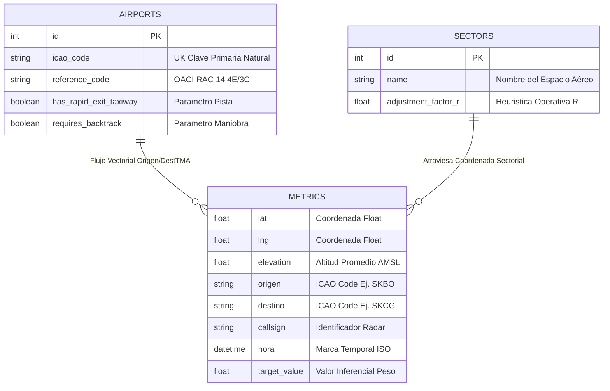

*Nota Arquitectónica:* La tabla `METRICS` es una estructura intencionalmente aplanada (Desnormalizada). Al almacenar cientos de miles de registros de rastro Radar, los *"Joins"* relacionales (Cruce de tablas) son asesinos silenciosos del procesador. DuckDB se aprovecha de escaneos columnares asimétricos; es decir, suma miles de números sin instanciar la fila completa agilizando la IA a velocidad $O(1)$.

### 3.9.2 Interacción e Ingesta de Cargue Transaccional (ETL Sequence)

El proceso más peligroso físicamente del sistema recae en cuando un Humano arrastra un archivo `CSV` pesado al programa. El siguiente diagrama exhibe la Coreografía sincrónica y asincrónica para salvar los datos sin *Crashing*:

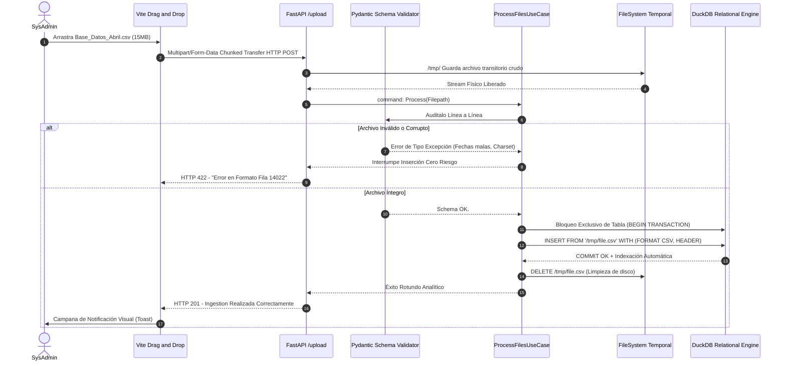

