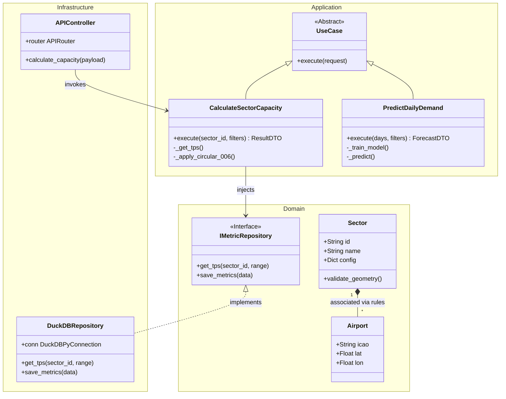
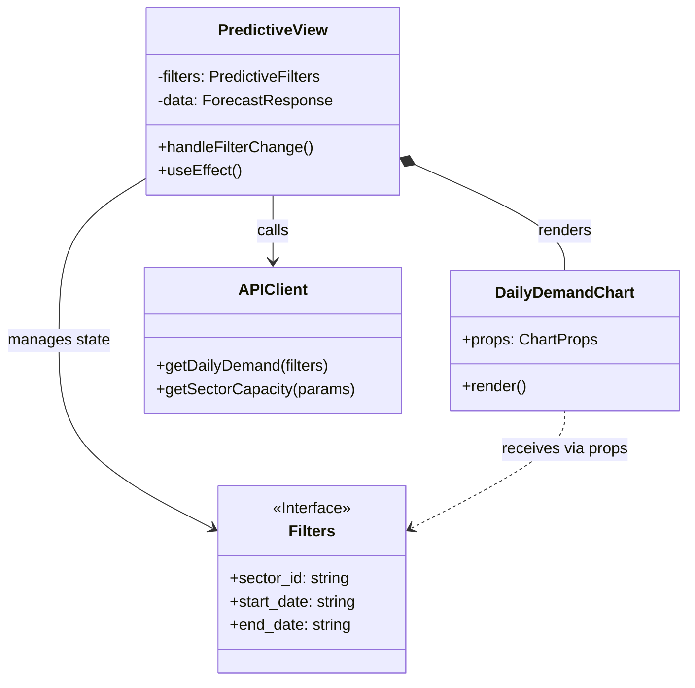
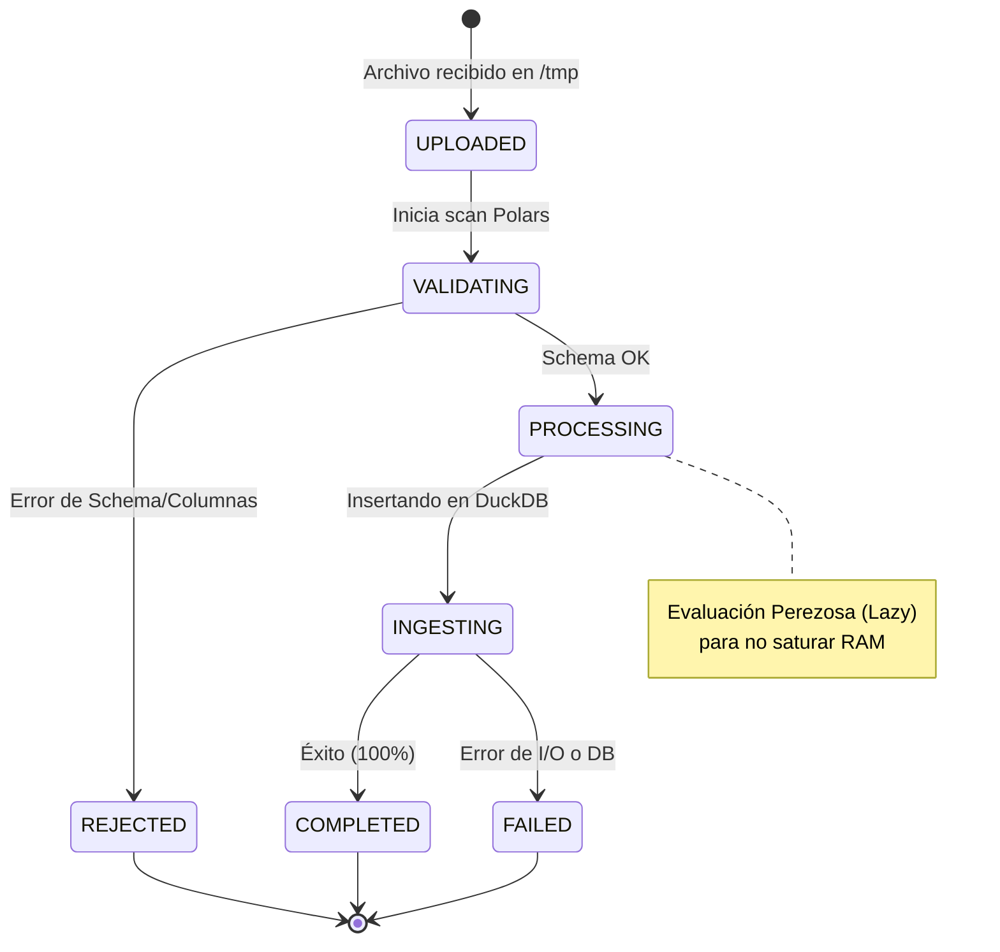
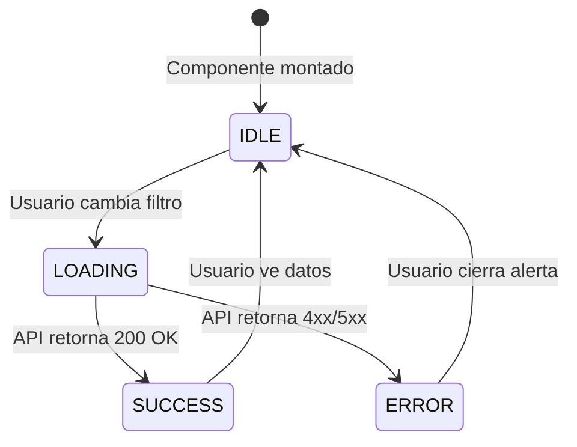
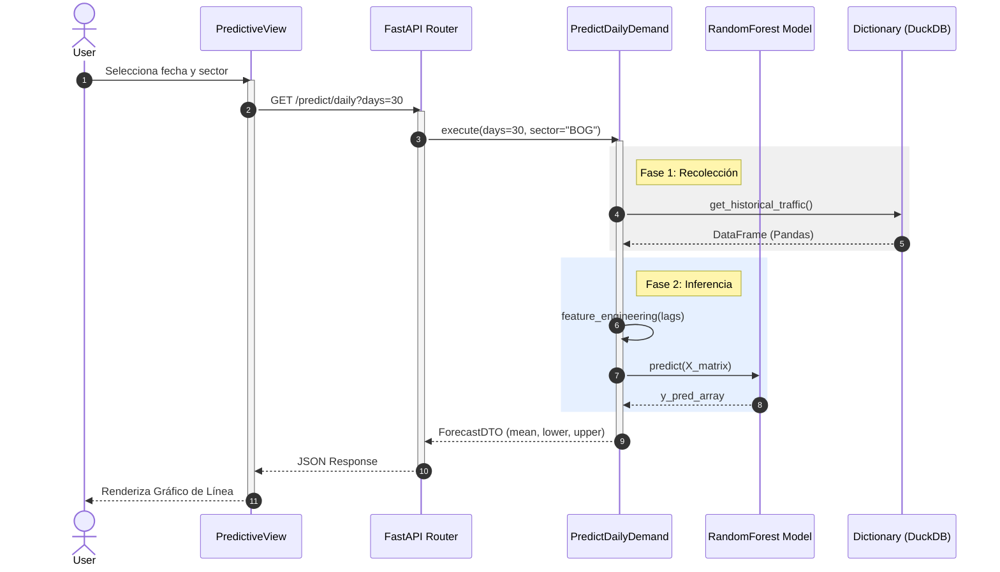
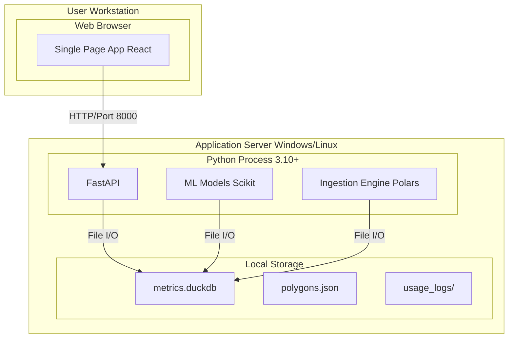

# 📐 Project Blueprints: Especificación Técnica y Modelado UML

Este documento formaliza la ingeniería del sistema **ATC Capacity & Analytics**, presentando los planos detallados de su construcción lógica, comportamental y física. Se ha estructurado siguiendo los estándares de documentación de arquitectura de software (UML 2.5).

---

## 📋 1. Matriz de Requerimientos

Esta sección define el contrato funcional del sistema, clasificando las capacidades críticas (Must Have) y de calidad (Non-Functional).

### 1.1 Requerimientos Funcionales (RF)

| ID | Nombre del Requerimiento | Descripción Técnica | Componente Responsable |
| :--- | :--- | :--- | :--- |
| **RF-01** | Ingesta Masiva de Datos SRS | El sistema debe permitir la carga de archivos `.csv`/`.xlsx` de vigilancia radar (>1GB), limpiarlos y normalizarlos. | `IngestFlightsData` (Polars) |
| **RF-02** | Configuración de Sectores ATC | El usuario debe poder definir/editar polígonos, niveles de vuelo y TFC para un sector. | `ManageSectors` (CRUD) |
| **RF-03** | Cálculo de Capacidad (C006) | El sistema debe calcular SCV y CH aplicando la fórmula matemática de la Circular 006. | `CalculateSectorCapacity` |
| **RF-04** | Predicción de Demanda Futura | El sistema debe utilizar ML para proyectar la demanda de vuelos a 30 días con intervalos de confianza. | `PredictDailyDemand` (Random Forest) |
| **RF-05** | Alerta de Saturación | El sistema debe identificar visualmente cuando la Demanda > Capacidad. | `SectorSaturationChart` |
| **RF-06** | Exportación de Reportes | El usuario debe poder descargar las tablas de resultados en formato Excel/PDF. | `ExportData` (Pandas) |

### 1.2 Requerimientos No Funcionales (RNF)

| ID | Atributo de Calidad | Métrica / Restricción | Estrategia de Implementación |
| :--- | :--- | :--- | :--- |
| **RNF-01** | **Performance** | Tiempo de respuesta < 2s para agregaciones de 1M de filas. | Uso de `DuckDB` (OLAP Columnar) y `Polars` (Lazy Eval). |
| **RNF-02** | **Escalabilidad** | Procesamiento de archivos limitado solo por disco, no por RAM. | Streaming y Batch Processing en capas de adaptador. |
| **RNF-03** | **Mantenibilidad** | Desacoplamiento total entre lógica y frameworks. | Arquitectura Hexagonal y DI Container. |
| **RNF-04** | **Usabilidad** | Interfaz responsiva y feedback visual inmediato (Spinners/Toasts). | React v18 + Optimistic UI updates. |
| **RNF-05** | **Integridad** | Tipado estricto en runtime para evitar corrupción de datos. | `Pydantic` (Backend) y `TypeScript` (Frontend). |

---

## 🏗️ 2. Vista Lógica: Diagramas de Clases

Esta vista detalla la estructura estática del código, mostrando las entidades, servicios y sus relaciones.

### 2.1 Backend Class Diagram (Dominio & Aplicación)

Representa cómo la Arquitectura Hexagonal organiza las clases para aislar el Dominio.



#### 🔍 Análisis Detallado: Clases Backend
- **Explicación**: El diagrama muestra la **Inversión de Dependencias**. Las flechas de implementación (`<|..`) van desde la Infraestructura hacia el Dominio, protegiendo las reglas de negocio.
- **Componentes Clave**:
    - `Sector` (Entidad): Objeto rico que no solo guarda datos, sino que valida su propia consistencia (ej. geometría válida).
    - `CalculateSectorCapacity` (Application Service): Orquestador que no sabe SQL, solo sabe matemáticas y llama al repositorio.
    - `DuckDBRepository` (Infrastructure): El "obrero" que traduce las peticiones del dominio a SQL nativo.
- **Referencias a Código**:
    - Entidad: [`src/domain/entities/sector.py`](file:///c:/Users/LENOVO/Documents/tesis/src/domain/entities/sector.py)
    - Puerto: [`src/domain/repositories/metric_repository.py`](file:///c:/Users/LENOVO/Documents/tesis/src/domain/repositories/metric_repository.py)
    - Caso de Uso: [`src/application/use_cases/calculate_sector_capacity.py`](file:///c:/Users/LENOVO/Documents/tesis/src/application/use_cases/calculate_sector_capacity.py)

---

### 2.2 Frontend Class Diagram (Componentes & Props)

Muestra la jerarquía de componentes React y sus contratos de datos (Interfaces).



#### 🔍 Análisis Detallado: Clases Frontend
- **Explicación**: Visualiza el patrón **Container-Presenter**. `PredictiveView` es la clase "inteligente" (Container) que posee el estado y la lógica de red. `DailyDemandChart` es la clase "tonta" (Presenter) que solo renderiza lo que recibe.
- **Flujo de Datos**:
    1.  `PredictiveView` instancia el estado `filters` implementando la interfaz `Filters`.
    2.  Llama a `APIClient` pasando esos filtros.
    3.  Al recibir datos, actualiza su estado interno, provocando un re-render.
    4.  Pasa los datos crudos a `DailyDemandChart` mediante *Prop Drilling*.
- **Referencias a Código**:
    - Vista: [`web/src/views/PredictiveView.tsx`](file:///c:/Users/LENOVO/Documents/tesis/web/src/views/PredictiveView.tsx)
    - Interfaz API: [`web/src/api.ts`](file:///c:/Users/LENOVO/Documents/tesis/web/src/api.ts)

---

## 🚦 3. Vista de Comportamiento: Diagramas de Estados

Esta vista modela el ciclo de vida de las entidades que sufren cambios de estado complejos durante la operación del sistema.

### 3.1 Máquina de Estados: Procesamiento de Archivos (Backend)

Modela la transición de un archivo SRS desde que se sube hasta que sus datos están listos para consulta.



#### 🔍 Análisis Detallado: Estados de Ingesta
- **Contexto**: El sistema no bloquea al usuario mientras procesa gigabytes de datos. Utiliza una tabla de control `files_control` para rastrear este estado.
- **Transiciones Críticas**:
    - `VALIDATING -> REJECTED`: Fail-fast si faltan columnas como `origen` o `destino`.
    - `PROCESSING -> INGESTING`: Transición de la validación de estructura a la persistencia física.
- **Referencias a Código**:
    - Lógica de Transición: [`src/application/use_cases/ingest_flights_data.py`](file:///c:/Users/LENOVO/Documents/tesis/src/application/use_cases/ingest_flights_data.py)
    - Entidad de Estado: `FileInfo` (Implícito en tabla SQL).

---

### 3.2 Máquina de Estados: UI de Predicción (Frontend)

Modela cómo `PredictiveView` reacciona a las interacciones del usuario y respuestas de la red.



#### 🔍 Análisis Detallado: Estados UI
- **Explicación**: React gestiona estos estados visuales.
    - `LOADING`: Muestra *Skeletons* o *Spinners* y deshabilita botones.
    - `ERROR`: Muestra un *Toast* con el mensaje de error del backend.
    - `SUCCESS`: Renderiza los gráficos `ApexCharts`.
- **Implementación**:
    - `const [loading, setLoading] = useState(false)`
    - `const [error, setError] = useState(null)`
- **Referencias a Código**:
    - Manejo de Estado: [`web/src/views/PredictiveView.tsx`](file:///c:/Users/LENOVO/Documents/tesis/web/src/views/PredictiveView.tsx)

---

## 🤝 4. Vista de Interacción: Diagramas de Colaboración

Estos diagramas enfatizan la organización estructural de los objetos que envían y reciben mensajes.

### 4.1 Colaboración: Cálculo de Capacidad

```mermaid
graph LR
    User((Controlador ATC))
    UI[CapacityView]
    Ctrl[API Controller]
    UC[CalculateUseCase]
    Repo[DuckDB Repo]

    linkStyle default stroke-width:2px,fill:none,stroke:black;

    User -- 1. Solicita Cálculo --> UI
    UI -- 2. GET /capacity --> Ctrl
    Ctrl -- 3. execute --> UC
    UC -- 4. get_tps --> Repo
    Repo -- 5. SQL Aggregation --> Repo
    Repo -. 6. Return Metrics .-> UC
    UC -- 7. Apply C006 Formula --> UC
    UC -. 8. Return ResultDTO .-> Ctrl
    Ctrl -. 9. Return JSON .-> UI
    UI -. 10. Render Charts .-> User
```

#### 🔍 Análisis Detallado: Colaboración
- **Explicación**: A diferencia de la secuencia (que enfatiza el tiempo), este diagrama enfatiza los **roles**.
- **Roles**:
    - **Orquestador**: `UC (CalculateUseCase)` es el centro de la estrella. Coordina al Repositorio y a la propia lógica de negocio.
    - **Interfaz**: `UI` y `Ctrl` son meros pasamanos de datos.
- **Mensajes Clave**:
    - `5. SQL Aggregation`: Es el paso más costoso computacionalmente (DuckDB Scan).
    - `7. Apply C006`: Es el paso de valor agregado del negocio.
- **Referencias a Código**:
    - Orquestador: [`src/application/use_cases/calculate_sector_capacity.py`](file:///c:/Users/LENOVO/Documents/tesis/src/application/use_cases/calculate_sector_capacity.py)

---

## ⏱️ 5. Vista de Interacción: Diagramas de Secuencia Detallados

Modela la lógica temporal paso a paso de los flujos más complejos.

### 5.1 Secuencia: Predicción de Demanda con ML



#### 🔍 Análisis Detallado: Secuencia ML
- **Flujo Síncrono/Asíncrono**: Aunque Python es asíncrono (`async def`), el cálculo de ML es CPU-bound. Se ejecuta en un ThreadPool para no bloquear el Event Loop principal de FastAPI.
- **Payloads**:
    - **Input**: `days=30`, `sector_id='SKED'`, `confidence=0.95`.
    - **Output**: `[{ date: '2025-01-01', pred: 145, min: 130, max: 160 }, ...]`.
- **Referencias a Código**:
    - Endpoint: [`src/infrastructure/adapters/api/predictive_controller.py`](file:///c:/Users/LENOVO/Documents/tesis/src/infrastructure/adapters/api/predictive_controller.py)

---

## 🧩 6. Vista de Implementación: Diagramas de Componentes

Muestra cómo se organiza el código en módulos físicos y sus dependencias.

```mermaid
graph TD
    subgraph Client_Side ["Client Side"]
        UI["React App"];
        HTTP["Axios Lib"];
        
        UI ..> HTTP;
    end

    subgraph Server_Side ["Server Side"]
        API["FastAPI App"];
        SRV["Uvicorn Server"];
        
        subgraph Core_Logic ["Core Logic"]
            UC["Use Cases"];
            DOM["Entities"];
        end

        subgraph Data_Access ["Data Access"]
            DUCK["DuckDB Driver"];
            POL["Polars Lib"];
        end
    end

    HTTP -- "JSON/REST" --> API;
    API --> UC;
    UC --> DOM;
    UC ..> DUCK;
    UC ..> POL;
    
    FILE["metrics.duckdb"];
    DUCK -- "SQL" --> FILE;
```

#### 🔍 Análisis Detallado: Componentes
- **Desacoplamiento**: Observa cómo `Core Logic` no depende de `Client Side`.
- **Interfases**: La comunicación cruza fronteras de proceso mediante HTTP/JSON.
- **Persistencia**: DuckDB actúa como una librería embebida (in-process), no como un servidor TCP separado (como PostgreSQL), lo que reduce la latencia a cero.

---

## 🌍 7. Vista Física: Diagramas de Distribución (Deployment)

Muestra los nodos de hardware/software donde corre el sistema.



#### 🔍 Análisis Detallado: Despliegue
- **Arquitectura Monolítica Modular**: Aunque lógicamente está separado en capas, físicamente todo el backend corre en **un solo proceso**. Esto simplifica el despliegue a copiar la carpeta y ejecutar `run.bat`.
- **Requisitos de Hardware**:
    - RAM: Min 4GB (para Ingesta Polars).
    - CPU: Multi-core recomendado (para Random Forest).
    - Disco: SSD obligatorio (para velocidad de DuckDB).

---


