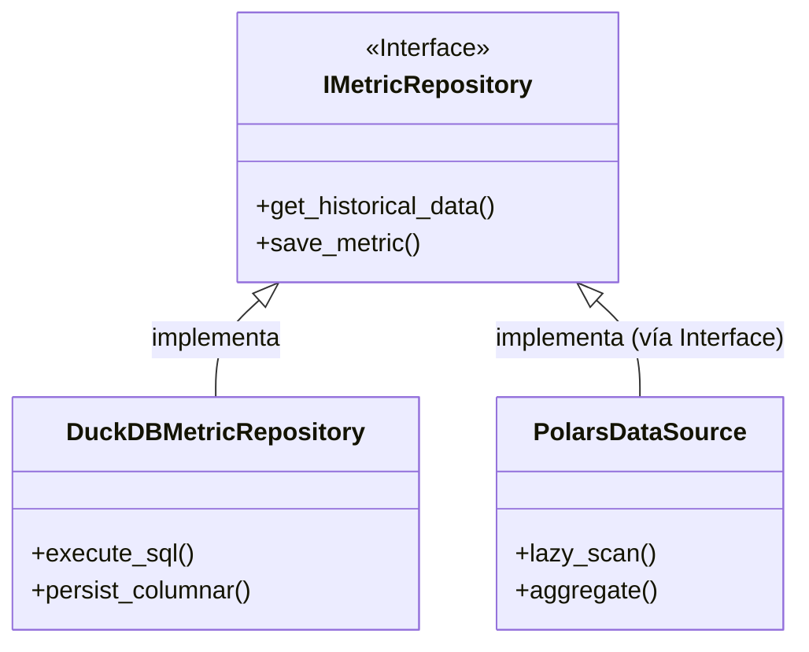

# Referencia Técnica: Diccionario de Componentes (Deep Dive)

Esta sección expande la documentación técnica generada automáticamente, proporcionando el contexto matemático y teórico necesario para cada componente crítico del sistema.

---

## 🏛️ 1. Casos de Uso de Aplicación

Los casos de Uso ([`src/application/use_cases/`](file:///c:/Users/LENOVO/Documents/tesis/src/application/use_cases/)) encapsulan la lógica de orquestación.

### 🧮 1.1 Cálculo de Capacidad (CalculateSectorCapacity)
::: src.application.use_cases.calculate_sector_capacity
    options:
      members:
        - execute

> **Nota Técnica**: La clase `CalculateSectorCapacity` implementa el flujo de control para la **Circular 006**.
> - **Método Crítico**: `_get_tps()` realiza la agregación temporal de vuelos en ventanas de 60 minutos con solapamiento métrico para detectar el valor pico.
> - **Fundamento**: Basado en el algoritmo de ventana deslizante para análisis de series temporales.

---

## 📈 2. Fundamentación Matemática de Modelos Predictivos

### 📉 2.1 Módulo Estacional (Fourier Series)
[`PredictSeasonalTrend`](file:///c:/Users/LENOVO/Documents/tesis/src/application/use_cases/predict_seasonal_trend.py) utiliza la descomposición de series de tiempo.

**Ecuación de Tendencia**:
$$ y_t = \beta_0 + \beta_1 t + \sum_{n=1}^N \left[ a_n \cos\left(\frac{2\pi n t}{P}\right) + b_n \sin\left(\frac{2\pi n t}{P}\right) \right] + \epsilon_t $$

- **Justificación**: El espacio aéreo presenta ciclos anuales ($P=365.25$) y semanales ($P=7$). El uso de términos de Fourier ($N=10$ para anual, $N=3$ para semanal) permite capturar la ciclicidad sin sobreajuste (overfitting).
- **Referencia**: Hyndman, R.J., & Athanasopoulos, G. (2018). *Forecasting: Principles and Practice*.

### 🌲 2.2 Residuos Híbridos (Random Forest)
[`PredictDailyDemand`](file:///c:/Users/LENOVO/Documents/tesis/src/application/use_cases/predict_daily_demand.py) implementa un modelo de residuos.
1.  **Paso 1**: Se extrae la tendencia estacional.
2.  **Paso 2**: El **Random Forest** se entrena sobre los residuos ($\epsilon_t$) usando retardos (lags) de 7, 14 y 30 días.
3.  **Matemática**: $ \hat{\epsilon}_t = f(L_7, L_{14}, L_{30}) $, donde $f$ son los árboles de decisión generados.

---

## 🌀 3. Mapa de Colaboración Full-Stack

Esta tabla mapea la lógica de backend con su representación visual en el frontend.

| Entidad / Lógica | Archivo Python (Backend) | Componente React (Frontend) | Responsabilidad Visual |
| :--- | :--- | :--- | :--- |
| **Sectores** | `manage_sectors.py` | `SectorConfigurationView.tsx` | Configuración de parámetros operativos. |
| **Demanda** | `predict_daily_demand.py` | `DailyDemandChart.tsx` | Visualización de predicción a 30 días. |
| **Picos** | `predict_peak_hours.py` | `PeakHoursHeatmap.tsx` | Detección de horas de congestión. |
| **Saturación** | `predict_sector_saturation.py`| `SectorSaturationChart.tsx` | Alerta de capacidad vs demanda. |

---

## 📊 4. Jerarquía de Repositorios (Ports & Adapters)

---

## 📚 5. Bibliografía de Desarrollo y Librerías

1.  **Pedregosa, F., et al. (2011)**. *Scikit-learn: Machine Learning in Python*. JMLR. [Librería base para Random Forest].
2.  **Virtanen, P., et al. (2020)**. *SciPy 1.0: Fundamental Algorithms for Scientific Computing in Python*. Nature Methods. [Base para optimización y Fourier].
3.  **Vandervoort, R. (2022)**. *Polars Documentation*. [polars.rs](https://pola.rs).
4.  **Robert C. Martin (2017)**. *Clean Architecture*. Prentice Hall.

---

> [!TIP]
> **Extensibilidad**: Para añadir un nuevo modelo de predicción, implementa un nuevo Caso de Uso en `src/application/use_cases/` y regístralo en el `DI Container`.
