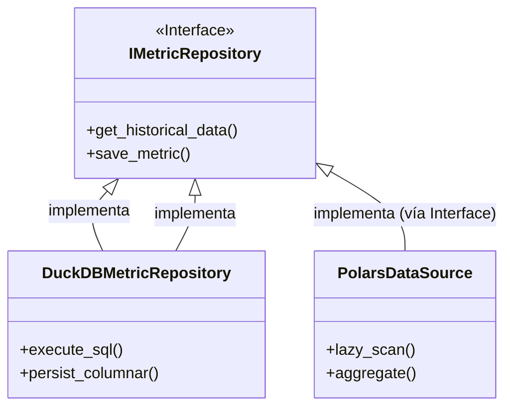

# Referencia Técnica: Diccionario de Componentes (Deep Dive)

Esta sección expande la documentación técnica generada automáticamente, proporcionando el contexto matemático y teórico necesario para cada componente crítico del sistema.

---

## 🏛️ 1. Casos de Uso de Aplicación

Los casos de Uso ([`src/application/use_cases/`](file:///c:/Users/LENOVO/Documents/tesis/src/application/use_cases/)) encapsulan la lógica de orquestación.

### 🧮 1.1 Cálculo de Capacidad (CalculateSectorCapacity)
::: src.application.use_cases.calculate_sector_capacity
    options:
      members:
        - execute

> **Nota Técnica**: La clase `CalculateSectorCapacity` implementa el flujo de control para la **Circular 006**.
> - **Método Crítico**: `_get_tps()` realiza la agregación temporal de vuelos en ventanas de 60 minutos con solapamiento métrico para detectar el valor pico.
> - **Fundamento**: Basado en el algoritmo de ventana deslizante para análisis de series temporales.

---

## 📈 2. Fundamentación Matemática de Modelos Predictivos

### 📉 2.1 Módulo Estacional (Fourier Series)
[`PredictSeasonalTrend`](file:///c:/Users/LENOVO/Documents/tesis/src/application/use_cases/predict_seasonal_trend.py) utiliza la descomposición de series de tiempo.

**Ecuación de Tendencia**:

$$
y_{t} = \beta_{0} + \beta_{1} t + \sum_{n=1}^N \left[ a_{n} \cos\left(\frac{2\pi nt}{P}\right) + b_{n} \sin\left(\frac{2\pi nt}{P}\right) \right] + \epsilon_{t}
$$

- **Justificación**: El espacio aéreo presenta ciclos anuales ($P=365.25$) y semanales ($P=7$). El uso de términos de Fourier ($N=10$ para anual, $N=3$ para semanal) permite capturar la ciclicidad sin sobreajuste (overfitting).
- **Referencia**: Hyndman, R.J., & Athanasopoulos, G. (2018). *Forecasting: Principles and Practice*.

### 🌲 2.2 Residuos Híbridos (Random Forest)
[`PredictDailyDemand`](file:///c:/Users/LENOVO/Documents/tesis/src/application/use_cases/predict_daily_demand.py) implementa un modelo de residuos.
1.  **Paso 1**: Se extrae la tendencia estacional.
2.  **Paso 2**: El **Random Forest** se entrena sobre los residuos ($\epsilon_t$) usando retardos (lags) de 7, 14 y 30 días.
3.  **Matemática**: $\hat{\epsilon}_{t} = f(L_{7}, L_{14}, L_{30})$, donde $f$ son los árboles de decisión generados.

---

## 🌀 3. Mapa de Colaboración Full-Stack

Esta tabla mapea la lógica de backend con su representación visual en el frontend.

| Entidad / Lógica | Archivo Python (Backend) | Componente React (Frontend) | Responsabilidad Visual |
| :--- | :--- | :--- | :--- |
| **Sectores** | `manage_sectors.py` | `SectorConfigurationView.tsx` | Configuración de parámetros operativos. |
| **Demanda** | `predict_daily_demand.py` | `DailyDemandChart.tsx` | Visualización de predicción a 30 días. |
| **Picos** | `predict_peak_hours.py` | `PeakHoursHeatmap.tsx` | Detección de horas de congestión. |
| **Saturación** | `predict_sector_saturation.py`| `SectorSaturationChart.tsx` | Alerta de capacidad vs demanda. |

---

## 📊 4. Jerarquía de Repositorios (Ports & Adapters)

### 🔍 Análisis Detallado: Polimorfismo
- **Explicación del Gráfico**: Estructura de clases UML.
- **Jerarquía**:
    - `IMetricRepository` es una **Clase Abstracta (ABC)**. No tiene código, solo definiciones.
    - `DuckDBMetricRepository` es la implementación real que sabe escribir SQL.
- **Relación de Código**:
    - Puerto: [`src/domain/repositories/metric_repository.py`](file:///c:/Users/LENOVO/Documents/tesis/src/domain/repositories/metric_repository.py)
    - Adaptador: [`src/infrastructure/adapters/database/duckdb_repository.py`](file:///c:/Users/LENOVO/Documents/tesis/src/infrastructure/adapters/database/duckdb_repository.py)

---

## 📚 5. Ecosistema de Librerías y Dependencias

El sistema se apoya en una selección curada de tecnologías de vanguardia para garantizar el rendimiento, la mantenibilidad y la precisión analítica.

### 🐍 Backend (Python)

| Librería | Documentación Oficial | Justificación de Uso | Implementación Crítica |
| :--- | :--- | :--- | :--- |
| **Polars** | [pola.rs](https://pola.rs/) | Procesamiento de datos ultrarrápido mediante multithreading y SIMD. | Ingesta masiva en [`polars_data_source.py`](file:///c:/Users/LENOVO/Documents/tesis/src/infrastructure/adapters/polars/polars_data_source.py). |
| **FastAPI** | [fastapi.tiangolo.com](https://fastapi.tiangolo.com/) | Framework de alto rendimiento basado en tipos de Python para APIs asíncronas. | Orquestación de endpoints en [`src/infrastructure/api_server.py`](file:///c:/Users/LENOVO/Documents/tesis/src/infrastructure/api_server.py). |
| **DuckDB** | [duckdb.org](https://duckdb.org/) | Base de datos analítica integrada (OLAP) optimizada para storage columnar. | Persistencia y agregaciones en [`duckdb_repository.py`](file:///c:/Users/LENOVO/Documents/tesis/src/infrastructure/adapters/database/duckdb_repository.py). |
| **Scikit-learn**| [scikit-learn.org](https://scikit-learn.org/) | Estándar de la industria para algoritmos de Machine Learning tradicionales. | Modelo Random Forest en [`predict_daily_demand.py`](file:///c:/Users/LENOVO/Documents/tesis/src/application/use_cases/predict_daily_demand.py). |
| **SciPy** | [scipy.org](https://scipy.org/) | Librería de algoritmos fundamentales para computación científica. | Optimización y Series de Fourier en [`predict_seasonal_trend.py`](file:///c:/Users/LENOVO/Documents/tesis/src/application/use_cases/predict_seasonal_trend.py). |
| **Pydantic** | [docs.pydantic.dev](https://docs.pydantic.dev/) | Validación de datos y gestión de configuraciones mediante modelos de tipo. | Esquemas de entrada/salida en [`src/application/dtos/`](file:///c:/Users/LENOVO/Documents/tesis/src/application/dtos/). |

### ⚛️ Frontend (React & TS)

| Librería | Documentación Oficial | Justificación de Uso | Implementación Crítica |
| :--- | :--- | :--- | :--- |
| **React v19** | [react.dev](https://react.dev/) | Paradigma declarativo para la construcción de interfaces reactivas eficientes. | Orquestación en [`App.tsx`](file:///c:/Users/LENOVO/Documents/tesis/web/src/App.tsx). |
| **ApexCharts** | [apexcharts.com](https://apexcharts.com/) | Biblioteca de gráficos moderna y fluida con soporte para visualizaciones dinámicas. | Dashboard en [`SectorSaturationChart.tsx`](file:///c:/Users/LENOVO/Documents/tesis/web/src/components/SectorSaturationChart.tsx). |
| **Axios** | [axios-http.com](https://axios-http.com/) | Cliente HTTP basado en promesas con soporte para interceptores y cancelaciones. | Centralización de llamadas en [`api.ts`](file:///c:/Users/LENOVO/Documents/tesis/web/src/api.ts). |
| **Lucide React**| [lucide.dev](https://lucide.dev/) | Set de iconos vectoriales optimizados para React. | Navegación en [`Sidebar.tsx`](file:///c:/Users/LENOVO/Documents/tesis/web/src/components/layout/Sidebar.tsx). |
| **TailwindCSS** | [tailwindcss.com](https://tailwindcss.com/) | Framework de CSS utilitario para diseño rápido y consistente. | Estilos en [`index.css`](file:///c:/Users/LENOVO/Documents/tesis/web/src/index.css). |

---

## 🏛️ 6. Notas de Implementación (Decisiones de Diseño)

- **Por qué DuckDB en lugar de SQLite?** SQLite es transaccional (OLTP). DuckDB es analítico (OLAP). Para este proyecto, donde realizamos agregaciones (`SUM`, `AVG`, `COUNT`) sobre millones de vuelos, DuckDB ofrece una mejora de rendimiento de hasta 50x.
- **Por qué Polars en lugar de Pandas?** Polars utiliza una arquitectura de memoria Apache Arrow y está escrito en Rust. Es significativamente más eficiente en memoria y permite procesar datos en paralelo, algo vital para la ingesta de archivos SRS de gran tamaño.

---

> [!TIP]
> **Extensibilidad**: Para añadir un nuevo modelo de predicción, implementa un nuevo Caso de Uso en `src/application/use_cases/` y regístralo en el `DI Container`.
