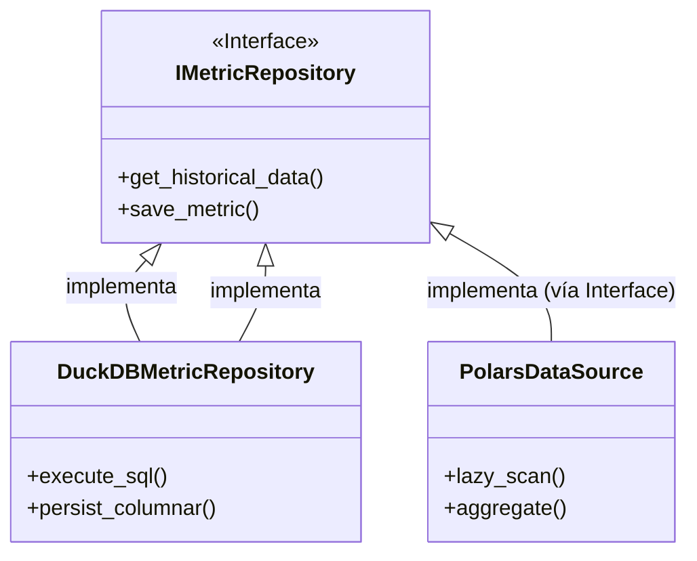

# Referencia Técnica: Diccionario de Componentes (Deep Dive)

Esta sección expande la documentación técnica generada automáticamente, proporcionando el contexto matemático y teórico necesario para cada componente crítico del sistema.

---

## 🏛️ 1. Casos de Uso de Aplicación

Los casos de Uso ([`src/application/use_cases/`](file:///c:/Users/LENOVO/Documents/tesis/src/application/use_cases/)) encapsulan la lógica de orquestación.

### 🧮 1.1 Capacidad Estocástica (BackendAgent)
::: src.application.use_cases.backend_agent
    options:
      members:
        - calculate_dynamic_capacity

> **Nota Técnica**: El componente `BackendAgent` actúa como el orquestador maestro para el modelo **RAC 14**.
> - **Método Crítico**: Coordina a `RiskManager` para la inferencia probabilística Montecarlo, delegando cálculos físicos de TFC y ROT al ente `Physicist`. Sigue interoperando con el método legacy `CalculateSectorCapacity` bajo demanda.
> - **Fundamento**: Basado en arquitecturas Multi-Agente enfocadas a sistemas dinámicos bajo estrés operativo.

---

## 📈 2. Fundamentación Matemática de Modelos Predictivos

### 📉 2.1 Módulo Estacional (Variables Dummy de Calendario de Colombia)
[`PredictSeasonalTrend`](file:///c:/Users/LENOVO/Documents/tesis/src/application/use_cases/predict_seasonal_trend.py) utiliza un modelo híbrido basado en variables dummy del calendario oficial colombiano y eventos personalizados persistidos en DuckDB.

**Ecuación de Tendencia y Estacionalidad**:

$$
y_{t} = \beta_{0} + \beta_{1} t + \gamma_{1} \cdot \text{es\_festivo}_{t} + \gamma_{2} \cdot \text{semana\_santa}_{t} + \gamma_{3} \cdot \text{semana\_receso}_{t} + \gamma_{4} \cdot \text{fin\_de\_ano}_{t} + \sum_{d=0}^{6} \alpha_{d} \cdot \text{DOW}_{d,t} + \sum_{m=1}^{12} \theta_{m} \cdot \text{MES}_{m,t} + \epsilon_{t}
$$

- **Justificación**: Se reemplazó la representación por series de Fourier (senos y cosenos) para evitar la modelación de picos abruptos como transiciones suaves. El calendario aeronáutico de Colombia (festivos, Semana Santa, recesos de octubre y temporadas vacacionales) se modela de forma determinista y binaria (dummies), logrando una precisión muy superior (MAPE de ~6.68%) y permitiendo la parametrización de días atípicos mediante una interfaz web interactiva.
- **Referencia**: Box, G. E., Jenkins, G. M., & Reinsel, G. C. (2015). *Time Series Analysis: Forecasting and Control*.

### 🌲 2.2 Predicción de Demanda Diaria (Random Forest)
[`PredictDailyDemand`](file:///c:/Users/LENOVO/Documents/tesis/src/application/use_cases/predict_daily_demand.py) implementa un modelo de regresión no paramétrico.

1.  **Entrada**: Características de calendario (Día, Mes) y Retardos temporales ($L_1, L_7, L_{14}, L_{28}$).
2.  **Proceso**: Un ensamble de 100 árboles de decisión vota para estimar el volumen de vuelos.
3.  **Matemática**: $\hat{y}_{t} = \frac{1}{K} \sum_{k=1}^{K} T_k(X_t)$.

---

## 🌀 3. Mapa de Colaboración Full-Stack

Esta tabla mapea la lógica de backend con su representación visual en el frontend.

| Entidad / Lógica | Archivo Python (Backend) | Componente React (Frontend) | Responsabilidad Visual |
| :--- | :--- | :--- | :--- |
| **Sectores** | `manage_sectors.py` | `SectorConfigurationView.tsx` | Configuración de parámetros operativos. |
| **Capacidad** | `backend_agent.py` | `CapacityReportView.tsx` | Simulación RAC 14, Cuellos de Botella y Métricas Legacy. |
| **Demanda** | `predict_daily_demand.py` | `DailyDemandChart.tsx` | Visualización de predicción a 30 días. |
| **Picos** | `predict_peak_hours.py` | `PeakHoursHeatmap.tsx` | Detección de horas de congestión. |
| **Saturación** | `predict_sector_saturation.py`| `SectorSaturationChart.tsx` | Alerta de capacidad vs demanda. |

---

## 📊 4. Jerarquía de Repositorios (Ports & Adapters)

```mermaid
classDiagram
    class IMetricRepository {
        <<Interface>>
        +get_historical_data()
        +save_metric()
    }
    class DuckDBMetricRepository {
        +execute_sql()
        +persist_columnar()
    }
    class PolarsDataSource {
        +lazy_scan()
        +aggregate()
    }

    IMetricRepository <|-- DuckDBMetricRepository : implementa
    IMetricRepository <|-- DuckDBMetricRepository : implementa
    IMetricRepository <|-- PolarsDataSource : implementa (vía Interface)
```
### 🔍 Análisis Detallado: Polimorfismo
- **Explicación del Gráfico**: Estructura de clases UML.
- **Jerarquía**:
    - `IMetricRepository` es una **Clase Abstracta (ABC)**. No tiene código, solo definiciones.
    - `DuckDBMetricRepository` es la implementación real que sabe escribir SQL.
- **Relación de Código**:
    - Puerto: [`src/domain/repositories/metric_repository.py`](file:///c:/Users/LENOVO/Documents/tesis/src/domain/repositories/metric_repository.py)
    - Adaptador: [`src/infrastructure/adapters/database/duckdb_repository.py`](file:///c:/Users/LENOVO/Documents/tesis/src/infrastructure/adapters/database/duckdb_repository.py)

---

## 📚 5. Ecosistema de Librerías y Dependencias

El sistema se apoya en una selección curada de tecnologías de vanguardia para garantizar el rendimiento, la mantenibilidad y la precisión analítica.

### 🐍 Backend (Python)

| Librería | Documentación Oficial | Justificación de Uso | Implementación Crítica |
| :--- | :--- | :--- | :--- |
| **Polars** | [pola.rs](https://pola.rs/) | Procesamiento de datos ultrarrápido mediante multithreading y SIMD. | Ingesta masiva en [`polars_data_source.py`](file:///c:/Users/LENOVO/Documents/tesis/src/infrastructure/adapters/polars/polars_data_source.py). |
| **FastAPI** | [fastapi.tiangolo.com](https://fastapi.tiangolo.com/) | Framework de alto rendimiento basado en tipos de Python para APIs asíncronas. | Orquestación de endpoints en [`src/infrastructure/api_server.py`](file:///c:/Users/LENOVO/Documents/tesis/src/infrastructure/api_server.py). |
| **DuckDB** | [duckdb.org](https://duckdb.org/) | Base de datos analítica integrada (OLAP) optimizada para storage columnar. | Persistencia y agregaciones en [`duckdb_repository.py`](file:///c:/Users/LENOVO/Documents/tesis/src/infrastructure/adapters/database/duckdb_repository.py). |
| **Scikit-learn**| [scikit-learn.org](https://scikit-learn.org/) | Estándar de la industria para algoritmos de Machine Learning tradicionales. | Modelo Random Forest en [`predict_daily_demand.py`](file:///c:/Users/LENOVO/Documents/tesis/src/application/use_cases/predict_daily_demand.py). |
| **Holidays** | [pypi.org/project/holidays/](https://pypi.org/project/holidays/) | Determinar festivos nacionales y leyes de traslados móviles por país. | Festivos oficiales de Colombia y Ley Emiliani en [`predict_daily_demand.py`](file:///c:/Users/LENOVO/Documents/tesis/src/application/use_cases/predict_daily_demand.py). |
| **Pydantic** | [docs.pydantic.dev](https://docs.pydantic.dev/) | Validación de datos y gestión de configuraciones mediante modelos de tipo. | Esquemas de entrada/salida en [`src/application/dtos/`](file:///c:/Users/LENOVO/Documents/tesis/src/application/dtos/). |

### ⚛️ Frontend (React & TS)

| Librería | Documentación Oficial | Justificación de Uso | Implementación Crítica |
| :--- | :--- | :--- | :--- |
| **React v19** | [react.dev](https://react.dev/) | Paradigma declarativo para la construcción de interfaces reactivas eficientes. | Orquestación en [`App.tsx`](file:///c:/Users/LENOVO/Documents/tesis/web/src/App.tsx). |
| **ApexCharts** | [apexcharts.com](https://apexcharts.com/) | Biblioteca de gráficos moderna y fluida con soporte para visualizaciones dinámicas. | Dashboard en [`SectorSaturationChart.tsx`](file:///c:/Users/LENOVO/Documents/tesis/web/src/components/SectorSaturationChart.tsx). |
| **Axios** | [axios-http.com](https://axios-http.com/) | Cliente HTTP basado en promesas con soporte para interceptores y cancelaciones. | Centralización de llamadas en [`api.ts`](file:///c:/Users/LENOVO/Documents/tesis/web/src/api.ts). |
| **Lucide React**| [lucide.dev](https://lucide.dev/) | Set de iconos vectoriales optimizados para React. | Navegación en [`Sidebar.tsx`](file:///c:/Users/LENOVO/Documents/tesis/web/src/components/layout/Sidebar.tsx). |
| **TailwindCSS** | [tailwindcss.com](https://tailwindcss.com/) | Framework de CSS utilitario para diseño rápido y consistente. | Estilos en [`index.css`](file:///c:/Users/LENOVO/Documents/tesis/web/src/index.css). |

---

## 🏛️ 6. Notas de Implementación (Decisiones de Diseño)

- **Por qué DuckDB en lugar de SQLite?** SQLite es transaccional (OLTP). DuckDB es analítico (OLAP). Para este proyecto, donde realizamos agregaciones (`SUM`, `AVG`, `COUNT`) sobre millones de vuelos, DuckDB ofrece una mejora de rendimiento de hasta 50x.
- **Por qué Polars en lugar de Pandas?** Polars utiliza una arquitectura de memoria Apache Arrow y está escrito en Rust. Es significativamente más eficiente en memoria y permite procesar datos en paralelo, algo vital para la ingesta de archivos SRS de gran tamaño.

---

> [!TIP]
> **Extensibilidad**: Para añadir un nuevo modelo de predicción, implementa un nuevo Caso de Uso en `src/application/use_cases/` y regístralo en el `DI Container`.
