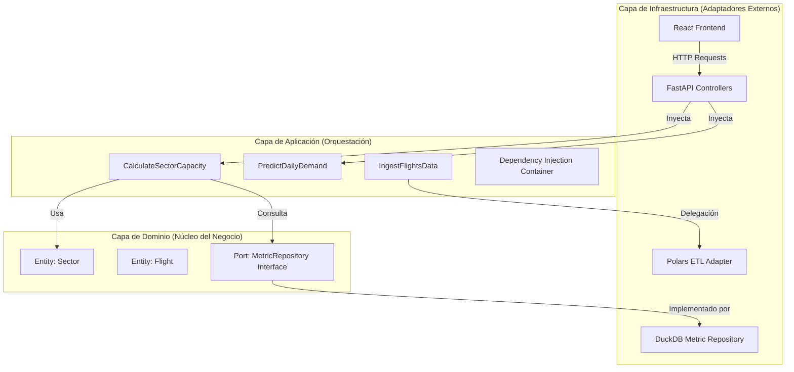

# 📘 Manual Técnico Maestro: ATC Capacity & Analytics

Este documento constituye la referencia técnica definitiva del sistema. Ha sido diseñado para proporcionar una visibilidad total sobre los fundamentos arquitectónicos, algoritmos matemáticos y decisiones de ingeniería que sustentan la plataforma.

---

## 🏗️ 1. Fundamentos Arquitectónicos

El sistema está construido bajo los principios de **Arquitectura Hexagonal** (Puertos y Adaptadores) y **Arquitectura Limpia**. Esta decisión de diseño garantiza que la lógica de negocio (el cálculo de capacidad y predicción) sea totalmente independiente de las herramientas externas como bases de datos, frameworks web o motores de procesamiento.

### 🧩 Diagrama de Capas y Flujo de Dependencias

### 🎯 Por qué esta Arquitectura
1.  **Independencia de Frameworks**: El núcleo del sistema no sabe que existe FastAPI o React. Podría convertirse en una herramienta de consola sin tocar la lógica de cálculo.
2.  **Testabilidad**: Podemos probar el cálculo de capacidad inyectando un repositorio "mock" en memoria sin necesidad de archivos reales.
3.  **Mantenibilidad de Polars**: Si en el futuro se requiere procesar miles de millones de registros, el adaptador de Polars puede ser reemplazado por un adaptador de Spark manteniendo intacto el caso de uso de ingesta.

---

## 🏛️ 2. Capa de Dominio (The Core)

Ubicación: `src/domain/`

Es la capa más interna y pura. Contiene las reglas que definen "qué es el negocio".

### 📦 Entidades Principales
- **Sector (`entities/sector.py`)**: Representa un volumen de control ATC. Define sus límites lógicos (Aeropuertos de Origen/Destino) y sus coeficientes técnicos (TFC, Factor R).
- **Flight (`entities/metric.py`)**: Estructura canónica de un vuelo procesado, conteniendo SIDs, niveles, fechas y aeródromos.
- **FileInfo (`entities/file_info.py`)**: Rastrea el metadato de cada archivo cargado (tamaño, estado de validación, errores).

### ⚓ Puertos (Interfaces)
- **MetricRepository**: Interfaz abstracta que define los métodos de persistencia (`save`, `get_stats_by_region`, `search_flights`). Permite que la capa de aplicación hable un lenguaje agnóstico antes de llegar a DuckDB.

---

## 🟢 3. Capa de Aplicación (Use Cases)

Ubicación: `src/application/`

Actúa como el cerebro del sistema, coordinando el flujo de datos hacia y desde las entidades.

### 🧩 Casos de Uso Críticos
1.  **CalculateSectorCapacity**: Implementa la lógica normativa Circular 006.
2.  **PredictDailyDemand**: Orquesta el motor de inferencia estadística.
3.  **IngestFlightsData**: Controla el ciclo de vida de los datos, desde la validación de esquema hasta la indexación final.

---

---

## 🧮 4. Fundamentos Matemáticos y Algoritmos (Extreme Detail)

### 📐 4.1 Metodología Circular 006 (UAEAC)

La **Capacidad de un Sector ATC** se define como el número de aeronaves que pueden ser aceptadas en un sector de control en un periodo de tiempo determinado, garantizando que la carga de trabajo del controlador se mantenga dentro de niveles seguros.

#### A. Derivación Matemática del SCV
La **Capacidad Simultánea de Vuelos (SCV)** es el número máximo de aeronaves que un controlador puede gestionar simultáneamente sin exceder su umbral cognitivo.

$$SCV = \frac{TPS}{TFC \times f_{mental}}$$

Donde:
- **TPS (Time in Sector)**: Tiempo promedio que una aeronave permanece dentro del volumen del sector. Calculado dinámicamente en el método `CalculateSectorCapacity._get_tps()`.
- **TFC (Time of Control Functions)**: Suma de los tiempos de Transferencia, Comunicación, Separación y Coordinación. Definido por el usuario en `SectorForm.tsx` y procesado en `CalculateSectorCapacity.execute()`.
- **$f_{mental}$ (Factor de Carga Mental)**: Constante 1.3 recomendada por la OACI (Doc 9689) para asegurar que el controlador disponga de un 30% de tiempo libre para imprevistos.

#### B. Capacidad Horaria (CH)
La capacidad horaria extrapola el SCV a una ventana de 60 minutos:

$$CH = \frac{3600 \times SCV}{TPS} \times R$$

- **Factor de Ajuste R**: Un coeficiente multiplicador (0.1 a 1.0) que penaliza la capacidad teórica ante factores externos (ej: degradación de radar o tormentas). Implementado en `src/application/use_cases/calculate_sector_capacity.py#L121`.

---

### 🤖 4.2 Inferencia Predictiva con Random Forest

El modelo implementado en [`predict_daily_demand.py`](file:///c:/Users/LENOVO/Documents/tesis/src/application/use_cases/predict_daily_demand.py) utiliza un ensamble de 100 árboles de decisión para mitigar el sesgo y la varianza.

#### Justificación de la Estrategia "Recursive Lag"
Debido a que el sistema debe predecir hasta 30 días con una granularidad diaria, se utiliza una estrategia recursiva:
1. Se predice el día $t+1$ usando los lags reales de la historia.
2. El valor predicho para $t+1$ se reinyecta como "Input" para calcular el lag de 1 día para la predicción de $t+2$.
3. Este proceso se repite $n$ veces hasta completar el horizonte.

**Ecuación de Características (Feature Vector):**
$$X_t = [D_{wk}, M_{yr}, Y_{trend}, Lag_1, Lag_7, Lag_{14}, Lag_{28}]$$

- **Teoría de Lags**: El uso de lags de 7 y 14 permite capturar la estacionalidad semanal (el factor con mayor auto-correlación en el tráfico aéreo comercial).

---

### 📈 4.3 Análisis Estacional via FFT (Fast Fourier Transform)

En el módulo [`predict_seasonal_trend.py`](file:///c:/Users/LENOVO/Documents/tesis/src/application/use_cases/predict_seasonal_trend.py), la estacionalidad no se trata como una variable discreta, sino como un fenómeno ondulatorio.

$$y(t) = \alpha + \beta t + \sum_{k=1}^{N} (a_k \sin(\frac{2\pi kt}{P}) + b_k \cos(\frac{2\pi kt}{P})) + \epsilon$$

- **Fundamentación**: Se utilizan 10 órdenes de Fourier para capturar la estacionalidad anual ($P=365.25$) y 3 órdenes para la semanal ($P=7$). Esto permite que el modelo "aprenda" formas complejas de demanda que no son puramente sinusoidales.

---

## 🏛️ 5. Mapeo Técnico de Funcionalidades (Code Matrix)

| Funcionalidad | Archivo de Orquestación (UC) | Método Crítico | Adaptador / Puerto |
| :--- | :--- | :--- | :--- |
| Ingesta ETL | `ingest_flights_data.py` | `execute()` | `PolarsDataSource` |
| Cálculo Capacidad | `calculate_sector_capacity.py` | `execute()` | `DuckDBRepository` |
| Predicción Demanda | `predict_daily_demand.py` | `execute()` | `Scikit-Learn (RF)` |
| Análisis Geográfico | `generate_region_report.py` | `execute()` | `DuckDBRepository` |
| Exportación PDF/XL | `generate_executive_report.py` | `generate_pdf()` | `ReportLab / Pandas` |

---

## 📚 9. Bibliografía Ampliada y Referencias Académicas

### Normativa Internacional y Local
1.  **OACI (ICAO)**. *Doc 9689: Manual on Air Traffic Services (ATS) Ground Capacity Planning*. Primera Edición.
2.  **Aerocivil Colombia**. *Circular Informativa No. 006: Procedimientos para la determinación de capacidad de los sectores**.

### Fundamentos de Ciencia de Datos e IA
3.  **Breiman, L. (2001)**. *Random Forests*. Machine Learning Journal. [Referencia académica para la estabilidad del ensamble].
4.  **Hyndman, R.J., & Athanasopoulos, G. (2021)**. *Forecasting: Principles and Practice*. OTexts. [Base teórica para el uso de términos de Fourier en series temporales].
5.  **VanderPlas, J. (2016)**. *Python Data Science Handbook*. O'Reilly Media. [Guía técnica para la implementación de Scikit-Learn].

### Recursos Digitales
6.  **DuckDB Documentation**. *DuckDB: The SQLite for Analytics*. [duckdb.org](https://duckdb.org).
7.  **Polars User Guide**. *Lazy Evaluation and Memory Efficiency in Python*. [pola.rs](https://pola.rs).
