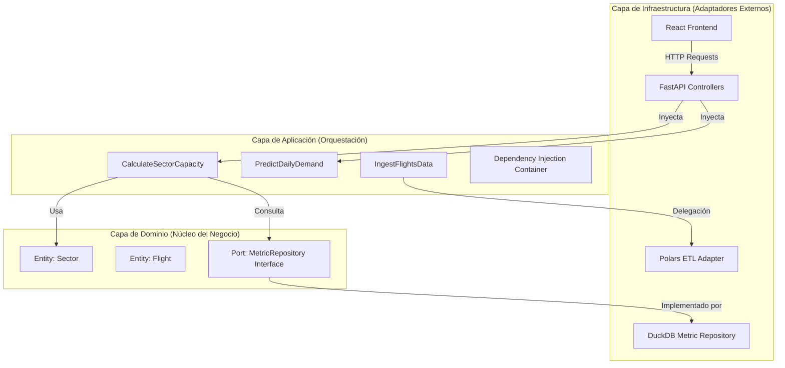

# 📘 Manual Técnico Maestro: ATC Capacity & Analytics

Este documento constituye la referencia técnica definitiva del sistema. Ha sido diseñado para proporcionar una visibilidad total sobre los fundamentos arquitectónicos, algoritmos matemáticos y decisiones de ingeniería que sustentan la plataforma.

---

## 🏗️ 1. Fundamentos Arquitectónicos

El sistema está construido bajo los principios de **Arquitectura Hexagonal** (Puertos y Adaptadores) y **Arquitectura Limpia**. Esta decisión de diseño garantiza que la lógica de negocio (el cálculo de capacidad y predicción) sea totalmente independiente de las herramientas externas como bases de datos, frameworks web o motores de procesamiento.

### 🧩 Diagrama de Capas y Flujo de Dependencias

### 🎯 Por qué esta Arquitectura
1.  **Independencia de Frameworks**: El núcleo del sistema no sabe que existe FastAPI o React. Podría convertirse en una herramienta de consola sin tocar la lógica de cálculo.
2.  **Testabilidad**: Podemos probar el cálculo de capacidad inyectando un repositorio "mock" en memoria sin necesidad de archivos reales.
3.  **Mantenibilidad de Polars**: Si en el futuro se requiere procesar miles de millones de registros, el adaptador de Polars puede ser reemplazado por un adaptador de Spark manteniendo intacto el caso de uso de ingesta.

---

## 🏛️ 2. Capa de Dominio (The Core)

Ubicación: `src/domain/`

Es la capa más interna y pura. Contiene las reglas que definen "qué es el negocio".

### 📦 Entidades Principales
- **Sector (`entities/sector.py`)**: Representa un volumen de control ATC. Define sus límites lógicos (Aeropuertos de Origen/Destino) y sus coeficientes técnicos (TFC, Factor R).
- **Flight (`entities/metric.py`)**: Estructura canónica de un vuelo procesado, conteniendo SIDs, niveles, fechas y aeródromos.
- **FileInfo (`entities/file_info.py`)**: Rastrea el metadato de cada archivo cargado (tamaño, estado de validación, errores).

### ⚓ Puertos (Interfaces)
- **MetricRepository**: Interfaz abstracta que define los métodos de persistencia (`save`, `get_stats_by_region`, `search_flights`). Permite que la capa de aplicación hable un lenguaje agnóstico antes de llegar a DuckDB.

---

## 🟢 3. Capa de Aplicación (Use Cases)

Ubicación: `src/application/`

Actúa como el cerebro del sistema, coordinando el flujo de datos hacia y desde las entidades.

### 🧩 Casos de Uso Críticos
1.  **CalculateSectorCapacity**: Implementa la lógica normativa Circular 006.
2.  **PredictDailyDemand**: Orquesta el motor de inferencia estadística.
3.  **IngestFlightsData**: Controla el ciclo de vida de los datos, desde la validación de esquema hasta la indexación final.

---

## 🧮 4. Fundamentos Matemáticos y Algoritmos

El valor diferencial del sistema reside en su capacidad de convertir datos crudos en métricas de ingeniería.

### 📐 Metodología Circular 006 (Capacidad Técnica)
El sistema calcula la **Capacidad Horaria (CH)** mediante la derivación de la **Capacidad Simultánea de Vuelos (SCV)**.

**Fórmulas Implementadas:**
1.  **TFC (Tiempo de Funciones de Control)**:
    $$TFC = t_{transfer} + t_{comunicaciones} + t_{vigilancia} + t_{coordinacion}$$
2.  **SCV (Capacidad Simultánea)**:
    $$SCV = \frac{TPS}{TFC \times 1.3}$$
    *Donde TPS es el Tiempo de Permanencia en Sector calculado dinámicamente y 1.3 es el buffer de carga mental.*
3.  **CH (Capacidad Horaria)**:
    $$CH = \frac{3,600 \times SCV}{TPS} \times R$$
    *Donde R es el factor de ajuste operacional definido por el usuario.*

### 🤖 Motor de Inteligencia Artificial (Predictive engine)
El sistema utiliza dos enfoques para la predicción de demanda:

#### A. Bosques Aleatorios (Random Forest Regressor)
Utilizado para la predicción a 30 días.
- **Por qué**: No asume una distribución lineal y es altamente resistente a valores atípicos (outliers) en el tráfico aéreo.
- **Features**: Lags temporales (t-1, t-7, t-14, t-28), día del año, mes y día de la semana.
- **Incertidumbre**: Se calcula el Intervalo de Confianza (95%) mediante la varianza de las predicciones de los 100 árboles de decisión en el ensamble.

#### B. Series de Fourier (Tendencia Estacional)
Utilizado para el análisis de estacionalidad pura.
- **Mecánica**: Descompone la señal de tráfico en componentes sinusoidales para identificar ciclos anuales y semanales, aislando la tendencia secular mediante regresiones lineales.

---

## 📥 5. Infraestructura y Adaptadores

### ⚡ Motor ETL con Polars
- **Estrategia**: Streaming + Lazy Evaluation.
- El sistema utiliza `pl.scan_csv()` para no cargar archivos pesados en RAM. Realiza validaciones de tipos en tiempo real antes de inyectar a DuckDB.

### 🦆 Persistencia con DuckDB
- Se seleccionó DuckDB por ser un motor **OLAP in-process**.
- Permite realizar agregaciones de millones de filas en milisegundos directamente sobre el archivo `data/metrics.duckdb`, eliminando la necesidad de un servidor de base de datos pesado como PostgreSQL.

---

## ⚛️ 6. Arquitectura Frontend

Desarrollado con **React v18** y **Vite**.

### 🎨 Design System
- **Tailwind CSS**: Implementación de una estética "Glassmorphic" y "Clean Layout".
- **Framer Motion**: Micro-animaciones para transiciones de estados y carga de datos.

### 📈 Visualización de Datos
- **ApexCharts**: Motor principal para gráficos de líneas, áreas y mapas de calor térmicos.
- **Lucide React**: Sistema de iconografía semántica.

---

## 🏛️ 7. Taxonomía de Componentes y Widgets (Frontend)

Cada elemento visual en el sistema ha sido diseñado para cumplir un rol específico dentro de la visualización de datos aeronáuticos.

### 📊 Capa de Visualización (Charts & Dashboards)

1.  **DailyDemandChart.tsx**
    - **Lógica**: Utiliza un gráfico de líneas superpuestas para proyecciones de 30 días.
    - **Algoritmo**: Renderiza intervalos de confianza (bandas de color) basados en el desvío estándar provisto por el modelo de Bosque Aleatorio.
    - **Ubicación**: `web/src/components/DailyDemandChart.tsx`

2.  **PeakHoursHeatmap.tsx**
    - **Lógica**: Implementa un mapa de calor 24x7.
    - **Dato**: Cruza la intensidad de vuelos por hora vs. día de la semana para identificar saturaciones cíclicas.
    - **Ubicación**: `web/src/components/PeakHoursHeatmap.tsx`

3.  **RegionsTreemap.tsx**
    - **Lógica**: Visualización jerárquica de vuelos por región.
    - **Impacto**: Permite ver proporcionalmente qué FIR concentra la mayor masa crítica de operaciones.

### 🛠️ Capa de Layout e infraestructura UI

- **Sidebar.tsx**: Gestiona el enrutamiento y la navegación por estados.
- **SystemStatus.tsx**: Realiza polling (muestreo periódico) al backend para verificar la latencia y disponibilidad de la base DuckDB.
- **MainLayout.tsx**: Orquesta el contenedor principal y asegura la responsividad del diseño.

---

## ⚡ 8. Ciclo de Vida del Dato (Detailed ETL)

1.  **Upload**: El archivo `.xlsx` llega al controlador FastAPI.
2.  **Streaming**: Polars escanea el archivo buscando inconsistencias en fechas y nombres de aeródromos ICAO.
3.  **Normalización**: Se mapean las columnas origen/destino a la tabla `airports` para asegurar integridad referencial.
4.  **Indexación**: Los datos se insertan en `flights` y se dispara un refresh de las vistas materializadas de DuckDB.

---

## 📚 9. Bibliografía y Fuentes Académicas

Para la construcción de este sistema se consultaron las siguientes bases normativas y técnicas:

1.  **Unidad Administrativa Especial de Aeronáutica Civil (UAEAC)**. *Circular 006: Metodología para la determinación de la capacidad de los sectores de control de tránsito aéreo*. Bogotá, Colombia.
2.  **OACI (Organización de Aviación Civil Internacional)**. *Documento 9689: Manual on Air Traffic Services (ATS) Ground Capacity Planning*. Montreal, Canadá.
3.  **Breiman, L.** (2001). *Random Forests*. Machine Learning, 45, 5-32.
4.  **McKinney, W.** (2010). *Data Structures for Statistical Computing in Python*. Proceedings of the 9th Python in Science Conference.
5.  **Polars Development Team**. (2023). *Polars: Lightning-fast DataFrame library*. [pola.rs](https://pola.rs).
