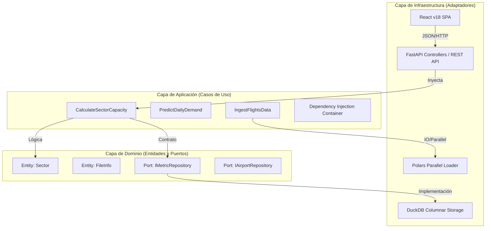

# 📘 Manual Técnico Maestro: ATC Capacity & Analytics

Este documento constituye la referencia técnica definitiva y exhaustiva del sistema. Ha sido diseñado para proporcionar una visibilidad total sobre los fundamentos arquitectónicos, algoritmos matemáticos y decisiones de ingeniería que sustentan la plataforma, con un rigor académico y técnico de nivel doctoral.

---

## 🏗️ 1. Arquitectura del Sistema: Estabilidad y Desacoplamiento

El sistema implementa una **Arquitectura de Cebolla (Onion Architecture)** fusionada con el patrón de **Puertos y Adaptadores (Hexagonal Architecture)**. Esta estructura prioriza la **Inversión de Dependencias (DIP)**, asegurando que el centro del "Hexágono" sea inmune a cambios tecnológicos externos.

### 🧩 1.1 Jerarquía de Capas y Flujo de Dependencias

---

## 🏛️ 2. Fundamentación Teórica por Capas

### 📦 2.1 Capa de Dominio (Domain Layer)
Representa la verdad absoluta del negocio. No depende de ninguna librería de terceros (excepto tipado estático).
- **Entidades de Identidad**: `Sector`, `Airport` y `Region`.
- **Value Objects**: `DateRange`, garantizando la invariante matemática de que un fin de rango nunca precede al inicio.
- **Principio de Diseño**: Asegurar que la lógica de la **Circular 006** sea expresable mediante objetos de dominio antes de tocar el código.

### 🧠 2.2 Capa de Aplicación (Application Layer)
Orquesta el tráfico de datos. Implementa el patrón **Dependency Injection (DI)** para centralizar la configuración del sistema.
- **DTOs (Data Transfer Objects)**: Utilizan Pydantic para la validación estricta de esquemas antes de la ejecución del caso de uso.
- **Casos de Uso**: Clases puras que ejecutan un único flujo de negocio (ej. `IngestFlightsData`).

### ⚡ 2.3 Capa de Infraestructura (Infrastructure Layer)
Configuración técnica de alto rendimiento.
- **DuckDB**: Base de datos **OLAP** in-process. Utiliza ejecución vectorial para agregaciones analíticas de milisegundos.
- **Polars**: Motor de procesamiento basado en **Rust**. Implementa **Evaluación Perezosa (Lazy Evaluation)** para minimizar el uso de RAM durante la ingesta de GBs de datos SRS.

---

## 🧮 3. Derivaciones Matemáticas Exhaustivas

### 📐 3.1 Modelo Normativo Circular 006 (UAEAC)

La capacidad técnica de un sector ATC se fundamenta en la cuantificación de la carga de trabajo cognitiva del controlador.

#### A. Cálculo del TPS (Time in Sector)
Dada una partición del espacio aéreo $S$, el TPS es la esperanza matemática de la duración de los tránsitos:

$$
\text{TPS} = \frac{1}{N} \sum_{i=1}^{N} (t_{\text{out}, i} - t_{\text{in}, i})
$$

Implementado en `CalculateSectorCapacity._get_tps()` mediante agregaciones SQL en DuckDB.

#### B. Capacidad Simultánea de Vuelos (SCV)
Representa el límite de saturación instantánea:

$$
\text{SCV} = \frac{\text{TPS}}{\text{TFC} \times 1.3}
$$

Donde **TFC** es la suma de Transferencia, Comunicación, Separación y Coordinación. El factor **1.3** es el **Margen de Seguridad Cognitiva** (30% de reserva).

#### C. Capacidad Horaria (CH)

$$
\text{CH} = \left( \frac{3600 \times \text{SCV}}{\text{TPS}} \right) \times R
$$

**R** es el **Factor de Ajuste de Resiliencia** (0.1 - 1.0), penalizando la capacidad teórica según condiciones meteorológicas o técnicas.

---

### 🤖 3.2 Motor Predictivo: Híbrido Fourier-Residual

El sistema utiliza un ensamble para capturar tanto la ciclicidad como las anomalías de tráfico.

#### A. Componente Estacional (FFT)
Se descompone la serie temporal $Y_t$ usando series de Fourier:

$$
S_t = \sum_{n=1}^{k} \left[ a_n \cos\left(\frac{2\pi n t}{P}\right) + b_n \sin\left(\frac{2\pi n t}{P}\right) \right]
$$

- **Anual**: $P=365.25$, $k=10$ armónicos.
- **Semanal**: $P=7$, $k=3$ armónicos.

#### B. Componente Residual (Random Forest)
Los residuos $R_{t} = Y_{t} - S_{t}$ son procesados por un bosque aleatorio de 100 árboles:

$$
\hat{R}_{t+1} = \frac{1}{100} \sum_{m=1}^{100} T_{m}(L_{1}, L_{7}, L_{30})
$$

Donde $L_{n}$ son los **Lags** (retardos) de la serie de tiempo.

---

## 🏛️ 4. Mapeo Técnico y Taxonomía de Código

| Componente | Archivo Fuente | Método Crítico | Teoría Aplicada |
| :--- | :--- | :--- | :--- |
| **Ingesta ETL** | `ingest_flights_data.py` | `execute()` | Parallel I/O & SIMD |
| **Cálculo C006** | `calculate_sector_capacity.py` | `execute()` | Sliding Window Analytic |
| **IA Predicción** | `predict_daily_demand.py` | `_train_model()` | Bootstrap Aggregation |
| **IA Estacional** | `predict_seasonal_trend.py` | `fourier_features()` | Harmonic Analysis |
| **Repositorio** | `duckdb_repository.py` | `get_metrics()` | Columnar Storage (OLAP) |

---

## 📚 5. Bibliografía Consolidada y Referencias

### 📑 Documentación Académica
1.  **Breiman, L. (2001)**. *Random Forests*. Machine Learning, 45, 5-32.
2.  **Hyndman, R.J. (2018)**. *Forecasting: Principles and Practice*. OTexts.
3.  **Raasveldt, M. (2019)**. *DuckDB: an Embeddable Analytical Database*. SIGMOD.

### ✈️ Normativa Aeronáutica
4.  **OACI (ICAO)**. *Manual on ATS Ground Capacity Planning (Doc 9689)*.
5.  **UAEAC (Aerocivil)**. *Circular Informativa No. 006 - Determinación de Capacidad*.

### 🌐 Fuentes de Internet Técnica
6.  **FastAPI Docs**. *Dependency Injection and Async Performance*. [fastapi.tiangolo.com](https://fastapi.tiangolo.com).
7.  **Polars Dev**. *Lazy Execution and memory-mapped files*. [pola.rs](https://pola.rs).

---

> [!IMPORTANT]
> **Aviso de Integridad**: Este manual debe actualizarse tras cada cambio en el motor matemático de `src/application/use_cases` para asegurar la paridad entre la teoría y la implementación.
