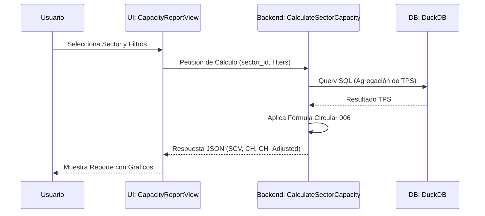

# 📙 Manual de Usuario Maestro: ATC Capacity & Analytics

Este manual proporciona una guía detallada sobre la operación del sistema, fundamentando cada acción del usuario en los principios técnicos y matemáticos que rigen el control de tráfico aéreo moderno.

---

## 🚀 1. Ciclo de Vida Operativo del Sistema

El sistema transforma datos brutos de vuelos en inteligencia operativa mediante un flujo dividido en tres etapas críticas:

---

## 📥 2. Ingesta de Datos (Data Ingestion)

El motor de ingesta es el primer punto de contacto. Técnica y matemáticamente, su función es la **normalización y limpieza de series temporales**.

### 📝 Procedimiento de Carga:
1.  **Acceso**: Diríjase a la sección de **Repositorio de Archivos**.
2.  **Carga masiva**: Arrastre archivos `.csv` o `.xlsx`. Internamente, el sistema activa el adaptador [`PolarsDataSource`](file:///c:/Users/LENOVO/Documents/tesis/src/infrastructure/adapters/polars/polars_data_source.py).
3.  **Validación Técnica**: El sistema verifica que el archivo contenga las columnas obligatorias (`origen`, `destino`, `fecha`, `duracion`).

**¿Qué ocurre detrás de escena?**
Al subir un archivo, se dispara el caso de uso `IngestFlightsData`, que utiliza **Evaluación Perezosa (Lazy Evaluation)** para procesar cientos de miles de filas sin saturar la memoria del servidor.

---

## 📑 3. Cálculo de Capacidad (Módulo Normativo)

Este es el módulo central basado en la **Circular 006 de la UAEAC**.

### 📐 Fundamentación de los Parámetros UI:
Al realizar un cálculo, usted interactúa con variables que tienen un impacto matemático directo en el resultado final:

1.  **TFC (Tiempo de Funciones de Control)**: 
    - Es la suma de los tiempos promerdio de coordinación, transferencia y comunicación. 
    - **Ubicación en Código**: `CalculateSectorCapacity.execute#L41-L49`.
2.  **TPS (Time in Sector)**:
    - El sistema lo calcula automáticamente promediando la duración de los vuelos que cruzaron el sector en el rango de fechas seleccionado.
3.  **Factor de Ajuste R**:
    - **Slider en Vista**: Permite penalizar la capacidad (ej: un Factor R de 0.8 reduce la capacidad teórica en un 20%).
    - **Uso Técnico**: Se utiliza para modelar condiciones de degradación operativa.

### 🔄 Flujo de Cálculo:

---

## 🔮 4. Análisis Predictivo con Inteligencia Artificial

El módulo predictivo le permite anticiparse a la demanda futura basándose en modelos de **Aprendizaje Supervisado**.

### 📊 Interpretación de Visualizaciones:
- **Daily Demand Chart**: Muestra la línea de tendencia central. El área sombreada representa el **Intervalo de Confianza**.
- **Seasonal Trend**: Visualiza la descomposición de Fourier. Es útil para identificar si un pico de tráfico se debe a un evento estacional (ej: temporada de vacaciones).
- **Sector Saturation Chart**: Compara la demanda proyectada contra la capacidad calculada en el Módulo 3. 
    - **Alerta 🟡 (80%)**: El sector se acerca a su límite operativo.
    - **Crítico 🔴 (100%)**: Se recomienda implementar medidas de control de flujo (ATFM).

---

## ⚙️ 5. Gestión de Catálogos (Configuración)

La precisión del sistema depende de la correcta definición de los activos aeronáuticos.

- **Definición de Sectores**: Un sector NO es una geometría simple para el sistema; es una **Lógica de Conectividad**. Se define por los pares Origen-Destino que lo atraviesan.
- **Mantenimiento de Aeropuertos**: Asegúrese de que los códigos ICAO sean correctos para que los uniones (JOINs) en DuckDB no fallen.

---

## 📖 Glosario Técnico-Operativo

| Término | Definición Técnica | Referencia Normativa |
| :--- | :--- | :--- |
| **SCV** | Capacidad Simultánea de Vuelos. Límite instantáneo de gestión. | OACI Doc 9689 |
| **CH** | Capacidad Horaria. Potencial de tráfico en 60 minutos. | UAEAC Circular 006 |
| **Random Forest** | Algoritmo de ensamble usado para la predicción de residuos. | Machine Learning |
| **ETL** | Siglas de Extraer, Transformar y Cargar (Proceso de datos). | Ingeniería de Datos |

---

## 📚 6. Bibliografía de Procedimientos

1.  **UAEAC**. *Manual de Procedimientos de Control de Tránsito Aéreo*.
2.  **OACI**. *Gestión del Flujo del Tránsito Aéreo (ATFM)*.
3.  **NASA**. *Human Multi-model Analysis (Workload Theory)*. [Referencia para la fundamentación del Factor de Carga Mental 1.3].

---

> [!TIP]
> **Recomendación de Uso**: Para obtener predicciones más precisas, realice una carga de datos al menos una vez por semana para que el modelo de IA se re-entrene con las tendencias más recientes.
